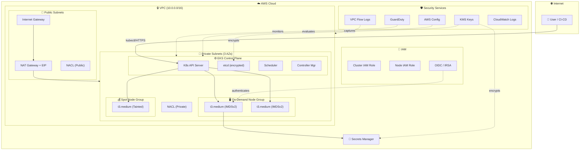
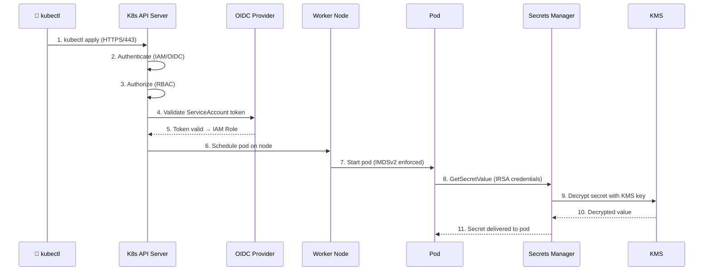

# 🔐 Secured EKS Terraform Template

> A production-ready, security-hardened Amazon EKS cluster template with comprehensive line-by-line documentation and architecture diagrams.

---

## 📋 Table of Contents

- [Architecture Overview](#architecture-overview)
- [Security Features](#security-features)
- [Module Structure](#module-structure)
- [Prerequisites](#prerequisites)
- [Quick Start](#quick-start)
- [Configuration Guide](#configuration-guide)
- [Security Hardening Checklist](#security-hardening-checklist)
- [Cost Estimation](#cost-estimation)
- [Troubleshooting](#troubleshooting)

---

## 🏗️ Architecture Overview


```mermaid
graph TB
    subgraph Internet["🌐 Internet"]
        User["👤 User / CI-CD"]
    end

    subgraph AWS["☁️ AWS Cloud"]
        subgraph VPC["🔒 VPC (10.0.0.0/16)"]
            subgraph PublicSubnets["📡 Public Subnets"]
                IGW["Internet Gateway"]
                NAT["NAT Gateway + EIP"]
                NACLPub["NACL (Public)"]
            end

            subgraph PrivateSubnets["🔐 Private Subnets (3 AZs)"]
                NACLPriv["NACL (Private)"]
                subgraph EKS_Cluster["⚙️ EKS Control Plane"]
                    API["K8s API Server"]
                    ETCD["etcd (encrypted)"]
                    Scheduler["Scheduler"]
                    Controller["Controller Mgr"]
                end

                subgraph NodeGroup1["🖥️ On-Demand Node Group"]
                    Node1["t3.medium (IMDSv2)"]
                    Node2["t3.medium (IMDSv2)"]
                end

                subgraph NodeGroup2["💰 Spot Node Group"]
                    SpotNode1["t3.medium (Tainted)"]
                end
            end
        end

        subgraph SecurityServices["🛡️ Security Services"]
            GuardDuty["GuardDuty"]
            Config["AWS Config"]
            KMS["KMS Keys"]
            FlowLogs["VPC Flow Logs"]
            CWLogs["CloudWatch Logs"]
        end

        subgraph IAM_Services["👤 IAM"]
            ClusterRole["Cluster IAM Role"]
            NodeRole["Node IAM Role"]
            IRSA["OIDC / IRSA"]
        end

        SecretsManager["🔑 Secrets Manager"]
    end

    User -->|kubectl/HTTPS| API
    IGW --> NAT
    NAT --> PrivateSubnets
    API --> Node1
    API --> Node2
    API --> SpotNode1
    Node1 --> SecretsManager
    GuardDuty -.->|monitors| EKS_Cluster
    FlowLogs -.->|captures| VPC
    Config -.->|evaluates| EKS_Cluster
    KMS -.->|encrypts| ETCD
    KMS -.->|encrypts| SecretsManager
    IRSA -.->|authenticates| Node1
```

### Data Flow Diagram


```mermaid
sequenceDiagram
    participant User as 👤 kubectl
    participant API as K8s API Server
    participant OIDC as OIDC Provider
    participant Node as Worker Node
    participant Pod as Pod
    participant SM as Secrets Manager
    participant KMS as KMS

    User->>API: 1. kubectl apply (HTTPS/443)
    API->>API: 2. Authenticate (IAM/OIDC)
    API->>API: 3. Authorize (RBAC)
    API->>OIDC: 4. Validate ServiceAccount token
    OIDC-->>API: 5. Token valid → IAM Role
    API->>Node: 6. Schedule pod on node
    Node->>Pod: 7. Start pod (IMDSv2 enforced)
    Pod->>SM: 8. GetSecretValue (IRSA credentials)
    SM->>KMS: 9. Decrypt secret with KMS key
    KMS-->>SM: 10. Decrypted value
    SM-->>Pod: 11. Secret delivered to pod
```

---

## 🛡️ Security Features

This template implements **5 layers of defense in depth**:

| Layer | Component | What It Does |
|-------|-----------|--------------|
| **Network** | VPC, NACLs, Security Groups | Isolates and filters network traffic |
| **Identity** | IAM Roles, IRSA, OIDC | Controls who can access what |
| **Encryption** | KMS, Encrypted EBS, Secrets Encryption | Protects data at rest |
| **Logging** | CloudWatch, VPC Flow Logs, Audit Logs | Records all activity |
| **Detection** | GuardDuty, AWS Config Rules | Alerts on threats and misconfigurations |

### Security Enhancements Over Reference


```mermaid
graph LR
    subgraph Reference["📦 Reference Template"]
        R1["VPC + Subnets"]
        R2["Basic IAM Roles"]
        R3["EKS Cluster"]
        R4["Secrets Manager"]
    end

    subgraph Enhanced["🔐 This Template (Added)"]
        E1["✅ Network ACLs"]
        E2["✅ VPC Flow Logs"]
        E3["✅ IMDSv2 Enforcement"]
        E4["✅ Encrypted gp3 EBS"]
        E5["✅ GuardDuty + EKS Monitoring"]
        E6["✅ AWS Config Rules"]
        E7["✅ Input Validation Blocks"]
        E8["✅ Line-by-Line Documentation"]
    end

    Reference --> Enhanced
```

---

## 📁 Module Structure

```
.
├── provider.tf                 # Terraform & provider configuration
├── variables.tf                # Root input variables (with validation)
├── main.tf                     # Module orchestration
├── outputs.tf                  # Root outputs
├── terraform.tfvars            # Base variable values
│
├── environments/               # Environment specific configurations
│   ├── dev.tfvars              # Cost optimized dev parameters (Spot instances)
│   └── prod.tfvars             # HA production parameters (On-Demand, 3x NAT)
│
├── bootstrap/                  # Remote State management
│   ├── main.tf                 # S3 (Versioning + Encryption) & DynamoDB tables
│   └── README.md               # Bootstrap sequence instructions
│
├── .github/workflows/          # CI/CD Pipelines
│   └── terraform-eks.yml       # Manual Terraform trigger (pick dev/prod)
│
├── modules/
│   ├── vpc/                    # Network infrastructure
│   │   ├── main.tf             # VPC, subnets, NAT, NACLs, Flow Logs
│   │   ├── variables.tf        # VPC input variables
│   │   └── outputs.tf          # VPC outputs
│   │
│   ├── iam/                    # Identity & access management
│   │   ├── main.tf             # Cluster & node IAM roles
│   │   ├── variables.tf        # IAM input variables
│   │   └── outputs.tf          # IAM role ARNs
│   │
│   ├── eks/                    # EKS cluster & node groups
│   │   ├── main.tf             # KMS, SG, cluster, OIDC, addons, nodes
│   │   ├── variables.tf        # EKS input variables
│   │   └── outputs.tf          # Cluster details
│   │
│   ├── secrets-manager/        # Secrets management
│   │   ├── main.tf             # KMS key, secrets, IAM policy
│   │   ├── variables.tf        # Secret configuration
│   │   └── outputs.tf          # Secret ARNs
│   │
│   └── security/               # Security monitoring (NEW)
│       ├── main.tf             # GuardDuty, AWS Config rules
│       ├── variables.tf        # Security toggles
│       └── outputs.tf          # Detector/recorder IDs
│
├── docs/
│   ├── ARCHITECTURE.md         # Detailed architecture deep dive
│   ├── SECURITY.md             # Security controls documentation
│   └── LINE_BY_LINE.md         # Code explanation guide
│
└── README.md                   # This file
```

---

## ✅ Prerequisites

| Requirement | Version | Purpose |
|-------------|---------|---------|
| Terraform CLI | >= 1.14 | Infrastructure as Code engine |
| AWS CLI | v2 | AWS authentication |
| kubectl | >= 1.28 | Kubernetes cluster management |
| AWS Account | — | With permissions to create EKS, VPC, IAM resources |

### AWS Permissions Required

The deploying user/role needs these AWS managed policies (at minimum):
- `AmazonEKSClusterPolicy`
- `AmazonEKSServicePolicy`
- `AmazonVPCFullAccess`
- `IAMFullAccess`
- `AWSKeyManagementServicePowerUser`

---

## 🚀 Quick Start (Local vs. GitHub Actions)

### 🥇 Method 1: Using the provided GitHub Action (Recommended)

1. **Bootstrap the Backend**: 
   Navigate to the `bootstrap/` folder and run `terraform init` and `terraform apply` locally once to create your S3 bucket and DynamoDB locking table.
2. **Configure GitHub Secrets**:
   Go to your repository **Settings** -> **Secrets and variables** -> **Actions** and add `AWS_ACCESS_KEY_ID` and `AWS_SECRET_ACCESS_KEY`.
3. **Run the Action**:
   Go to the **Actions** tab in GitHub, select **Deploy EKS Cluster**, click **Run workflow**, choose your environment (`dev` or `prod`), and select the `apply` action.

### 🥈 Method 2: Running Locally

```bash
# 1. Clone and enter the directory
cd EKS_k8s_custom_template_with_Terraform

# 2. Bootstrap remote state (Do this first!)
cd bootstrap/
terraform init && terraform apply
cd ..

# 3. Configure AWS credentials
aws configure
# Or use environment variables:
# export AWS_ACCESS_KEY_ID="..."
# export AWS_SECRET_ACCESS_KEY="..."
# export AWS_DEFAULT_REGION="us-east-1"

# 4. Initialize Terraform
terraform init

# 5. Preview changes for your chosen environment (e.g. dev)
terraform plan -var-file="environments/dev.tfvars"

# 6. Apply the configuration
terraform apply -var-file="environments/dev.tfvars"

# 7. Configure kubectl
aws eks update-kubeconfig --region us-east-1 --name eks-dev-cluster

# 8. Verify cluster access
kubectl get nodes
kubectl get pods -A
```

---

## 🌍 Environment Configurations (`dev` vs `prod`)

This project cleanly separates environments using `.tfvars` files located in the `environments/` directory.

- **`environments/dev.tfvars`**: 
  - **Cost-Optimized**: Uses only 1 NAT Gateway, disables expensive GuardDuty/VPC logging, and utilizes cheaper `t3.medium` **SPOT** instances.
- **`environments/prod.tfvars`**: 
  - **Highly Available**: Uses NAT Gateways in every AZ.
  - **Secure**: Enables GuardDuty, AWS Config, and CloudWatch Control Plane logging.
  - **Stable**: Provisions `m5.large` instances strictly as **ON_DEMAND** capacity.

---

## ⚙️ Configuration Guide

### Key Variables

| Variable | Default | Description |
|----------|---------|-------------|
| `aws_region` | `us-east-1` | AWS region for deployment |
| `cluster_name` | `eks-secure-cluster` | EKS cluster name |
| `kubernetes_version` | `1.31` | Kubernetes version |
| `environment` | `development` | Environment tag |
| `vpc_cidr` | `10.0.0.0/16` | VPC CIDR block |
| `enable_public_endpoint` | `true` | Public API access |
| `single_nat_gateway` | `true` | Single NAT (cost saving) |
| `enable_guardduty` | `true` | GuardDuty detection |
| `enable_config` | `true` | AWS Config compliance |

### Production Configuration Changes

```hcl
# terraform.tfvars — Production settings

environment          = "production"
single_nat_gateway   = false         # Multi-AZ NAT for HA
enable_public_endpoint = false       # Private-only API access
public_access_cidrs  = ["YOUR_VPN_CIDR/32"]  # Restrict to VPN
```

---

## 🔒 Security Hardening Checklist

- [x] **KMS encryption** for Kubernetes secrets (envelope encryption)
- [x] **All 5 control plane log types** enabled
- [x] **VPC Flow Logs** capturing all traffic
- [x] **Network ACLs** on public and private subnets
- [x] **IMDSv2 enforced** on all worker nodes
- [x] **Encrypted gp3 EBS** volumes on all nodes
- [x] **Private subnets** for worker nodes (no public IPs)
- [x] **IRSA enabled** (pod-level IAM roles)
- [x] **GuardDuty** with EKS audit log monitoring
- [x] **AWS Config Rules** for compliance validation
- [x] **Least-privilege IAM** — only AWS managed policies
- [x] **Input validation** on all variables
- [ ] **Restrict `public_access_cidrs`** to your IP/VPN (manual step)
- [ ] **Enable S3 backend** for remote state (manual step)
- [ ] **Deploy OPA/Kyverno** for Kubernetes policy enforcement

---

## 💰 Cost Estimation

| Component | Dev/Test | Production |
|-----------|----------|------------|
| EKS Control Plane | $73/mo | $73/mo |
| NAT Gateway (single) | $32/mo | $96/mo (3x) |
| EC2 On-Demand (2x t3.medium) | $60/mo | $60/mo |
| EC2 Spot (1x t3.medium) | ~$18/mo | ~$18/mo |
| EBS Volumes (gp3) | ~$5/mo | ~$5/mo |
| CloudWatch Logs | ~$5/mo | ~$10/mo |
| GuardDuty | ~$5/mo | ~$10/mo |
| AWS Config | ~$3/mo | ~$5/mo |
| **Total** | **~$200/mo** | **~$280/mo** |

> 💡 Costs are approximate. Use the [AWS Pricing Calculator](https://calculator.aws/) for precise estimates.

---

## 🔧 Troubleshooting

| Issue | Solution |
|-------|----------|
| `terraform init` fails | Check internet connectivity and provider versions |
| `Unauthorized` errors | Verify AWS credentials and permissions |
| Nodes not joining cluster | Check node IAM role and security group rules |
| CoreDNS degraded | Wait for nodes to be Ready, then check addon status |
| `kubectl` connection refused | Verify `public_access_cidrs` includes your IP |
| GuardDuty already enabled | Import existing detector: `terraform import module.security.aws_guardduty_detector.main[0] <detector-id>` |

---

## 📚 Additional Documentation

- **[Architecture Deep Dive](docs/ARCHITECTURE.md)** — Detailed component diagrams and relationships
- **[Security Controls](docs/SECURITY.md)** — Explanation of every security measure
- **[Line-by-Line Guide](docs/LINE_BY_LINE.md)** — Code explanation for learning
- **[Deployment & Operations Guide](GUIDE.md)** — Complete step-by-step deployment, cluster access, and troubleshooting

---

## 📝 License

This project is provided as-is for educational and production use. Customize according to your organization's security policies and compliance requirements.