# 🔐 Secured EKS Terraform Template

> A production-ready, security-hardened Amazon EKS cluster template with comprehensive line-by-line documentation and architecture diagrams.

---

## 📋 Table of Contents

- [Architecture Overview](#architecture-overview)
- [Security Features](#security-features)
- [Module Structure](#module-structure)
- [Prerequisites](#prerequisites)
- [Quick Start](#quick-start)
- [Configuration Guide](#configuration-guide)
- [Security Hardening Checklist](#security-hardening-checklist)
- [Cost Estimation](#cost-estimation)
- [Troubleshooting](#troubleshooting)

---

## 🏗️ Architecture Overview


### Data Flow Diagram


---

## 🛡️ Security Features

This template implements **5 layers of defense in depth**:

| Layer | Component | What It Does |
|-------|-----------|--------------|
| **Network** | VPC, NACLs, Security Groups | Isolates and filters network traffic |
| **Identity** | IAM Roles, IRSA, OIDC | Controls who can access what |
| **Encryption** | KMS, Encrypted EBS, Secrets Encryption | Protects data at rest |
| **Logging** | CloudWatch, VPC Flow Logs, Audit Logs | Records all activity |
| **Detection** | GuardDuty, AWS Config Rules | Alerts on threats and misconfigurations |

### Security Enhancements Over Reference

```mermaid
graph LR
    subgraph Reference["📦 Reference Template"]
        R1["VPC + Subnets"]
        R2["Basic IAM Roles"]
        R3["EKS Cluster"]
        R4["Secrets Manager"]
    end

    subgraph Enhanced["🔐 This Template (Added)"]
        E1["✅ Network ACLs"]
        E2["✅ VPC Flow Logs"]
        E3["✅ IMDSv2 Enforcement"]
        E4["✅ Encrypted gp3 EBS"]
        E5["✅ GuardDuty + EKS Monitoring"]
        E6["✅ AWS Config Rules"]
        E7["✅ Input Validation Blocks"]
        E8["✅ Line-by-Line Documentation"]
    end

    Reference --> Enhanced
```



---

## 📁 Module Structure

```
.
├── provider.tf                 # Terraform & provider configuration
├── variables.tf                # Root input variables (with validation)
├── main.tf                     # Module orchestration
├── outputs.tf                  # Root outputs
├── terraform.tfvars            # Example variable values
│
├── modules/
│   ├── vpc/                    # Network infrastructure
│   │   ├── main.tf             # VPC, subnets, NAT, NACLs, Flow Logs
│   │   ├── variables.tf        # VPC input variables
│   │   └── outputs.tf          # VPC outputs
│   │
│   ├── iam/                    # Identity & access management
│   │   ├── main.tf             # Cluster & node IAM roles
│   │   ├── variables.tf        # IAM input variables
│   │   └── outputs.tf          # IAM role ARNs
│   │
│   ├── eks/                    # EKS cluster & node groups
│   │   ├── main.tf             # KMS, SG, cluster, OIDC, addons, nodes
│   │   ├── variables.tf        # EKS input variables
│   │   └── outputs.tf          # Cluster details
│   │
│   ├── secrets-manager/        # Secrets management
│   │   ├── main.tf             # KMS key, secrets, IAM policy
│   │   ├── variables.tf        # Secret configuration
│   │   └── outputs.tf          # Secret ARNs
│   │
│   └── security/               # Security monitoring (NEW)
│       ├── main.tf             # GuardDuty, AWS Config rules
│       ├── variables.tf        # Security toggles
│       └── outputs.tf          # Detector/recorder IDs
│
├── docs/
│   ├── ARCHITECTURE.md         # Detailed architecture deep dive
│   ├── SECURITY.md             # Security controls documentation
│   └── LINE_BY_LINE.md         # Code explanation guide
│
└── README.md                   # This file
```

---

## ✅ Prerequisites

| Requirement | Version | Purpose |
|-------------|---------|---------|
| Terraform CLI | >= 1.14 | Infrastructure as Code engine |
| AWS CLI | v2 | AWS authentication |
| kubectl | >= 1.28 | Kubernetes cluster management |
| AWS Account | — | With permissions to create EKS, VPC, IAM resources |

### AWS Permissions Required

The deploying user/role needs these AWS managed policies (at minimum):
- `AmazonEKSClusterPolicy`
- `AmazonEKSServicePolicy`
- `AmazonVPCFullAccess`
- `IAMFullAccess`
- `AWSKeyManagementServicePowerUser`

---

## 🚀 Quick Start

```bash
# 1. Clone and enter the directory
cd EKS_k8s_custom_template_with_Terraform

# 2. Configure AWS credentials
aws configure
# Or use environment variables:
# export AWS_ACCESS_KEY_ID="..."
# export AWS_SECRET_ACCESS_KEY="..."
# export AWS_DEFAULT_REGION="us-east-1"

# 3. Review and customize variables
vim terraform.tfvars

# 4. Initialize Terraform (downloads providers & modules)
terraform init

# 5. Preview changes (dry run)
terraform plan

# 6. Apply the configuration
terraform apply

# 7. Configure kubectl
aws eks update-kubeconfig \
  --region us-east-1 \
  --name eks-secure-cluster

# 8. Verify cluster access
kubectl get nodes
kubectl get pods -A
```

---

## ⚙️ Configuration Guide

### Key Variables

| Variable | Default | Description |
|----------|---------|-------------|
| `aws_region` | `us-east-1` | AWS region for deployment |
| `cluster_name` | `eks-secure-cluster` | EKS cluster name |
| `kubernetes_version` | `1.31` | Kubernetes version |
| `environment` | `development` | Environment tag |
| `vpc_cidr` | `10.0.0.0/16` | VPC CIDR block |
| `enable_public_endpoint` | `true` | Public API access |
| `single_nat_gateway` | `true` | Single NAT (cost saving) |
| `enable_guardduty` | `true` | GuardDuty detection |
| `enable_config` | `true` | AWS Config compliance |

### Production Configuration Changes

```hcl
# terraform.tfvars — Production settings

environment          = "production"
single_nat_gateway   = false         # Multi-AZ NAT for HA
enable_public_endpoint = false       # Private-only API access
public_access_cidrs  = ["YOUR_VPN_CIDR/32"]  # Restrict to VPN
```

---

## 🔒 Security Hardening Checklist

- [x] **KMS encryption** for Kubernetes secrets (envelope encryption)
- [x] **All 5 control plane log types** enabled
- [x] **VPC Flow Logs** capturing all traffic
- [x] **Network ACLs** on public and private subnets
- [x] **IMDSv2 enforced** on all worker nodes
- [x] **Encrypted gp3 EBS** volumes on all nodes
- [x] **Private subnets** for worker nodes (no public IPs)
- [x] **IRSA enabled** (pod-level IAM roles)
- [x] **GuardDuty** with EKS audit log monitoring
- [x] **AWS Config Rules** for compliance validation
- [x] **Least-privilege IAM** — only AWS managed policies
- [x] **Input validation** on all variables
- [ ] **Restrict `public_access_cidrs`** to your IP/VPN (manual step)
- [ ] **Enable S3 backend** for remote state (manual step)
- [ ] **Deploy OPA/Kyverno** for Kubernetes policy enforcement

---

## 💰 Cost Estimation

| Component | Dev/Test | Production |
|-----------|----------|------------|
| EKS Control Plane | $73/mo | $73/mo |
| NAT Gateway (single) | $32/mo | $96/mo (3x) |
| EC2 On-Demand (2x t3.medium) | $60/mo | $60/mo |
| EC2 Spot (1x t3.medium) | ~$18/mo | ~$18/mo |
| EBS Volumes (gp3) | ~$5/mo | ~$5/mo |
| CloudWatch Logs | ~$5/mo | ~$10/mo |
| GuardDuty | ~$5/mo | ~$10/mo |
| AWS Config | ~$3/mo | ~$5/mo |
| **Total** | **~$200/mo** | **~$280/mo** |

> 💡 Costs are approximate. Use the [AWS Pricing Calculator](https://calculator.aws/) for precise estimates.

---

## 🔧 Troubleshooting

| Issue | Solution |
|-------|----------|
| `terraform init` fails | Check internet connectivity and provider versions |
| `Unauthorized` errors | Verify AWS credentials and permissions |
| Nodes not joining cluster | Check node IAM role and security group rules |
| CoreDNS degraded | Wait for nodes to be Ready, then check addon status |
| `kubectl` connection refused | Verify `public_access_cidrs` includes your IP |
| GuardDuty already enabled | Import existing detector: `terraform import module.security.aws_guardduty_detector.main[0] <detector-id>` |

---

## 📚 Additional Documentation

- **[Architecture Deep Dive](docs/ARCHITECTURE.md)** — Detailed component diagrams and relationships
- **[Security Controls](docs/SECURITY.md)** — Explanation of every security measure
- **[Line-by-Line Guide](docs/LINE_BY_LINE.md)** — Code explanation for learning

---

## 📝 License

This project is provided as-is for educational and production use. Customize according to your organization's security policies and compliance requirements.