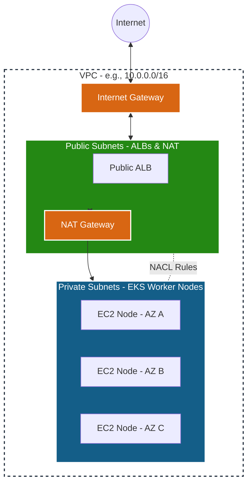
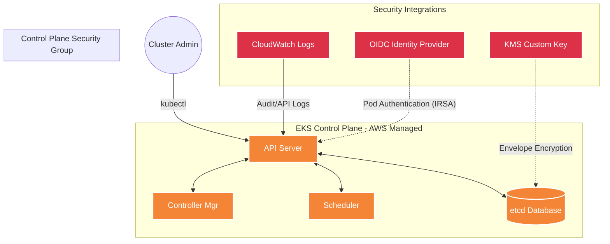
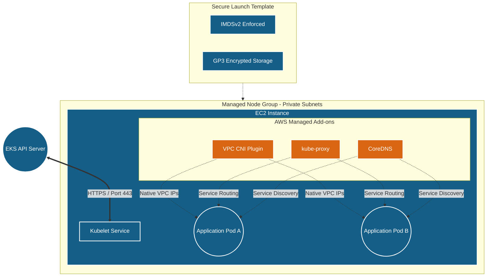
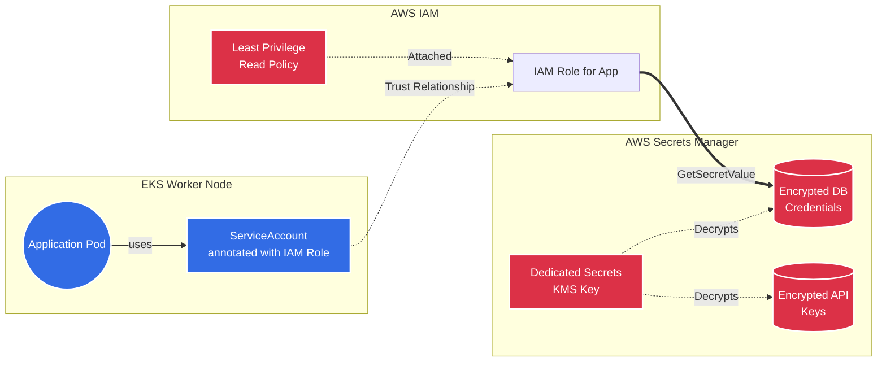
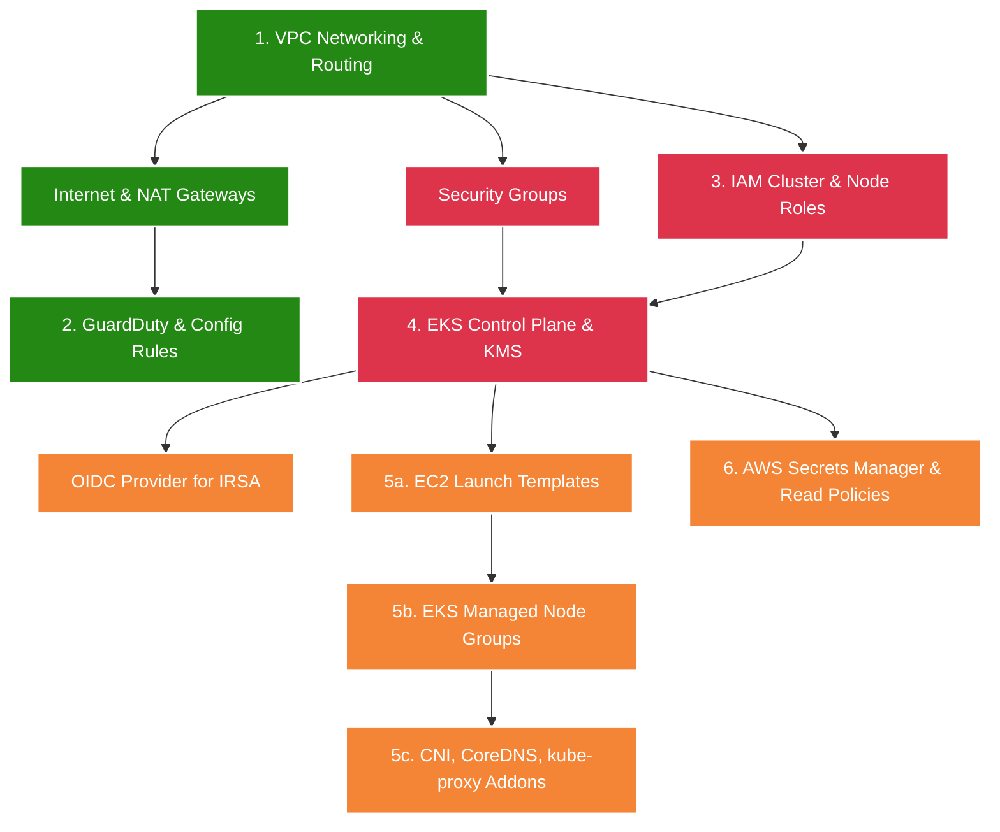

# Detailed Step-by-Step EKS Architecture Deployment Guide

This comprehensive guide breaks down the ordered, sequential deployment of the EKS architecture using Terraform. It explains not only *what* is being deployed, but *why* it is structured this way, emphasizing security, high availability, and best practices.

---

## Step 1: The Foundation - Isolated Networking (VPC Module)

Before any compute resources can be provisioned, we must establish the network boundary. The **Virtual Private Cloud (VPC)** acts as your private data center in the cloud.

### Detailed Actions:
1. **VPC Creation**: A `/16` CIDR block is allocated to provide ample IP addresses for pods and nodes. DNS hostnames and resolution are enabled, which is strictly required for EKS nodes to communicate with the control plane endpoint.
2. **Subnet Layering**:
   - **Public Subnets** (assigned across 3 Availability Zones): These have a route to the Internet Gateway. Only external-facing resources like Application Load Balancers (ALBs) or NAT Gateways reside here.
   - **Private Subnets** (assigned across 3 AZs): Worker nodes and their pods run here. They have no direct inbound access from the internet.
3. **Egress Routing**: Private subnets are routed to a **NAT Gateway** (either a single gateway to save costs or one per AZ for High Availability). This allows pods to pull container images from the internet or communicate with external APIs securely.
4. **Subnet Tagging**: Specific tags (`kubernetes.io/role/elb` for public, `kubernetes.io/role/internal-elb` for private) are applied so the AWS Load Balancer Controller knows exactly where to place load balancers later.
5. **Network ACLs (NACL)**: Stateless, subnet-level firewalls act as a secondary defense layer allowing specific port ranges in and out.
6. **VPC Flow Logs**: Network traffic metadata is captured and sent to CloudWatch for continuous security auditing.



---

## Step 2: Continuous Security Monitoring (Security Module)

With the network in place, we overlay security detection services. This acts as our automated Security Operations Center (SOC) *before* the cluster even exists.

### Detailed Actions:
1. **Amazon GuardDuty**: Enabled to continuously analyze metadata streams (like the VPC Flow Logs we just created, DNS logs, and CloudTrail events) for malicious activity such as lateral movement or compromised instances.
2. **EKS Audit and Runtime Monitoring**: Specific GuardDuty features are enabled to monitor Kubernetes-specific threats, such as unexpected `kubectl exec` commands, privileged container escapes, or crypto-mining payloads.
3. **AWS Config**: An automated auditor that evaluates resource configurations against best practices.
4. **Config Rules**: Specific rules are deployed to ensure compliance, immediately flagging if EKS control plane logging is turned off or if secrets are left unencrypted.

```mermaid
graph LR
    classDef src fill:#F58536,stroke:#fff,stroke-width:2px,color:#fff;
    classDef analyze fill:#8C4FFF,stroke:#fff,stroke-width:2px,color:#fff;
    classDef alert fill:#DC3147,stroke:#fff,stroke-width:2px,color:#fff;

    subgraph Data_Sources [Telemetry & Data Sources]
        VPCFlow[VPC Flow Logs]
        K8sAudit[Kubernetes Audit Logs]
        CloudTrail[AWS CloudTrail]
        OSRuntime[Node OS Events]
    end

    subgraph Threat_Detection [Threat Detection & Compliance]
        GD[Amazon GuardDuty<br/>(Machine Learning & Threat Intel)]
        Config[AWS Config<br/>(Continuous Auditing)]
    end

    Data_Sources --> GD
    GD --> Alerts((Security Finding))
    
    K8sAudit -.-> Config
    Config --> Compliance((Compliance <br/> Pass/Fail))

    class VPCFlow,K8sAudit,CloudTrail,OSRuntime src;
    class GD,Config analyze;
    class Alerts,Compliance alert;
```

---

## Step 3: Identity & Access Management (IAM Module)

AWS operates on a strict explicitly-deny-by-default permission model. We must create specific IAM Roles based on the Principle of Least Privilege.

### Detailed Actions:
1. **Cluster Role**: This role is assumed by the AWS-managed EKS Control Plane service (`eks.amazonaws.com`). It grants EKS the right to orchestrate AWS resources on your behalf, such as creating Elastic Network Interfaces (ENIs) for pods and shipping logs to CloudWatch.
2. **Node Group Role**: Assumed by your raw EC2 worker instances (`ec2.amazonaws.com`). This role only has exact permissions to:
   - Register the `kubelet` with the EKS API server.
   - Run the VPC CNI plugin to assign real VPC IP addresses to pods.
   - Provide **Read-Only** access to Elastic Container Registry (ECR) so nodes can pull Docker images but can never maliciously alter or push them.

```mermaid
graph TD
    classDef role fill:#DD344C,stroke:#fff,stroke-width:2px,color:#fff;
    classDef policy fill:#E78F24,stroke:#fff,stroke-width:2px,color:#fff;

    subgraph AWS_IAM [Identity & Access Management]
        subgraph Roles
            CRole[Cluster Role <br/> (Trusts: eks.amazonaws.com)]
            NRole[Node Group Role <br/> (Trusts: ec2.amazonaws.com)]
        end
        
        subgraph Managed_Policies [AWS Managed Policies]
            pCluster[AmazonEKSClusterPolicy]
            pVPC[AmazonEKSVPCResourceController]
            
            pNode[AmazonEKSWorkerNodePolicy]
            pCNI[AmazonEKS_CNI_Policy]
            pECR[AmazonEC2ContainerRegistryReadOnly]
        end
        
        pCluster --> CRole
        pVPC --> CRole
        
        pNode --> NRole
        pCNI --> NRole
        pECR --> NRole
    end
    
    EKS_Service((EKS Service)) -- Assumes --> CRole
    Worker_Node((EC2 Instance)) -- Assumes --> NRole

    class CRole,NRole role;
    class pCluster,pVPC,pNode,pCNI,pECR policy;
```

---

## Step 4: The Kubernetes Control Plane (EKS Module - Part 1)

Now we deploy the brain of the cluster. AWS fully manages the high availability of these components.

### Detailed Actions:
1. **Encryption at Rest (KMS)**: We generate a dedicated AWS KMS key *first*. We pass this to EKS to provide **Envelope Encryption** for Kubernetes Secrets inside `etcd`. Otherwise, `etcd` stores secrets as easily decoded `base64`.
2. **Control Plane Logging**: We provision a CloudWatch Log Group to capture all 5 types of control plane logs (API, Audit, Authenticator, ControllerManager, Scheduler) for deep visibility.
3. **Security Groups**: 
   - A restricted Security Group is placed on the control plane ENIs.
   - A separate SG is created for the Nodes.
   - Specific SG Rules are established allowing Port 443 (Nodes to API Server) and Port 1025-65535 (API Server to Nodes for `kubectl exec`/logs).
4. **EKS Cluster Creation**: The control plane is spun up across 3 AZs.
5. **OIDC Provider**: Crucially, we connect the EKS cluster's OpenID Connect issuer to AWS IAM. This allows individual pods (via ServiceAccounts) to authenticate to AWS IAM directly, known as **IRSA** (IAM Roles for Service Accounts).



---

## Step 5: Worker Nodes & Cluster Add-ons (EKS Module - Part 2)

The cluster brain needs muscle. We deploy EC2 instances and the critical software that makes them act like a unified cluster.

### Detailed Actions:
1. **EC2 Launch Templates**: We don't just spin up default EC2 servers. We define a highly secure template:
   - Enforce **IMDSv2** (requiring tokens to access instance metadata, killing SSRF vulnerabilities like the Capital One breach).
   - Require **Encrypted gp3 EBS Volumes** for the node root filesystem.
2. **Managed Node Groups**: We attach the Launch Template and the Node IAM Role to Auto-Scaling Groups that will provision instances entirely in the **Private Subnets**.
3. **EKS Add-ons**: Once nodes spin up, AWS pushes managed system pods to them:
   - **VPC CNI**: Reaches into the VPC and hands out native AWS IP addresses directly to the pods (bypassing overlay network overhead).
   - **kube-proxy**: Manipulates `iptables` or IPVS on the node to properly route traffic for Kubernetes Services.
   - **CoreDNS**: Provides the internal `svc.cluster.local` DNS resolution.



---

## Step 6: Application Secrets Storage (Secrets Manager Module)

Finally, for secure post-deployment application operations, we provision isolated storage for sensitive data like DB passwords or external API tokens.

### Detailed Actions:
1. **Dedicated KMS Key**: We create a completely separate KMS key just for Secrets Manager, ensuring separation of duties between control plane encryption and application data encryption.
2. **Secrets Manager Provisioning**: Conditionally generated secrets are created as encrypted JSON documents.
3. **Least Privilege Read Policy**: An IAM Policy is created that strictly allows `GetSecretValue` and `Decrypt` actions *only* against these specific secrets.
4. **Integration**: Now, when the developer deploys their application pods, they can use the **IRSA** feature (from Step 4) to attach this read-only policy to their app's ServiceAccount, allowing the application to securely fetch database credentials at runtime without hardcoding them.



---

## Complete Dependency Flow

When `terraform apply` executes, Terraform builds an internal dependency graph ensuring components are created in the exact order required for stability:


