# 🏗️ Architecture Deep Dive

This document provides detailed diagrams explaining how each component works and interconnects.

---

## Module Dependency Graph

```mermaid
graph TD
    Root["📦 Root Module<br/>main.tf"]
    
    Root --> VPC["🌐 VPC Module"]
    Root --> IAM["👤 IAM Module"]
    Root --> EKS["⚙️ EKS Module"]
    Root --> SM["🔑 Secrets Manager"]
    Root --> SEC["🛡️ Security Module"]
    
    VPC -->|vpc_id, subnet_ids| EKS
    IAM -->|cluster_role_arn, node_role_arn| EKS
    
    EKS -->|cluster_name| SM
    EKS -->|cluster_name| SEC
    
    style VPC fill:#4CAF50,color:#fff
    style IAM fill:#FF9800,color:#fff
    style EKS fill:#2196F3,color:#fff
    style SM fill:#9C27B0,color:#fff
    style SEC fill:#F44336,color:#fff
```

**Deployment Order:** VPC → IAM → EKS → Secrets Manager → Security

---

## VPC Architecture

### Network Security Layers

---

## EKS Cluster Architecture

### IRSA (IAM Roles for Service Accounts) Flow

```mermaid
sequenceDiagram
    participant Pod as 🐳 Pod
    participant SA as ServiceAccount
    participant STS as AWS STS
    participant OIDC as OIDC Provider
    participant S3 as AWS S3

    Pod->>SA: 1. Uses annotated ServiceAccount
    SA->>Pod: 2. Injects OIDC token via projected volume
    Pod->>STS: 3. AssumeRoleWithWebIdentity(token)
    STS->>OIDC: 4. Validate OIDC token
    OIDC-->>STS: 5. Token valid for ServiceAccount X
    STS-->>Pod: 6. Temporary AWS credentials
    Pod->>S3: 7. Access S3 with scoped credentials
```

---

## Security Services Architecture

```mermaid
graph TB
    subgraph Monitoring["Security Monitoring Layer"]
        GD["GuardDuty<br/>Threat Detection"]
        CFG["AWS Config<br/>Compliance"]
        FL["VPC Flow Logs<br/>Network Audit"]
        CW["CloudWatch Logs<br/>Control Plane Audit"]
    end
    
    subgraph DataSources["Data Sources"]
        CT["CloudTrail Events"]
        EKSAudit["EKS Audit Logs"]
        DNS["DNS Logs"]
        VPCFlow["VPC Flow Log Data"]
    end
    
    CT --> GD
    EKSAudit --> GD
    DNS --> GD
    VPCFlow --> FL
    
    subgraph Rules["Config Rules"]
        R1["EKS Logging Enabled?"]
        R2["Public Endpoint Disabled?"]
        R3["Secrets Encrypted?"]
    end
    
    CFG --> R1
    CFG --> R2
    CFG --> R3
    
    GD -->|"Findings"| Alert["⚠️ Security Alert"]
    R1 -->|"NON_COMPLIANT"| Alert
```

---

## Encryption Architecture

