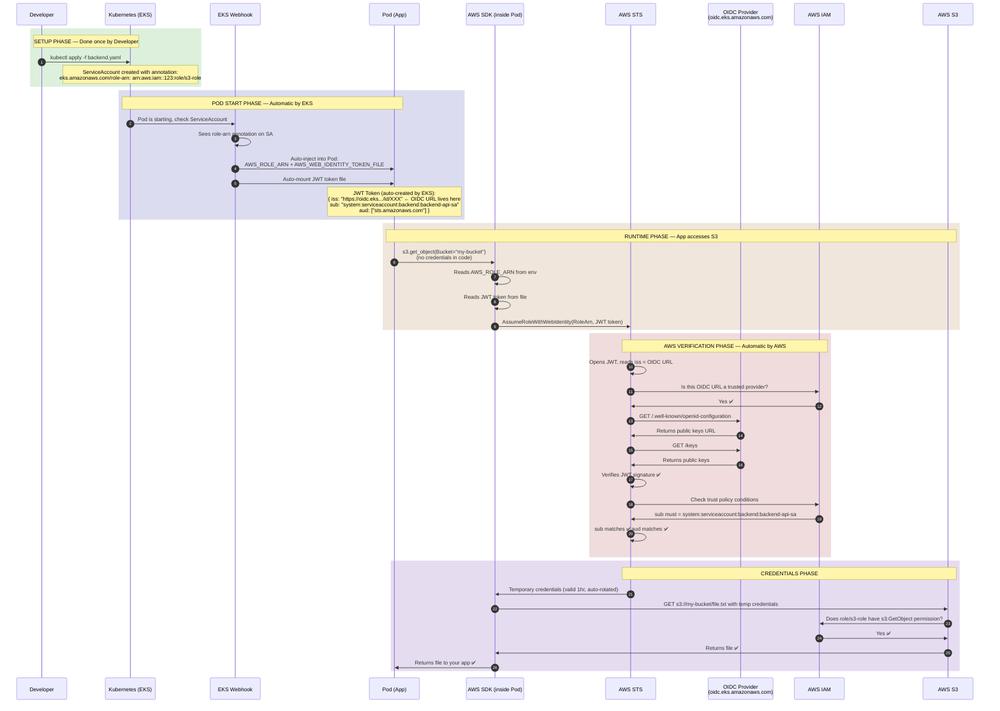
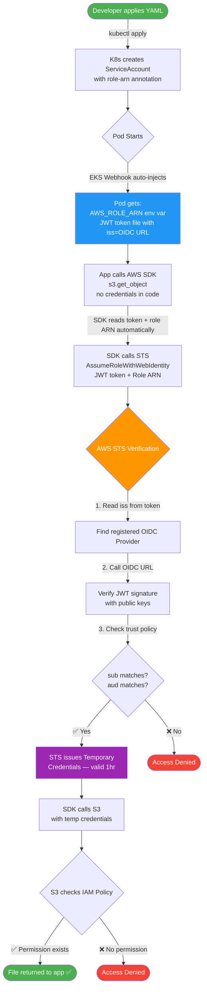
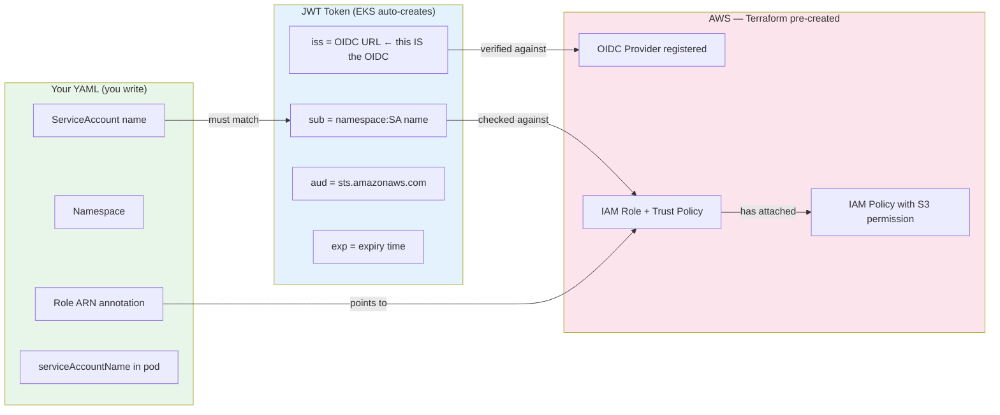

# EKS + OIDC + IRSA — Complete Guide with All Q&A

---

## Table of Contents

1. [What is IRSA?](#what-is-irsa)
2. [The Big Picture](#the-big-picture)
3. [Q&A — All Doubts Explained](#qa--all-doubts-explained)
4. [Normal Role vs OIDC Role](#normal-role-vs-oidc-role)
5. [Terraform Setup](#terraform-setup)
6. [Kubernetes YAML Setup](#kubernetes-yaml-setup)
7. [Complete Flow Diagrams](#complete-flow-diagrams)
8. [Key Rules to Remember](#key-rules-to-remember)

---

## What is IRSA?

**IRSA = IAM Roles for Service Accounts**

It lets Kubernetes pods assume AWS IAM Roles securely — without storing any AWS credentials (no access keys, no secrets) inside the pod or cluster.

---

## The Big Picture

```
┌─────────────────────────────────────────────────────────────────┐
│                        AWS SIDE                                  │
│                                                                  │
│   OIDC Provider (ONE per cluster — shared by all SAs)           │
│        │                                                         │
│        ├── IAM Role A (S3)    ← Trust: only SA-A can assume     │
│        ├── IAM Role B (SQS)   ← Trust: only SA-B can assume     │
│        └── IAM Role C (CW)    ← Trust: only SA-C can assume     │
│                                                                  │
└─────────────────────────────────────────────────────────────────┘
                    │ role ARN passed via annotation only
┌─────────────────────────────────────────────────────────────────┐
│                     KUBERNETES SIDE                              │
│                                                                  │
│   ServiceAccount-A (annotated with Role A ARN)                  │
│        └── Pod 1, Pod 2, Pod 3  (all share SA-A)                │
│   ServiceAccount-B (annotated with Role B ARN)                  │
│        └── Pod 4, Pod 5                                          │
│   ServiceAccount-C (annotated with Role C ARN)                  │
│        └── Pod 6                                                 │
│                                                                  │
└─────────────────────────────────────────────────────────────────┘
```

---

## Q&A — All Doubts Explained

---

### Q1: What is the OIDC URL actually?

When EKS creates a cluster, it spins up a built-in OIDC identity provider. The URL looks like:

```
https://oidc.eks.us-east-1.amazonaws.com/id/EXAMPLED539D4633E53DE1B716D3041E
```

This URL is an **identity verification server**. AWS calls it to verify that the JWT token inside a pod is genuine and was issued by your EKS cluster.

```bash
# You can curl it — it's a public endpoint
curl https://oidc.eks.us-east-1.amazonaws.com/id/XXXXX/.well-known/openid-configuration

# Returns:
{
  "issuer":  "https://oidc.eks.us-east-1.amazonaws.com/id/XXXXX",
  "jwks_uri": "https://oidc.eks.../id/XXXXX/keys",   # public keys to verify signatures
  "id_token_signing_alg_values_supported": ["RS256"]
}
```

The random ID (`EXAMPLED539D4633E53DE1B716D3041E`) is unique to your EKS cluster — derived from the cluster's signing key.

**ONE OIDC provider per EKS cluster. It is shared by ALL service accounts. You never reference it in YAML.**

---

### Q2: Can all Service Accounts use a single OIDC provider?

**YES — One OIDC provider per cluster is the standard pattern.**

The differentiation happens at the IAM Role trust policy level, where you specify exactly which namespace + service account can assume each role.

```
ONE OIDC Provider (per cluster)     ✅ shared by everything
     │
     ├── IAM Role A  (S3 access)    ← separate role per permission set
     │      └── ServiceAccount A
     │           └── Pod 1, Pod 2, Pod 3  ✅ all share same role
     │
     ├── IAM Role B  (DynamoDB)
     │      └── ServiceAccount B
     │           └── Pod 4, Pod 5  ✅ share role B
     │
     └── IAM Role C  (SQS access)
            └── ServiceAccount C
                 └── Pod 6
```

| Question | Answer |
|---|---|
| One OIDC for all pods? | ✅ YES — one OIDC provider per cluster |
| One IAM Role for all pods? | ❌ NO — depends on what AWS access each pod needs |
| Multiple pods sharing one role? | ✅ YES — if they need the same permissions |

---

### Q3: Do we create roles in Kubernetes with OIDC like we do in AWS?

**NO. Roles are only created in AWS. Kubernetes just holds a reference (annotation) pointing to the AWS role.**

```
AWS Side                          Kubernetes Side
─────────────────────────────     ─────────────────────────────
✅ IAM Role (created here)        ✅ ServiceAccount (created here)
✅ OIDC Provider (created here)   ✅ Pod uses ServiceAccount
✅ Trust Policy (created here)    ❌ NO role creation here
✅ IAM Policy (created here)      ❌ NO policy creation here
```

Think of it like a hotel keycard system:
- **IAM Role** = the actual room and what's inside it (AWS)
- **OIDC** = the hotel's keycard verification machine (AWS)
- **Kubernetes ServiceAccount** = the keycard itself (K8s)
- The keycard just has the **room number written on it** (the annotation) — it doesn't create the room

---

### Q4: How do we attach policies?

**Same as normal IAM — policies are attached to the IAM Role on the AWS side. Kubernetes has zero involvement.**

```
IAM Policy (what can be done)
      │
      │ attached to
      ▼
IAM Role (OIDC trust policy — who can assume)
      │
      │ pointed to by annotation
      ▼
Kubernetes ServiceAccount
      │
      │ used by
      ▼
Pod → gets AWS credentials automatically
```

```hcl
# Attach AWS Managed Policy
resource "aws_iam_role_policy_attachment" "app1_s3" {
  role       = aws_iam_role.app1.name
  policy_arn = "arn:aws:iam::aws:policy/AmazonS3ReadOnlyAccess"
}

# Attach Custom Inline Policy
resource "aws_iam_role_policy" "app1_custom" {
  name = "app1-custom-policy"
  role = aws_iam_role.app1.id
  policy = jsonencode({
    Version = "2012-10-17"
    Statement = [{
      Effect   = "Allow"
      Action   = ["s3:GetObject", "s3:PutObject"]
      Resource = "arn:aws:s3:::my-bucket/*"
    }]
  })
}
```

---

### Q5: Principal is who is accessing — am I right?

**YES. Principal = who is trying to assume the role.**

| Scenario | Principal |
|---|---|
| EC2 assuming a role | `Service: ec2.amazonaws.com` |
| Lambda assuming a role | `Service: lambda.amazonaws.com` |
| Another AWS account | `AWS: arn:aws:iam::OTHER_ACCOUNT:root` |
| K8s Pod via OIDC | `Federated: arn:aws:iam::123:oidc-provider/...` |

---

### Q6: Does the Service Account assume the AWS Role with OIDC?

**YES, but not directly — the Pod assumes the role ON BEHALF of the ServiceAccount using the SA's JWT token as proof of identity.**

```
Pod starts
   │ K8s mounts JWT token automatically (represents the ServiceAccount)
   ▼
AWS SDK inside pod reads:
   - AWS_ROLE_ARN
   - AWS_WEB_IDENTITY_TOKEN_FILE
   │ SDK calls sts:AssumeRoleWithWebIdentity
   ▼
AWS STS verifies token via OIDC provider
   │ checks Condition → sub matches ✅
   ▼
STS issues temporary credentials
   │
   ▼
Pod has AWS access 🎉
```

**ServiceAccount = the identity (the "who"), OIDC = proof verifier (the "trust mechanism"), AssumeRoleWithWebIdentity = the actual assume action.**

---

### Q7: After STS verifies the token — does it then access the role?

**YES. Once STS verifies:**
1. Token signature is valid ✅
2. `sub` condition matches ✅
3. `aud` condition matches ✅

STS issues temporary credentials FOR that role. The pod then uses those credentials to access AWS resources.

---

### Q8: Do SA name and AWS Role name need to be the same?

**NO. They are completely independent. The only link is:**
1. The `sub` condition in the trust policy (SA name mentioned here)
2. The annotation on the ServiceAccount (Role ARN mentioned here)

```
Kubernetes SA name: "my-app-sa"           # can be anything
AWS Role name:      "production-s3-role"  # can be anything different
```

```
AWS IAM Role (production-s3-role)
    trust policy sub = "system:serviceaccount:my-namespace:my-app-sa"
                                                            ▲
                                              must match exactly ↕
Kubernetes ServiceAccount (my-app-sa)
    annotation: eks.amazonaws.com/role-arn: arn:aws:iam::123:role/production-s3-role
                                                                   ▲
                                                     these point to each other
```

---

### Q9: Should we create ServiceAccounts during infrastructure creation or via kubectl YAML?

**Both work — it's a team/workflow preference.**

| Situation | Recommendation |
|---|---|
| Infrastructure team manages everything | ✅ Terraform for both AWS + K8s SA |
| Separate infra and app teams | ✅ Terraform for AWS, YAML/Helm for K8s SA |
| App deployed via Helm | ✅ Terraform for AWS, Helm values for SA |
| Quick dev/testing | ✅ Just YAML, fast and simple |

**Terraform approach** — role ARN auto-referenced, no hardcoding:
```hcl
resource "kubernetes_service_account" "app1" {
  metadata {
    name      = "my-app-sa"
    namespace = "my-namespace"
    annotations = {
      "eks.amazonaws.com/role-arn" = aws_iam_role.app1.arn  # auto-referenced!
    }
  }
}
```

**YAML approach** — paste role ARN from terraform output:
```yaml
apiVersion: v1
kind: ServiceAccount
metadata:
  name: my-app-sa
  namespace: my-namespace
  annotations:
    eks.amazonaws.com/role-arn: arn:aws:iam::123456789:role/production-s3-role
    # hardcoded — copied from terraform output
```

---

### Q10: Is there no OIDC in YAML files — how does AWS verify it?

**Correct — OIDC is never in YAML. The OIDC URL is embedded inside the JWT token itself (`iss` claim).**

```
YAML has:
  annotation → role ARN        (tells pod WHICH role to assume)

JWT token has (auto by EKS):
  iss → OIDC URL               (tells STS WHERE to verify — this IS the OIDC)
  sub → namespace:SA name      (tells STS WHO is claiming)
  aud → sts.amazonaws.com      (tells STS FOR WHOM the token is)

AWS has (registered in your account):
  OIDC Provider → same URL     (pre-registered trust)
  IAM Role → trust policy      (conditions to check)
```

The OIDC URL travels inside the token, not in your YAML. EKS puts it there automatically when it mints the JWT.

---

### Q11: So `iss` IS the OIDC URL — it is automatically sent?

**YES. `iss` = OIDC URL. EKS bakes it into the token automatically. The SDK sends it automatically. You never touch it.**

```
JWT Token (auto-created by EKS, auto-mounted in pod)
{
  "iss": "https://oidc.eks.us-east-1.amazonaws.com/id/XXX"
          ☝️ THIS IS THE OIDC URL
          ☝️ EKS puts this here automatically
          ☝️ you never write this anywhere

  "sub": "system:serviceaccount:backend:backend-api-sa",
  "aud": ["sts.amazonaws.com"],
  "exp": 1234567890
}
```

What your app code does vs what SDK does invisibly:

```
Your app code:                    What SDK does invisibly underneath:
──────────────                    ────────────────────────────────────
s3 = boto3.client('s3')           1. Reads AWS_ROLE_ARN from env
s3.get_object(...)                2. Reads JWT token from file
                                  3. Sends BOTH to STS automatically
                                  4. Gets back temp credentials
                                  5. Calls S3 with those credentials
                                  6. Returns file to your app ✅
```

---

## Normal Role vs OIDC Role

### Normal IAM Role (EC2, Lambda)
```json
{
  "Statement": [{
    "Principal": { "Service": "ec2.amazonaws.com" },
    "Action": "sts:AssumeRole"
  }]
}
```
Trust is based on **which AWS service is calling** — no token involved.

### OIDC IAM Role (EKS Pod)
```json
{
  "Statement": [{
    "Principal": {
      "Federated": "arn:aws:iam::123456789:oidc-provider/oidc.eks.us-east-1.amazonaws.com/id/XXXXX"
    },
    "Action": "sts:AssumeRoleWithWebIdentity",
    "Condition": {
      "StringEquals": {
        "oidc.eks.../id/XXXXX:sub": "system:serviceaccount:my-namespace:my-sa",
        "oidc.eks.../id/XXXXX:aud": "sts.amazonaws.com"
      }
    }
  }]
}
```

### Side by Side

| Aspect | Normal Role | OIDC Role |
|---|---|---|
| Principal | AWS Service | Federated OIDC Provider |
| Action | `sts:AssumeRole` | `sts:AssumeRoleWithWebIdentity` |
| Condition | Usually none | `sub` + `aud` claims required |
| Token involved | No | Yes — K8s JWT |
| Use case | EC2, Lambda, ECS | Kubernetes Pods |

---

## Terraform Setup

### main.tf — EKS Cluster (enable_irsa = true creates OIDC automatically)
```hcl
module "eks" {
  source          = "terraform-aws-modules/eks/aws"
  version         = "~> 20.0"
  cluster_name    = var.cluster_name
  cluster_version = "1.29"
  vpc_id          = module.vpc.vpc_id
  subnet_ids      = module.vpc.private_subnets
  enable_irsa     = true   # ← ONE line creates the OIDC provider for the whole cluster
  eks_managed_node_groups = {
    default = { instance_types = ["t3.medium"], min_size = 1, max_size = 3, desired_size = 2 }
  }
}
```

### modules/irsa/main.tf — Reusable IRSA Module
```hcl
variable "oidc_provider_arn"    {}
variable "oidc_issuer_url"      {}
variable "namespace"            {}
variable "service_account_name" {}
variable "role_name"            {}
variable "policy_arns"          { type = list(string); default = [] }
variable "inline_policy"        { default = null }

locals {
  oidc_id = replace(var.oidc_issuer_url, "https://", "")
}

resource "aws_iam_role" "this" {
  name = var.role_name
  assume_role_policy = jsonencode({
    Version = "2012-10-17"
    Statement = [{
      Effect    = "Allow"
      Principal = { Federated = var.oidc_provider_arn }  # WHO = OIDC provider
      Action    = "sts:AssumeRoleWithWebIdentity"         # different from normal AssumeRole
      Condition = {
        StringEquals = {
          "${local.oidc_id}:sub" = "system:serviceaccount:${var.namespace}:${var.service_account_name}"
          "${local.oidc_id}:aud" = "sts.amazonaws.com"
        }
      }
    }]
  })
}

resource "aws_iam_role_policy_attachment" "managed" {
  for_each   = toset(var.policy_arns)
  role       = aws_iam_role.this.name
  policy_arn = each.value
}

resource "aws_iam_role_policy" "inline" {
  count  = var.inline_policy != null ? 1 : 0
  role   = aws_iam_role.this.id
  policy = var.inline_policy
}

output "role_arn" { value = aws_iam_role.this.arn }
```

### irsa.tf — All 3 Apps Using Same OIDC Provider
```hcl
# App 1: Backend — S3 access
module "irsa_backend" {
  source                = "./modules/irsa"
  oidc_provider_arn     = module.eks.oidc_provider_arn       # same OIDC for all ↓
  oidc_issuer_url       = module.eks.cluster_oidc_issuer_url # same OIDC for all ↓
  namespace             = "backend"
  service_account_name  = "backend-api-sa"   # must match K8s SA name exactly
  role_name             = "eks-backend-s3-role"  # can be anything — doesn't need to match SA
  policy_arns           = ["arn:aws:iam::aws:policy/AmazonS3ReadOnlyAccess"]
}

# App 2: Worker — SQS + DynamoDB
module "irsa_worker" {
  source                = "./modules/irsa"
  oidc_provider_arn     = module.eks.oidc_provider_arn       # same OIDC ↑
  oidc_issuer_url       = module.eks.cluster_oidc_issuer_url
  namespace             = "workers"
  service_account_name  = "queue-worker-sa"
  role_name             = "eks-queue-worker-role"
  policy_arns           = ["arn:aws:iam::aws:policy/AmazonSQSFullAccess",
                           "arn:aws:iam::aws:policy/AmazonDynamoDBFullAccess"]
}

# App 3: Prometheus — CloudWatch
module "irsa_prometheus" {
  source                = "./modules/irsa"
  oidc_provider_arn     = module.eks.oidc_provider_arn       # same OIDC ↑
  oidc_issuer_url       = module.eks.cluster_oidc_issuer_url
  namespace             = "monitoring"
  service_account_name  = "prometheus-sa"
  role_name             = "eks-prometheus-cloudwatch-role"
  policy_arns           = ["arn:aws:iam::aws:policy/CloudWatchReadOnlyAccess"]
}
```

---

## Kubernetes YAML Setup

> OIDC is never mentioned in YAML. Only 2 things needed:
> 1. ServiceAccount with role ARN annotation
> 2. Deployment referencing the SA name

### Step 1 — Get Role ARNs from Terraform
```bash
terraform output backend_role_arn
# arn:aws:iam::123456789:role/eks-backend-s3-role
```

### backend.yaml
```yaml
---
apiVersion: v1
kind: Namespace
metadata:
  name: backend

---
apiVersion: v1
kind: ServiceAccount
metadata:
  name: backend-api-sa        # must match trust policy sub exactly
  namespace: backend          # must match trust policy sub exactly
  annotations:
    eks.amazonaws.com/role-arn: arn:aws:iam::123456789:role/eks-backend-s3-role
    # ☝️ ONLY AWS thing in your YAML — no OIDC, no trust policy, no IAM

---
apiVersion: apps/v1
kind: Deployment
metadata:
  name: backend-api
  namespace: backend
spec:
  replicas: 3   # all 3 pods share same SA → same AWS access
  selector:
    matchLabels:
      app: backend-api
  template:
    metadata:
      labels:
        app: backend-api
    spec:
      serviceAccountName: backend-api-sa   # ← only this needed, EKS does rest
      containers:
        - name: backend
          image: my-backend:latest
          env:
            - name: AWS_REGION
              value: "us-east-1"
          # DO NOT manually set AWS_ROLE_ARN or AWS_WEB_IDENTITY_TOKEN_FILE
          # EKS webhook auto-injects them from the SA annotation
```

### worker.yaml
```yaml
---
apiVersion: v1
kind: Namespace
metadata:
  name: workers
---
apiVersion: v1
kind: ServiceAccount
metadata:
  name: queue-worker-sa
  namespace: workers
  annotations:
    eks.amazonaws.com/role-arn: arn:aws:iam::123456789:role/eks-queue-worker-role
---
apiVersion: apps/v1
kind: Deployment
metadata:
  name: queue-worker
  namespace: workers
spec:
  replicas: 5
  selector:
    matchLabels:
      app: queue-worker
  template:
    metadata:
      labels:
        app: queue-worker
    spec:
      serviceAccountName: queue-worker-sa
      containers:
        - name: worker
          image: my-worker:latest
```

### monitoring.yaml
```yaml
---
apiVersion: v1
kind: Namespace
metadata:
  name: monitoring
---
apiVersion: v1
kind: ServiceAccount
metadata:
  name: prometheus-sa
  namespace: monitoring
  annotations:
    eks.amazonaws.com/role-arn: arn:aws:iam::123456789:role/eks-prometheus-cloudwatch-role
---
apiVersion: apps/v1
kind: Deployment
metadata:
  name: prometheus
  namespace: monitoring
spec:
  replicas: 1
  selector:
    matchLabels:
      app: prometheus
  template:
    metadata:
      labels:
        app: prometheus
    spec:
      serviceAccountName: prometheus-sa
      containers:
        - name: prometheus
          image: prom/prometheus:latest
```

---

## Complete Flow Diagrams

### Full Sequence — Pod Accessing S3



---

### Simplified Flowchart



---

### What Each Component Knows



---

## Verify Everything Works

```bash
# 1. Connect kubectl to your EKS cluster
aws eks update-kubeconfig --name my-eks-cluster --region us-east-1

# 2. Apply YAML files
kubectl apply -f backend.yaml
kubectl apply -f worker.yaml
kubectl apply -f monitoring.yaml

# 3. Verify ServiceAccount has annotation
kubectl describe sa backend-api-sa -n backend
# Look for: eks.amazonaws.com/role-arn: arn:aws:iam::123:role/eks-backend-s3-role

# 4. Verify EKS injected env vars into pod
kubectl exec -it <pod-name> -n backend -- env | grep AWS
# AWS_ROLE_ARN=arn:aws:iam::123456789:role/eks-backend-s3-role       ← injected by EKS
# AWS_WEB_IDENTITY_TOKEN_FILE=/var/run/secrets/.../token              ← injected by EKS

# 5. The ultimate test — check AWS identity from inside the pod
kubectl exec -it <pod-name> -n backend -- aws sts get-caller-identity
# Expected:
# { "Arn": "arn:aws:sts::123456789:assumed-role/eks-backend-s3-role/..." }  ✅
```

---

## Key Rules to Remember

| Rule | Detail |
|---|---|
| One OIDC per cluster | Shared by all SAs — never in YAML |
| One IAM Role per permission boundary | Not per pod — per what AWS access is needed |
| SA name + namespace must match exactly | The `sub` condition in trust policy |
| IAM Role name ≠ SA name required | Completely independent — linked only by annotation |
| No AWS credentials in pods | That's the whole point of IRSA |
| No OIDC in YAML | OIDC URL lives in JWT token `iss` claim — auto by EKS |
| `iss` = OIDC URL | EKS bakes it into token, SDK sends it, STS reads it — you never touch it |
| Credentials auto-rotate | STS issues 1hr temp creds, SDK handles renewal silently |
| Policies on AWS side only | Kubernetes never manages IAM policies |

---

## Who Does What Summary

| What | Where | Who / Tool |
|---|---|---|
| OIDC Provider | AWS | Terraform (`enable_irsa = true`) |
| IAM Role + Trust Policy | AWS | Terraform |
| IAM Policy attachment | AWS | Terraform |
| Namespace | Kubernetes | kubectl / YAML |
| ServiceAccount + annotation | Kubernetes | kubectl / YAML or Terraform |
| Deployment | Kubernetes | kubectl / YAML |
| JWT token creation | Automatic | EKS |
| Token injection into pod | Automatic | EKS Webhook |
| Token sent to STS | Automatic | AWS SDK |
| Token verification | Automatic | AWS STS + OIDC |
| Credential rotation | Automatic | AWS STS |