# 🛠️ How to Build a Custom EKS Terraform Template — From Scratch

A step-by-step guide explaining **what** we built, **why** each decision was made,
and **how** to recreate it yourself. Written for someone starting from zero.

---

## Table of Contents

1. [The Big Picture](#1-the-big-picture)
2. [Prerequisites](#2-prerequisites)
3. [Step 1 — Project Structure](#step-1--project-structure)
4. [Step 2 — Provider Configuration](#step-2--provider-configuration-providertf)
5. [Step 3 — Variables with Validation](#step-3--variables-with-validation-variablestf)
6. [Step 4 — VPC Module](#step-4--vpc-module-modulesvpc)
7. [Step 5 — IAM Module](#step-5--iam-module-modulesiam)
8. [Step 6 — EKS Module](#step-6--eks-module-moduleseks)
9. [Step 7 — Secrets Manager Module](#step-7--secrets-manager-module-modulessecrets-manager)
10. [Step 8 — Security Module](#step-8--security-module-modulessecurity)
11. [Step 9 — Root Orchestration](#step-9--root-orchestration-maintf)
12. [Step 10 — Outputs](#step-10--outputs-outputstf)
13. [Step 11 — Cost Optimization](#step-11--cost-optimization)
14. [Build Order Summary](#build-order-summary)
15. [Architecture Decision Records](#architecture-decision-records)

---

## 1. The Big Picture

We are building a **production-ready, cost-aware EKS cluster** using Terraform.
The goal is an infrastructure template that is:

- **Modular** — each component is a reusable Terraform module
- **Secure by default** — IMDSv2, KMS encryption, private subnets, least-privilege IAM
- **Cost-conscious** — paid AWS services are opt-in, kube-native alternatives documented
- **Well-documented** — every file has line-by-line comments explaining "why"

### What We're Building


### The Mental Model

Think of building an EKS template like building a **house**:

| House Analogy | AWS/Terraform Equivalent | Module |
|---------------|--------------------------|--------|
| Land plot | VPC (your private network) | `vpc` |
| House keys | IAM roles (who can do what) | `iam` |
| The house itself | EKS cluster + worker nodes | `eks` |
| Safe/vault | Secrets Manager (sensitive data) | `secrets-manager` |
| Security cameras | GuardDuty, Config, Flow Logs | `security` |

**You can't build the house without the land, and you can't set up security cameras
without the house.** This is why **build order matters** in Terraform.

---

## 2. Prerequisites

Before writing any Terraform code, ensure you have:

```bash
# 1. Terraform CLI (>= 1.14)
terraform version

# 2. AWS CLI configured with credentials
aws sts get-caller-identity

# 3. kubectl for cluster access after deployment
kubectl version --client
```

**Why these versions?**
- Terraform 1.14+ supports `optional()` in variable types, `moved` blocks, etc.
- AWS Provider 6.x follows the latest API patterns for EKS
- TLS Provider 4.x is needed for OIDC certificate fetching (IRSA)

---

## Step 1 — Project Structure

### Why Modules?

A flat Terraform project (everything in one folder) works for small setups but
becomes unmaintainable at scale. Modules give us:

| Benefit | How |
|---------|-----|
| **Reusability** | Use the same VPC module in dev, staging, and prod |
| **Isolation** | A bug in the VPC module won't affect IAM resources |
| **Readability** | New team members understand the project in minutes |
| **Testing** | You can `terraform plan` a single module in isolation |

### The Directory Layout

```
EKS_k8s_custom_template_with_Terraform/
├── provider.tf          ← 1. WHERE to deploy (AWS, region, versions)
├── variables.tf         ← 2. WHAT is configurable (inputs)
├── main.tf              ← 3. HOW to build (module orchestration)
├── outputs.tf           ← 4. WHAT to display after build
├── terraform.tfvars     ← 5. Actual values for variables
│
├── modules/
│   ├── vpc/             ← Network foundation
│   │   ├── main.tf
│   │   ├── variables.tf
│   │   └── outputs.tf
│   │
│   ├── iam/             ← Identity & access
│   │   ├── main.tf
│   │   ├── variables.tf
│   │   └── outputs.tf
│   │
│   ├── eks/             ← Cluster & nodes
│   │   ├── main.tf
│   │   ├── variables.tf
│   │   └── outputs.tf
│   │
│   ├── secrets-manager/ ← Sensitive data
│   │   ├── main.tf
│   │   ├── variables.tf
│   │   └── outputs.tf
│   │
│   └── security/        ← Monitoring & compliance
│       ├── main.tf
│       ├── variables.tf
│       └── outputs.tf
│
└── docs/                ← Documentation
    ├── ARCHITECTURE.md
    ├── SECURITY.md
    ├── LINE_BY_LINE.md
    ├── COST_OPTIMIZATION.md
    └── HOW_TO_BUILD.md  ← This file
```

### Why This Structure?


Each module has exactly **3 files** (the Terraform convention):

| File | Purpose |
|------|---------|
| `variables.tf` | Inputs — what the module needs from the caller |
| `main.tf` | Resources — what the module creates |
| `outputs.tf` | Outputs — what the module exposes to the caller |

---

## Step 2 — Provider Configuration (`provider.tf`)

**Create this file FIRST.** It tells Terraform which cloud to use and which versions
are allowed.

### What Goes Here and Why

```hcl
terraform {
  required_version = ">= 1.14"          # Pin Terraform CLI version

  required_providers {
    aws = {
      source  = "hashicorp/aws"
      version = "~> 6.0"               # Allow 6.x, block 7.0+
    }
    tls = {
      source  = "hashicorp/tls"
      version = "~> 4.0"               # Needed for OIDC/IRSA
    }
  }
}

provider "aws" {
  region = var.aws_region

  default_tags {
    tags = {
      ManagedBy   = "Terraform"
      Project     = "EKS-Custom-Template"
      Environment = var.environment
    }
  }
}
```

### Key Decisions

| Decision | Why |
|----------|-----|
| **Pin AWS provider to `~> 6.0`** | Major versions (7.0) can contain breaking changes. The `~>` operator allows minor updates (6.1, 6.2) but blocks majors. |
| **Include TLS provider** | Required to fetch the OIDC certificate thumbprint from the EKS cluster URL. Without this, IRSA (pod-level IAM) doesn't work. |
| **Use `default_tags`** | Automatically tags every resource. Without this, you'd forget to tag resources and lose visibility in AWS Cost Explorer. |
| **S3 backend (commented)** | Local state is fine for learning. Production needs remote state for team collaboration, encryption, and locking. |

### The Version Constraint Flow


---

## Step 3 — Variables with Validation (`variables.tf`)

**Create this SECOND.** Variables define every configurable knob in your template.

### Design Principles

1. **Every variable gets a `description`** — shown in `terraform plan` output
2. **Use `type` constraints** — catches errors early (`string` vs `list(string)`)
3. **Add `validation` blocks** — prevents invalid deployments at plan time
4. **Secure defaults** — never default to `0.0.0.0/0` for API access

### Example: A Well-Designed Variable

```hcl
variable "cluster_name" {
  description = "Name of the EKS cluster (must be 1-100 chars, alphanumeric + hyphens)"
  type        = string
  default     = "eks-secure-cluster"

  validation {
    condition     = can(regex("^[a-zA-Z][a-zA-Z0-9-]{0,99}$", var.cluster_name))
    error_message = "Cluster name must start with a letter, be 1-100 characters, and only contain letters, numbers, and hyphens."
  }
}
```

**Why validation blocks?** Without them, Terraform would attempt to create the cluster
with an invalid name, fail 5 minutes later during `apply`, and waste your time.
With validation, it fails immediately at `plan` time.

### Variable Categories in This Template


### The 5 Toggle Variables (Cost Control)

These are boolean variables that default to `false` to keep costs minimal:

```hcl
variable "enable_cluster_logging"    { default = false }  # ~$5-10/mo
variable "enable_vpc_flow_logs"      { default = false }  # ~$5/mo
variable "enable_detailed_monitoring" { default = false }  # ~$2/instance/mo
variable "enable_guardduty"          { default = false }  # ~$4-15/mo
variable "enable_aws_config"         { default = false }  # ~$2-5/mo
```

---

## Step 4 — VPC Module (`modules/vpc/`)

**Build this FIRST** among modules. Everything else depends on the network.

### Why Build a Custom VPC?

The default AWS VPC has:
- ❌ No private subnets (all instances get public IPs)
- ❌ No NAT Gateway (private instances can't reach the internet)
- ❌ No Network ACLs (only default allow-all)
- ❌ No Flow Logs (no network visibility)

Our custom VPC has all of these.

### What the VPC Module Creates

```mermaid
graph TB
    subgraph VPC["VPC Module — 9 Resource Types"]
        direction TB

        V["1. VPC<br/>10.0.0.0/16"]

        subgraph Subnets["2-3. Subnets (6 total)"]
            PubS["3 Public Subnets<br/>10.0.101-103.0/24"]
            PrivS["3 Private Subnets<br/>10.0.1-3.0/24"]
        end

        IGW["4. Internet Gateway"]
        EIP["5. Elastic IP"]
        NAT["6. NAT Gateway"]

        subgraph Routes["7. Route Tables"]
            PubRT["Public RT<br/>0.0.0.0/0 → IGW"]
            PrivRT["Private RT<br/>0.0.0.0/0 → NAT"]
        end

        subgraph ACLs["8. Network ACLs"]
            PubACL["Public NACL<br/>Allow 80, 443, ephemeral"]
            PrivACL["Private NACL<br/>Allow VPC + ephemeral"]
        end

        FL["9. VPC Flow Logs<br/>(OPTIONAL)"]
    end

    Internet["🌐"] --> IGW --> PubS
    PubS --> NAT --> PrivS
    PrivS -.->|outbound via NAT| Internet

    style VPC fill:#4CAF50,color:#fff
    style FL fill:#FF9800,color:#000
```



### Why 3 Availability Zones?

```mermaid
graph LR
    subgraph Normal["Normal Operation"]
        AZ1A["AZ-1 ✅"]
        AZ2A["AZ-2 ✅"]
        AZ3A["AZ-3 ✅"]
    end

    subgraph Failure["AZ-1 Fails"]
        AZ1B["AZ-1 ❌"]
        AZ2B["AZ-2 ✅<br/>Takes traffic"]
        AZ3B["AZ-3 ✅<br/>Takes traffic"]
    end

    Normal -->|"AZ failure"| Failure
```



- AWS ALB **requires** at least 2 AZs
- 3 AZs provides **higher availability** — survive any single AZ failure
- EKS scheduler distributes pods across AZs automatically

### Why Private Subnets for Worker Nodes?

| Feature | Public Subnet | Private Subnet |
|---------|:------------:|:--------------:|
| Direct internet access | ✅ Yes | ❌ No |
| Reachable from internet | ⚠️ Yes | ✅ No |
| Outbound via NAT | N/A | ✅ Yes |
| **Use for EKS nodes** | ❌ Never | ✅ Always |

Worker nodes don't need to be reachable from the internet but **do** need outbound
access (to pull container images, reach AWS APIs). The NAT Gateway provides one-way
outbound access.

### Key Decision: `single_nat_gateway = true`

```
Production:  3 NAT Gateways (1 per AZ) = ~$99/month — high availability
Development: 1 NAT Gateway             = ~$33/month — cost saving
```

We default to `single_nat_gateway = true` for cost savings. Flip to `false`
for production environments.

---

## Step 5 — IAM Module (`modules/iam/`)

**Build this SECOND.** EKS needs IAM roles before it can be created.

### Why a Separate IAM Module?

IAM roles are **identity definitions** — they're independent of the VPC (networking)
and can be reused across clusters. Keeping them separate means:

- You can audit all IAM permissions in one place
- IAM doesn't depend on any other module
- Roles can be pre-created by a security team

### What the IAM Module Creates


### Why Two Roles?

**Principle of Least Privilege:** The EKS control plane and worker nodes need
different permissions. The cluster role manages Kubernetes, while the node role
manages pod networking and image pulling. Merging them would give nodes unnecessary
cluster-level permissions.

### IAM Trust Policy Explained

```mermaid
sequenceDiagram
    participant EKS as EKS Service
    participant STS as AWS STS
    participant Role as IAM Role

    EKS->>STS: AssumeRole(cluster-role-arn)
    STS->>Role: Check trust policy
    Note over Role: Trust policy says:<br/>"Allow eks.amazonaws.com"
    Role-->>STS: ✅ Allowed
    STS-->>EKS: Temporary credentials
    EKS->>EKS: Use credentials to manage cluster
```



---

## Step 6 — EKS Module (`modules/eks/`)

**Build this THIRD.** This is the core module — it depends on both VPC and IAM.

### What the EKS Module Creates (8 Resource Types)


### Why KMS Encryption for Secrets?

Without KMS, Kubernetes secrets in etcd are stored as **base64** (NOT encrypted).
Anyone with etcd access can decode them.

```mermaid
graph LR
    subgraph Without["Without KMS ❌"]
        S1["Secret: password=admin123"]
        S1 -->|base64| E1["etcd: cGFzc3dvcmQ9YWRtaW4xMjM="]
        E1 -->|base64 decode| D1["password=admin123 😱"]
    end

    subgraph With["With KMS ✅"]
        S2["Secret: password=admin123"]
        S2 -->|KMS encrypt| E2["etcd: AQIBa...encrypted..."]
        E2 -->|need KMS key| D2["🔒 Cannot read without key"]
    end
```



### Why IMDSv2? (Critical Security)

The Instance Metadata Service (IMDS) provides AWS credentials to EC2 instances.
IMDSv1 is vulnerable to **Server-Side Request Forgery (SSRF)**:

```mermaid
sequenceDiagram
    participant Attacker
    participant App as Vulnerable App
    participant IMDS as IMDS (169.254.169.254)

    Note over Attacker,IMDS: IMDSv1 Attack (Capital One 2019)
    Attacker->>App: Craft SSRF request
    App->>IMDS: GET /latest/meta-data/iam/credentials/
    IMDS-->>App: {"AccessKeyId": "AKIA...", "SecretAccessKey": "..."}
    App-->>Attacker: Leaked AWS credentials 😱

    Note over Attacker,IMDS: IMDSv2 Protection
    Attacker->>App: Craft SSRF request
    App->>IMDS: GET /latest/meta-data/ (no token)
    IMDS-->>App: 401 Unauthorized ✅
    Note over IMDS: Requires PUT first<br/>SSRF can only do GET
```



Our launch template enforces `http_tokens = "required"` (IMDSv2 only).

### Why Two Node Groups?


**Taints and Tolerations:** The spot node group has a taint that repels regular pods.
Only pods with a matching toleration can run on spot instances. This prevents
critical workloads from landing on interruptible nodes.

### Why IRSA? (IAM Roles for Service Accounts)

Without IRSA, all pods on a node share the same IAM permissions (the node role).
With IRSA, each pod gets its own scoped credentials:


---

## Step 7 — Secrets Manager Module (`modules/secrets-manager/`)

**Build this FOURTH.** It needs the cluster name from the EKS module for tagging.

### Why Secrets Manager?

Kubernetes Secrets are base64-encoded in etcd. Even with KMS encryption, you need
a source of truth for secrets that supports:
- **Rotation** — automatic credential rotation
- **Versioning** — rollback to previous secret values
- **Audit** — CloudTrail logs who accessed each secret

### What It Creates


### The Conditional Pattern

Secrets are created only when enabled via variables:

```hcl
resource "aws_secretsmanager_secret" "db" {
  count = var.create_db_secret ? 1 : 0    # 0 = not created
  # ...
}
```

This `count = condition ? 1 : 0` pattern is used throughout the template
for all optional resources.

---

## Step 8 — Security Module (`modules/security/`)

**Build this FIFTH (last).** This is an optional monitoring layer.

### What It Creates (All Optional)


### Why These Were Made Optional

Both services have **ongoing monthly costs** regardless of cluster usage. For
development and learning environments, kube-native alternatives provide similar
functionality at zero additional AWS cost:

| AWS Service | Kube-Native Alternative |
|------------|------------------------|
| GuardDuty | Falco (runtime security) |
| AWS Config | Kyverno / OPA Gatekeeper (policy enforcement) |
| CloudWatch Logs | Loki / ELK (log aggregation) |
| VPC Flow Logs | Cilium Hubble (network observability) |
| Detailed Monitoring | Prometheus + Grafana (metrics) |

---

## Step 9 — Root Orchestration (`main.tf`)

Now that all modules exist, `main.tf` wires them together. **This is the conductor
of the orchestra.**

### The Dependency Chain


### How Outputs Flow Between Modules


This is why module outputs are important — they're the **communication channel**
between modules. Without outputs, modules would be isolated islands.

---

## Step 10 — Outputs (`outputs.tf`)

Outputs are what you see after `terraform apply` completes. They expose the
information you need to use the cluster:

```bash
# After terraform apply:
cluster_endpoint = "https://ABCDEF.gr7.us-east-1.eks.amazonaws.com"
configure_kubectl = "aws eks update-kubeconfig --region us-east-1 --name eks-secure-cluster"
```

### Key Output: `configure_kubectl`

This convenience output gives you the exact command to run:

```hcl
output "configure_kubectl" {
  value = "aws eks update-kubeconfig --region ${var.aws_region} --name ${module.eks.cluster_name}"
}
```

After `terraform apply`, copy this command and run it. Your `~/.kube/config`
is automatically updated.

---

## Step 11 — Cost Optimization

All paid monitoring services default to `false`. The `count` pattern
controls whether resources are created:

```mermaid
graph TD
    Var["enable_vpc_flow_logs = false"]
    Var -->|"false → count = 0"| NoCreate["Resources NOT created<br/>$0/month"]
    Var2["enable_vpc_flow_logs = true"]
    Var2 -->|"true → count = 1"| Create["Resources created<br/>~$5/month"]

    style NoCreate fill:#4CAF50,color:#fff
    style Create fill:#FF9800,color:#fff
```



See [COST_OPTIMIZATION.md](./COST_OPTIMIZATION.md) for the full cost breakdown
and kube-native alternative setup guides.

---

## Build Order Summary

Here's the exact order to build each file when creating this template from scratch:


### The Validation Loop

After every change, always run:

```bash
terraform fmt -recursive    # Format all .tf files
terraform validate          # Check syntax and references
terraform plan              # Preview what will be created (dry run)
```

---

## Architecture Decision Records

### ADR-1: Why Modules Instead of a Single File?

**Context:** Terraform supports everything in one directory.

**Decision:** Use 5 separate modules.

**Reason:** A 2000-line `main.tf` is unmaintainable. Modules provide isolation,
reusability, and team ownership boundaries.

---

### ADR-2: Why `count` for Optional Resources?

**Context:** We need to conditionally create resources.

**Decision:** Use `count = var.enable_x ? 1 : 0`.

**Alternatives Considered:**
- `for_each` — better for maps but overkill for boolean toggles
- Separate modules — too much file duplication

**Reason:** `count` is the simplest pattern for boolean on/off toggles.
When `count = 0`, the resource is not created at all.

---

### ADR-3: Why KMS Over AWS-Managed Keys?

**Context:** EBS and etcd encryption can use AWS-managed keys (free) or
customer-managed KMS keys (~$1/month).

**Decision:** Use customer-managed KMS keys.

**Reason:** Customer-managed keys allow:
- **Key rotation control** (we set annual rotation)
- **Deletion protection** (7-day grace period)
- **IAM-based access control** (who can use the key)
- **CloudTrail auditing** (who used the key and when)

---

### ADR-4: Why Two Node Groups?

**Context:** EKS supports a single node group with mixed instances.

**Decision:** Separate on-demand and spot node groups.

**Reason:** Taints on the spot group prevent critical workloads from scheduling
on interruptible instances. The on-demand group guarantees capacity for stateful
workloads. This pattern saves 60-90% on batch/CI compute costs.

---

### ADR-5: Why Paid Services Are Off by Default

**Context:** AWS monitoring services provide excellent observability but cost money.

**Decision:** Default all paid services to `false`.

**Reason:** For development, learning, and cost-sensitive environments,
kube-native tools (Prometheus, Grafana, Falco) provide equivalent functionality
at zero additional AWS cost. Users can opt-in to AWS services for production
with a single boolean toggle.

---

## What's Next?

After deploying this template:

1. **Configure kubectl** — use the `configure_kubectl` output
2. **Install monitoring** — choose AWS services or kube-native (see [COST_OPTIMIZATION.md](./COST_OPTIMIZATION.md))
3. **Deploy workloads** — apply your Kubernetes manifests
4. **Set up CI/CD** — automate deployments with GitHub Actions or ArgoCD
5. **Enable state backend** — uncomment S3 backend in `provider.tf` for team use
