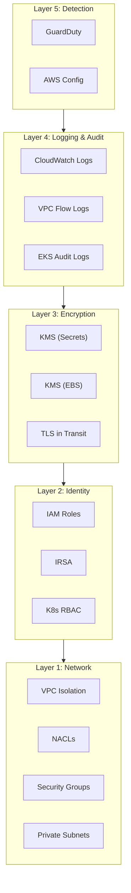

# 🛡️ Security Controls Documentation

This document explains every security measure implemented in this template.

---

## Defense in Depth Model

---

## 1. Network Security

### 1.1 VPC Isolation
- **Private subnets** for all worker nodes (no public IPs)
- **NAT Gateway** for controlled outbound internet access
- **Separate route tables** for public and private subnets

### 1.2 Network ACLs (Stateless Firewall)
| Subnet | Rule | Ports | Purpose |
|--------|------|-------|---------|
| Public | ALLOW | 80, 443 | HTTP/HTTPS inbound |
| Public | ALLOW | 1024-65535 | Ephemeral ports (return traffic) |
| Public | DENY | All others | Default deny |
| Private | ALLOW | HTTPS from VPC | API server communication |
| Private | ALLOW | 1024-65535 from VPC | Internal traffic |
| Private | DENY | All others | Default deny |

### 1.3 Security Groups (Stateful Firewall)
| Security Group | Direction | Port | Source/Dest | Purpose |
|----------------|-----------|------|-------------|---------|
| Cluster SG | Ingress | 443 | Node SG | Nodes → API server |
| Node SG | Ingress | 1025-65535 | Cluster SG | API server → nodes |
| Node SG | Ingress | All | Self (Node SG) | Node-to-node traffic |
| Both | Egress | All | 0.0.0.0/0 | Outbound access |

### 1.4 VPC Flow Logs
- **Captures**: ALL traffic (ACCEPT + REJECT)
- **Destination**: CloudWatch Logs
- **Retention**: 30 days
- **Use cases**: Forensics, anomaly detection, compliance auditing

---

## 2. Identity & Access Management

### 2.1 IAM Roles (Least Privilege)

**Cluster Role** — Only what EKS control plane needs:
- `AmazonEKSClusterPolicy`
- `AmazonEKSVPCResourceController`

**Node Role** — Only what worker nodes need:
- `AmazonEKSWorkerNodePolicy`
- `AmazonEKS_CNI_Policy`
- `AmazonEC2ContainerRegistryReadOnly`

### 2.2 IRSA (IAM Roles for Service Accounts)
- Each pod gets its **own IAM role** via OIDC
- No shared node-level credentials for application access
- Principle: pods only get permissions they actually need

---

## 3. Encryption

### 3.1 At Rest
| Data | Encryption Method | Key |
|------|-------------------|-----|
| K8s Secrets (etcd) | Envelope encryption | Dedicated KMS key |
| Secrets Manager values | AES-256 | Dedicated KMS key |
| EBS volumes (nodes) | AES-256 | AWS default EBS key |

### 3.2 In Transit
- **API Server**: TLS 1.2+ (HTTPS/443)
- **Node-to-Node**: VPC CNI native (within VPC)
- **Secrets Manager API**: HTTPS

### 3.3 Key Rotation
- All KMS keys have **automatic annual rotation** enabled
- Old data encrypted with previous key versions remains accessible

---

## 4. Compute Security

### 4.1 IMDSv2 Enforcement
- **What**: Blocks IMDSv1 requests (which are vulnerable to SSRF attacks)
- **How**: `http_tokens = "required"` in launch template
- **Impact**: Prevents credential theft via Server-Side Request Forgery

### 4.2 Node Configuration
- **gp3 EBS volumes** with encryption at rest
- **No public IPs** on worker nodes
- **Detailed monitoring** (1-minute CloudWatch metrics)
- **Spot instance taints** to prevent accidental scheduling

---

## 5. Monitoring & Detection

### 5.1 GuardDuty
- **EKS Audit Log Monitoring**: Detects suspicious K8s API calls
- **Malware Scanning**: Scans EBS volumes when threats are found
- **Finding frequency**: 15 minutes (production setting)

### 5.2 AWS Config Rules
| Rule | What It Checks |
|------|----------------|
| `EKS_CLUSTER_LOGGING_ENABLED` | All 5 log types enabled |
| `EKS_ENDPOINT_NO_PUBLIC_ACCESS` | API server public access |
| `EKS_SECRETS_ENCRYPTED` | KMS encryption for secrets |

### 5.3 Control Plane Logging
All 5 log types enabled:
1. **API** — API server request logs
2. **Audit** — Detailed audit trail (compliance requirement)
3. **Authenticator** — IAM authentication decisions
4. **Controller Manager** — Controller actions
5. **Scheduler** — Pod scheduling decisions

---

## Production Hardening Steps

1. **Disable public API endpoint** → `enable_public_endpoint = false`
2. **Restrict `public_access_cidrs`** → Your VPN/office CIDR only
3. **Enable S3 backend** → Uncomment backend block in `provider.tf`
4. **Multi-AZ NAT** → `single_nat_gateway = false`
5. **Deploy OPA/Kyverno** → Kubernetes policy enforcement
6. **Enable pod security standards** → Enforce restricted profile
7. **Set up SNS alerts** → GuardDuty findings → SNS → Email/Slack
