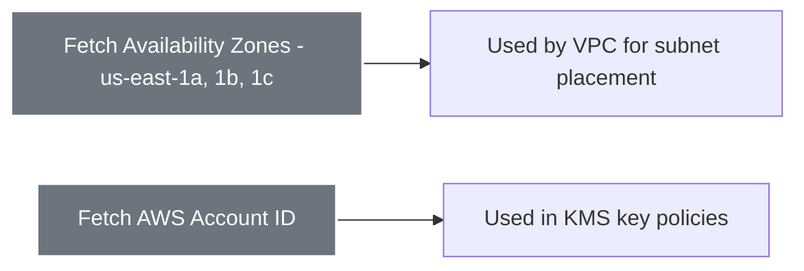
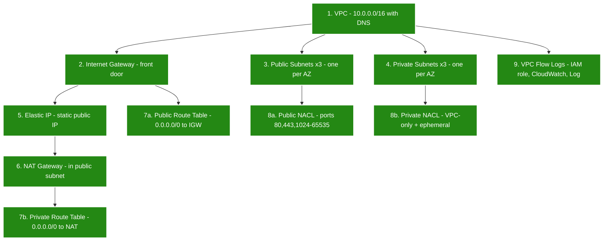
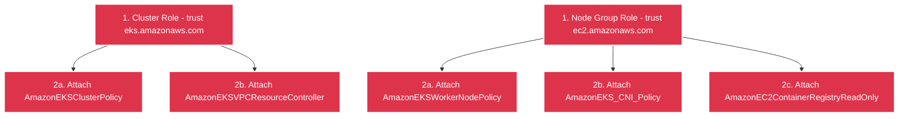
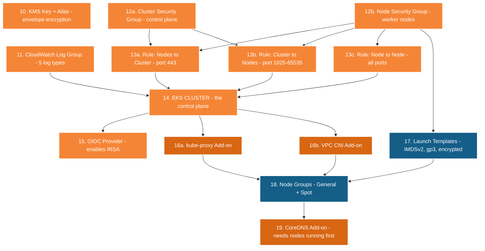
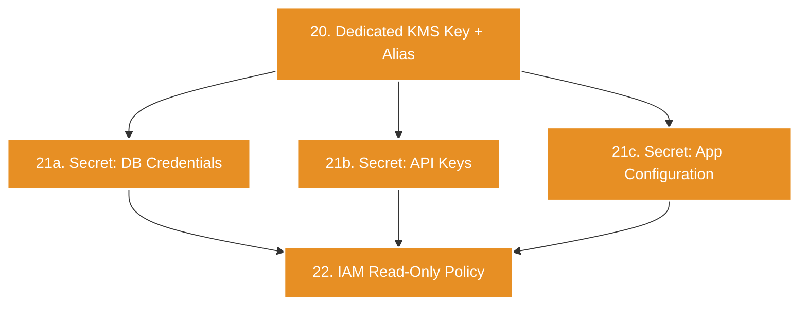
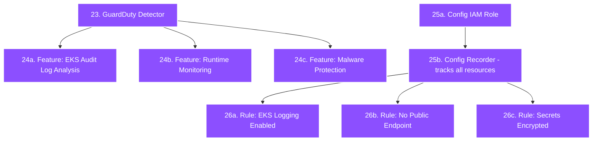

# 🏗️ Architecture Build Steps — How `main.tf` Creates Everything

This document shows the **exact order** in which Terraform creates all infrastructure resources when you run `terraform apply`. Each step depends on the previous steps being complete.

---

## Complete Build Order Diagram

```mermaid
graph TD
    classDef dataStyle fill:#6C757D,stroke:#fff,stroke-width:2px,color:#fff
    classDef vpcStyle fill:#248814,stroke:#fff,stroke-width:2px,color:#fff
    classDef iamStyle fill:#DD344C,stroke:#fff,stroke-width:2px,color:#fff
    classDef eksStyle fill:#F58536,stroke:#fff,stroke-width:2px,color:#fff
    classDef nodeStyle fill:#145E88,stroke:#fff,stroke-width:2px,color:#fff
    classDef addonStyle fill:#D86613,stroke:#fff,stroke-width:2px,color:#fff
    classDef secStyle fill:#8C4FFF,stroke:#fff,stroke-width:2px,color:#fff
    classDef smStyle fill:#E78F24,stroke:#fff,stroke-width:2px,color:#fff

    %% ── PHASE 0: DATA SOURCES ──
    AZ["Step 0a: Fetch Availability Zones"]
    CALLER["Step 0b: Fetch AWS Account ID"]

    %% ── PHASE 1: VPC MODULE ──
    VPC["Step 1: Create VPC - 10.0.0.0/16"]
    IGW["Step 2: Create Internet Gateway"]

    PUB1["Step 3a: Public Subnet AZ-A - 10.0.101.0/24"]
    PUB2["Step 3b: Public Subnet AZ-B - 10.0.102.0/24"]
    PUB3["Step 3c: Public Subnet AZ-C - 10.0.103.0/24"]

    PRIV1["Step 4a: Private Subnet AZ-A - 10.0.1.0/24"]
    PRIV2["Step 4b: Private Subnet AZ-B - 10.0.2.0/24"]
    PRIV3["Step 4c: Private Subnet AZ-C - 10.0.3.0/24"]

    EIP["Step 5: Elastic IP for NAT"]
    NAT["Step 6: NAT Gateway in Public Subnet"]

    PUB_RT["Step 7a: Public Route Table 0.0.0.0/0 to IGW"]
    PRIV_RT["Step 7b: Private Route Table 0.0.0.0/0 to NAT"]

    PUB_NACL["Step 8a: Public NACL - HTTP/HTTPS/Ephemeral"]
    PRIV_NACL["Step 8b: Private NACL - VPC Internal/Ephemeral"]

    FLOW_ROLE["Step 9a: Flow Logs IAM Role"]
    FLOW_CW["Step 9b: Flow Logs CloudWatch Log Group"]
    FLOW_LOG["Step 9c: VPC Flow Log - ALL Traffic"]

    %% ── PHASE 1B: IAM MODULE (parallel with VPC) ──
    CLUSTER_ROLE["Step 1i: EKS Cluster IAM Role - eks.amazonaws.com"]
    CP1["Step 2ia: Attach AmazonEKSClusterPolicy"]
    CP2["Step 2ib: Attach AmazonEKSVPCResourceController"]

    NODE_ROLE["Step 1ii: Node Group IAM Role - ec2.amazonaws.com"]
    NP1["Step 2iia: Attach AmazonEKSWorkerNodePolicy"]
    NP2["Step 2iib: Attach AmazonEKS_CNI_Policy"]
    NP3["Step 2iic: Attach AmazonEC2ContainerRegistryReadOnly"]

    %% ── PHASE 2: EKS MODULE ──
    KMS["Step 10: KMS Key + Alias for Secrets Encryption"]
    CW_LOG["Step 11: CloudWatch Log Group for Control Plane"]
    CLUSTER_SG["Step 12a: Cluster Security Group"]
    NODE_SG["Step 12b: Node Security Group"]

    SG_R1["Step 13a: SG Rule - Nodes to Cluster Port 443"]
    SG_R2["Step 13b: SG Rule - Cluster to Nodes Port 1025-65535"]
    SG_R3["Step 13c: SG Rule - Node to Node All Ports"]

    EKS_CLUSTER["Step 14: EKS Cluster - Kubernetes Control Plane"]

    OIDC_CERT["Step 15a: Fetch TLS Certificate from OIDC Issuer"]
    OIDC["Step 15b: Register OIDC Provider with IAM - IRSA"]

    KPROXY["Step 16a: Install kube-proxy Add-on"]
    VPC_CNI["Step 16b: Install VPC CNI Add-on"]

    LT_GEN["Step 17a: Launch Template - General - IMDSv2/gp3/Encrypted"]
    LT_SPOT["Step 17b: Launch Template - Spot - IMDSv2/gp3/Encrypted"]

    NG_GEN["Step 18a: Node Group - General - 2x t3.medium ON_DEMAND"]
    NG_SPOT["Step 18b: Node Group - Spot - 1x t3.medium SPOT"]

    COREDNS["Step 19: Install CoreDNS Add-on"]

    %% ── PHASE 3: SECRETS MANAGER MODULE ──
    SM_KMS["Step 20: Dedicated KMS Key for Secrets"]
    SM_DB["Step 21a: Secret - Database Credentials"]
    SM_API["Step 21b: Secret - API Keys"]
    SM_APP["Step 21c: Secret - App Configuration"]
    SM_POLICY["Step 22: IAM Read-Only Policy for Secrets"]

    %% ── PHASE 4: SECURITY MODULE ──
    GD["Step 23: GuardDuty Detector"]
    GD_EKS["Step 24a: GuardDuty Feature - EKS Audit Logs"]
    GD_RT["Step 24b: GuardDuty Feature - Runtime Monitoring"]
    GD_MAL["Step 24c: GuardDuty Feature - Malware Protection"]

    CFG_ROLE["Step 25a: AWS Config IAM Role"]
    CFG_REC["Step 25b: AWS Config Recorder"]
    CFG_R1["Step 26a: Config Rule - EKS Logging Enabled"]
    CFG_R2["Step 26b: Config Rule - No Public Endpoint"]
    CFG_R3["Step 26c: Config Rule - Secrets Encrypted"]

    %% ── EDGES: DATA SOURCES ──
    AZ --> VPC
    CALLER --> VPC

    %% ── EDGES: VPC BUILD ──
    VPC --> IGW
    VPC --> PUB1
    VPC --> PUB2
    VPC --> PUB3
    VPC --> PRIV1
    VPC --> PRIV2
    VPC --> PRIV3

    IGW --> EIP
    EIP --> NAT
    PUB1 --> NAT

    IGW --> PUB_RT
    NAT --> PRIV_RT

    PUB1 --> PUB_NACL
    PUB2 --> PUB_NACL
    PUB3 --> PUB_NACL
    PRIV1 --> PRIV_NACL
    PRIV2 --> PRIV_NACL
    PRIV3 --> PRIV_NACL

    VPC --> FLOW_ROLE
    FLOW_ROLE --> FLOW_CW
    FLOW_CW --> FLOW_LOG

    %% ── EDGES: IAM BUILD ──
    CLUSTER_ROLE --> CP1
    CLUSTER_ROLE --> CP2
    NODE_ROLE --> NP1
    NODE_ROLE --> NP2
    NODE_ROLE --> NP3

    %% ── EDGES: EKS BUILD ──
    PRIV1 --> KMS
    PRIV2 --> KMS
    PRIV3 --> KMS
    CP1 --> KMS
    CP2 --> KMS
    NP1 --> KMS
    NP2 --> KMS
    NP3 --> KMS

    KMS --> CW_LOG
    KMS --> CLUSTER_SG
    KMS --> NODE_SG

    CLUSTER_SG --> SG_R1
    NODE_SG --> SG_R1
    CLUSTER_SG --> SG_R2
    NODE_SG --> SG_R2
    NODE_SG --> SG_R3

    CW_LOG --> EKS_CLUSTER
    SG_R1 --> EKS_CLUSTER
    SG_R2 --> EKS_CLUSTER
    SG_R3 --> EKS_CLUSTER

    EKS_CLUSTER --> OIDC_CERT
    OIDC_CERT --> OIDC

    EKS_CLUSTER --> KPROXY
    EKS_CLUSTER --> VPC_CNI

    NODE_SG --> LT_GEN
    NODE_SG --> LT_SPOT

    LT_GEN --> NG_GEN
    LT_SPOT --> NG_SPOT
    VPC_CNI --> NG_GEN
    KPROXY --> NG_GEN
    VPC_CNI --> NG_SPOT
    KPROXY --> NG_SPOT

    NG_GEN --> COREDNS
    NG_SPOT --> COREDNS

    %% ── EDGES: SECRETS MANAGER BUILD ──
    SM_KMS --> SM_DB
    SM_KMS --> SM_API
    SM_KMS --> SM_APP
    SM_DB --> SM_POLICY
    SM_API --> SM_POLICY
    SM_APP --> SM_POLICY

    %% ── EDGES: SECURITY BUILD ──
    GD --> GD_EKS
    GD --> GD_RT
    GD --> GD_MAL

    CFG_ROLE --> CFG_REC
    CFG_REC --> CFG_R1
    CFG_REC --> CFG_R2
    CFG_REC --> CFG_R3

    %% ── STYLES ──
    class AZ,CALLER dataStyle
    class VPC,IGW,PUB1,PUB2,PUB3,PRIV1,PRIV2,PRIV3,EIP,NAT,PUB_RT,PRIV_RT,PUB_NACL,PRIV_NACL,FLOW_ROLE,FLOW_CW,FLOW_LOG vpcStyle
    class CLUSTER_ROLE,CP1,CP2,NODE_ROLE,NP1,NP2,NP3 iamStyle
    class KMS,CW_LOG,CLUSTER_SG,NODE_SG,SG_R1,SG_R2,SG_R3,EKS_CLUSTER,OIDC_CERT,OIDC eksStyle
    class KPROXY,VPC_CNI,COREDNS addonStyle
    class LT_GEN,LT_SPOT,NG_GEN,NG_SPOT nodeStyle
    class SM_KMS,SM_DB,SM_API,SM_APP,SM_POLICY smStyle
    class GD,GD_EKS,GD_RT,GD_MAL,CFG_ROLE,CFG_REC,CFG_R1,CFG_R2,CFG_R3 secStyle
```

---

## Phase-by-Phase Breakdown

### Phase 0 — Data Sources (Read Only)

These read information from AWS — they don't create anything. The AZ list ensures subnets are distributed across fault domains.

---

### Phase 1A — VPC Module (Networking Foundation)

**Why this order?** The VPC must exist before subnets, the IGW before route tables, subnets before NACLs, and the EIP before the NAT Gateway.

---

### Phase 1B — IAM Module (Runs in Parallel with VPC)

**IAM has no dependency on VPC** — Terraform creates both modules in parallel. This saves ~30 seconds of build time.

---

### Phase 2 — EKS Module (Needs VPC + IAM)

**Key dependencies:**
- The cluster needs security groups and the log group before creation
- OIDC provider needs the cluster to exist first (it reads the cluster's OIDC URL)
- Node groups need VPC CNI and kube-proxy add-ons to be installed first
- CoreDNS needs at least one node to schedule its pods on

---

### Phase 3 — Secrets Manager Module

This module has **no dependency on EKS** — it could technically run in parallel. But logically, you create the cluster first, then set up the secrets it will consume.

---

### Phase 4 — Security Module (Monitors Everything)

Security is the last layer — it monitors the infrastructure created by all previous modules.

---

## Build Timeline

| Phase | Module | Resources Created | Approx Time | Depends On |
|-------|--------|------------------|-------------|------------|
| **0** | Data Sources | 2 data lookups | ~2 sec | Nothing |
| **1A** | VPC | VPC, 6 subnets, IGW, NAT, routes, NACLs, flow logs | ~3 min | Phase 0 |
| **1B** | IAM | 2 roles, 5 policy attachments | ~30 sec | Phase 0 (parallel with 1A) |
| **2** | EKS | KMS, logs, SGs, cluster, OIDC, addons, nodes | ~15 min | Phase 1A + 1B |
| **3** | Secrets Manager | KMS, 3 secrets, IAM policy | ~30 sec | None (independent) |
| **4** | Security | GuardDuty, 3 features, Config, 3 rules | ~1 min | None (independent) |
| | | **Total: ~40+ resources** | **~20 min** | |

> **Note**: The EKS cluster creation alone takes ~10 minutes. This is by far the longest step, as AWS needs to provision 3 redundant API server instances across 3 AZs.

---

## Color Legend

| Color | Module |
|-------|--------|
| 🟢 Green | VPC — Networking |
| 🔴 Red | IAM — Identity |
| 🟠 Orange | EKS — Cluster & Control Plane |
| 🔵 Blue | EKS — Worker Nodes & Launch Templates |
| 🟤 Brown | EKS — Add-ons (CoreDNS, kube-proxy, VPC CNI) |
| 🟡 Yellow | Secrets Manager |
| 🟣 Purple | Security (GuardDuty, AWS Config) |
| ⚪ Gray | Data Sources |
