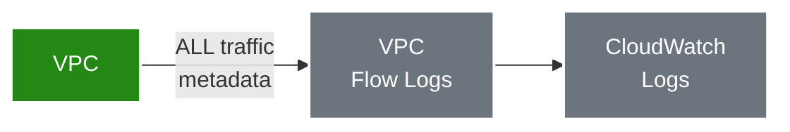

# 🏗️ Architecture Build Steps

How `terraform apply` builds the entire infrastructure — step by step.

---

## Step 1 — Create the VPC

The VPC is your private, isolated network inside AWS. Everything else lives inside it.


> Terraform: `aws_vpc.main` — Enables DNS support + DNS hostnames (required by EKS).

---

## Step 2 — Attach an Internet Gateway

The Internet Gateway is the "front door" — it connects the VPC to the public internet.


> Terraform: `aws_internet_gateway.main` — One per VPC. Fully managed by AWS.

---

## Step 3 — Create Public Subnets (×3)

One public subnet per Availability Zone for high availability.


> `map_public_ip_on_launch = true` — Instances here get public IPs automatically.
> Tagged with `kubernetes.io/role/elb = 1` so EKS places public load balancers here.

---

## Step 4 — Create Private Subnets (×3)

Worker nodes live here — no direct internet access.


> No public IPs. Tagged with `kubernetes.io/role/internal-elb = 1` for internal load balancers.

---

## Step 5 — Create NAT Gateway

NAT Gateway lets private subnets reach the internet (outbound only — for pulling images, DNS, etc.).


> NAT is placed in a public subnet. `single_nat_gateway = true` uses 1 NAT (~$33/mo) instead of 3.

---

## Step 6 — Create Route Tables

Route tables tell traffic where to go.

```mermaid
graph TD
    classDef rtStyle fill:#1ABC9C,stroke:#fff,stroke-width:2px,color:#fff
    classDef gwStyle fill:#D86613,stroke:#fff,stroke-width:2px,color:#fff

    PubRT["Public Route Table\n0.0.0.0/0 → Internet Gateway"] --> IGW["Internet\nGateway"]
    PrivRT["Private Route Table\n0.0.0.0/0 → NAT Gateway"] --> NAT["NAT\nGateway"]

    class PubRT,PrivRT rtStyle
    class IGW,NAT gwStyle
```



> Public subnets → Internet Gateway (direct access).
> Private subnets → NAT Gateway (outbound only).

---

## Step 7 — Create Network ACLs

NACLs are stateless subnet-level firewalls — a second layer of defense.


> NACLs are stateless — you must allow both request AND response traffic explicitly.

---

## Step 8 — Enable VPC Flow Logs (Optional)

Captures network traffic metadata for security auditing.



> Records source/destination IP, port, protocol, and accept/reject decisions. ~$5/month.

---

## Step 9 — Create IAM Cluster Role

EKS needs an IAM role to manage the control plane on your behalf. **This runs in parallel with VPC steps.**


> Only the EKS service can assume this role. It grants permissions to manage ENIs, load balancers, and logging.

---

## Step 10 — Create IAM Node Role

Worker nodes need their own IAM role to join the cluster and pull images.


> Nodes can register with EKS, assign VPC IPs to pods, and pull container images. Read-only ECR access.

---

## Step 11 — Create KMS Key for Secrets

A KMS key enables envelope encryption for Kubernetes secrets stored in etcd.


> Without KMS, secrets in etcd are just base64-encoded (not encrypted). This key encrypts the Data Encryption Keys.

---

## Step 12 — Create Security Groups

Two security groups control network access for the cluster and nodes.


> Nodes talk to the API on 443. The API reaches nodes on high ports for `kubectl exec/logs`. Nodes talk to each other freely.

---

## Step 13 — Create the EKS Cluster

The core resource — the Kubernetes control plane. **Takes ~10 minutes**.


> AWS runs 3 API server replicas across 3 AZs. You don't manage control plane nodes — AWS does.

---

## Step 14 — Register OIDC Provider (IRSA)

Enables pods to assume their own IAM roles instead of sharing the node role.

```mermaid
graph LR
    classDef eksStyle fill:#F58536,stroke:#fff,stroke-width:2px,color:#fff
    classDef irsaStyle fill:#8C4FFF,stroke:#fff,stroke-width:2px,color:#fff

    EKS["EKS Cluster"] -- "OIDC Issuer URL" --> OIDC["OIDC Provider\nRegistered in IAM"]
    OIDC -. "Pod → ServiceAccount → IAM Role" .-> Pods(("Fine-grained\npod permissions"))

    class EKS eksStyle
    class OIDC,Pods irsaStyle
```



> Without IRSA, all pods share the Node Role. With IRSA, each pod gets only the permissions it needs.

---

## Step 15 — Install EKS Add-ons

Three essential networking add-ons managed by AWS.


> VPC CNI + kube-proxy install immediately. CoreDNS waits for nodes (it needs somewhere to run).

---

## Step 16 — Create Launch Templates

Defines the EC2 instance configuration for worker nodes — security-hardened.


> IMDSv2 prevents SSRF credential theft (Capital One breach). Encrypted gp3 volumes with 3000 IOPS baseline.

---

## Step 17 — Create Managed Node Groups

The actual worker EC2 instances that run your pods.


> General: 2-4 nodes, never interrupted. Spot: 1-3 nodes, can be reclaimed with 2-min warning.
> Spot nodes are tainted — pods need a toleration to schedule there.

---

## Step 18 — Create Secrets Manager KMS Key

A **separate** KMS key dedicated to encrypting secrets (not the EKS one).


> Key separation: if one key is compromised, the other secrets remain safe.

---

## Step 19 — Create Secrets

Three types of secrets stored in AWS Secrets Manager.


> Each secret is conditionally created via `count` flags. 7-day recovery window prevents accidental deletion.

---

## Step 20 — Create Secrets Read-Only Policy

Least-privilege IAM policy for pods to read secrets.


> Only specific secret ARNs are allowed (no wildcards). Also grants `kms:Decrypt` for the secrets KMS key.

---

## Step 21 — Enable GuardDuty

Continuous threat detection using ML and threat intelligence.

```mermaid
graph TD
    classDef gdStyle fill:#8C4FFF,stroke:#fff,stroke-width:2px,color:#fff

    GD["GuardDuty\nDetector"] --> F1["EKS Audit\nLog Analysis"]
    GD --> F2["Runtime\nMonitoring"]
    GD --> F3["Malware\nProtection"]

    class GD,F1,F2,F3 gdStyle
```

> Analyzes VPC flow logs, EKS audit logs, and DNS queries. Detects crypto mining, compromised credentials, and unauthorized access.

---

## Step 22 — Enable AWS Config Rules

Configuration compliance monitoring — checks if your setup follows best practices.

```mermaid
graph TD
    classDef cfgStyle fill:#8C4FFF,stroke:#fff,stroke-width:2px,color:#fff

    REC["Config\nRecorder"] --> R1["Rule: EKS\nLogging Enabled?"]
    REC --> R2["Rule: No Public\nEndpoint?"]
    REC --> R3["Rule: Secrets\nEncrypted?"]

    class REC,R1,R2,R3 cfgStyle
```

> Config Recorder tracks all resource changes. Rules evaluate compliance automatically.

---

## Full Build Summary

| Step | What Gets Created | Module | Approx Time |
|------|------------------|--------|-------------|
| 1 | VPC | VPC | ~10 sec |
| 2 | Internet Gateway | VPC | ~10 sec |
| 3 | Public Subnets ×3 | VPC | ~15 sec |
| 4 | Private Subnets ×3 | VPC | ~15 sec |
| 5 | NAT Gateway + EIP | VPC | ~2 min |
| 6 | Route Tables | VPC | ~10 sec |
| 7 | Network ACLs | VPC | ~10 sec |
| 8 | VPC Flow Logs | VPC | ~15 sec |
| 9 | Cluster IAM Role + Policies | IAM | ~15 sec |
| 10 | Node IAM Role + Policies | IAM | ~15 sec |
| 11 | KMS Key for EKS | EKS | ~10 sec |
| 12 | Security Groups + Rules | EKS | ~15 sec |
| 13 | **EKS Cluster** | EKS | **~10 min** |
| 14 | OIDC Provider | EKS | ~10 sec |
| 15 | Add-ons (CNI, proxy, DNS) | EKS | ~2 min |
| 16 | Launch Templates | EKS | ~10 sec |
| 17 | Node Groups | EKS | ~3 min |
| 18 | Secrets KMS Key | Secrets | ~10 sec |
| 19 | Secrets (DB, API, App) | Secrets | ~15 sec |
| 20 | Secrets Read Policy | Secrets | ~10 sec |
| 21 | GuardDuty + Features | Security | ~30 sec |
| 22 | Config Rules | Security | ~30 sec |
| | **Total: ~40 resources** | | **~20 min** |

> **Step 13 (EKS Cluster)** alone takes ~10 minutes — AWS provisions 3 redundant API servers across 3 AZs.

---

## Dependency Overview

```mermaid
graph LR
    classDef vpcStyle fill:#248814,stroke:#fff,stroke-width:2px,color:#fff
    classDef iamStyle fill:#DD344C,stroke:#fff,stroke-width:2px,color:#fff
    classDef eksStyle fill:#F58536,stroke:#fff,stroke-width:2px,color:#fff
    classDef smStyle fill:#E78F24,stroke:#fff,stroke-width:2px,color:#fff
    classDef secStyle fill:#8C4FFF,stroke:#fff,stroke-width:2px,color:#fff

    VPC["VPC\nSteps 1-8"] --> EKS["EKS\nSteps 11-17"]
    IAM["IAM\nSteps 9-10"] --> EKS
    SM["Secrets\nSteps 18-20"]
    SEC["Security\nSteps 21-22"]

    class VPC vpcStyle
    class IAM iamStyle
    class EKS eksStyle
    class SM smStyle
    class SEC secStyle
```

> VPC and IAM build in **parallel**. EKS needs both. Secrets Manager and Security are independent.
