# 🏗️ Architecture Build Steps

How `terraform apply` builds the entire infrastructure — step by step, resource by resource.
Each step includes the actual Terraform code from the module and an architecture diagram.

---

## Phase 1 — VPC Module (Networking Foundation)

### Step 1 — Create the VPC

```hcl
resource "aws_vpc" "main" {
  cidr_block           = var.vpc_cidr
  enable_dns_hostnames = true
  enable_dns_support   = true

  tags = merge(var.tags, {
    Name = "${var.name_prefix}-vpc"
  })
}
```

```mermaid
graph TB
    subgraph VPC["VPC: 10.0.0.0/16"]
        DNS["✅ DNS Support Enabled\n✅ DNS Hostnames Enabled\n65,536 IP addresses"]
    end

    style DNS fill:#4CAF50,color:#fff
```

> `enable_dns_support` and `enable_dns_hostnames` are **required by EKS** — the kubelet uses DNS to register nodes.

---

### Step 2 — Attach Internet Gateway

```hcl
resource "aws_internet_gateway" "main" {
  vpc_id = aws_vpc.main.id

  tags = merge(var.tags, {
    Name = "${var.name_prefix}-igw"
  })
}
```

```mermaid
graph TB
    Internet(("🌐 Internet"))

    subgraph VPC["VPC: 10.0.0.0/16"]
        IGW["🟠 Internet Gateway"]
    end

    Internet <--> IGW

    style IGW fill:#FF9800,color:#000
```

> One IGW per VPC. It's the "front door" — only public subnets use it.

---

### Step 3 — Create Public Subnets (×3)

```hcl
resource "aws_subnet" "public" {
  count                   = length(var.public_subnets)
  vpc_id                  = aws_vpc.main.id
  cidr_block              = var.public_subnets[count.index]
  availability_zone       = var.azs[count.index]
  map_public_ip_on_launch = true

  tags = merge(var.tags, var.public_subnet_tags, {
    Name = "${var.name_prefix}-public-${var.azs[count.index]}"
    Type = "public"
  })
}
```

```mermaid
graph TB
    Internet(("🌐 Internet")) <--> IGW

    subgraph VPC["VPC: 10.0.0.0/16"]
        IGW["🟠 Internet Gateway"]

        subgraph AZ1["AZ-A"]
            PUB1["🟢 Public Subnet\n10.0.101.0/24"]
        end
        subgraph AZ2["AZ-B"]
            PUB2["🟢 Public Subnet\n10.0.102.0/24"]
        end
        subgraph AZ3["AZ-C"]
            PUB3["🟢 Public Subnet\n10.0.103.0/24"]
        end
    end

    IGW <--> PUB1
    IGW <--> PUB2
    IGW <--> PUB3

    style PUB1 fill:#4CAF50,color:#fff
    style PUB2 fill:#4CAF50,color:#fff
    style PUB3 fill:#4CAF50,color:#fff
    style IGW fill:#FF9800,color:#000
```

> `map_public_ip_on_launch = true` — instances get public IPs automatically.
> Tagged with `kubernetes.io/role/elb = 1` so EKS places public ALBs here.

---

### Step 4 — Create Private Subnets (×3)

```hcl
resource "aws_subnet" "private" {
  count             = length(var.private_subnets)
  vpc_id            = aws_vpc.main.id
  cidr_block        = var.private_subnets[count.index]
  availability_zone = var.azs[count.index]

  tags = merge(var.tags, var.private_subnet_tags, {
    Name = "${var.name_prefix}-private-${var.azs[count.index]}"
    Type = "private"
  })
}
```

```mermaid
graph TB
    Internet(("🌐 Internet")) <--> IGW

    subgraph VPC["VPC: 10.0.0.0/16"]
        IGW["🟠 Internet Gateway"]

        subgraph AZ1["AZ-A"]
            PUB1["🟢 Public\n10.0.101.0/24"]
            PRIV1["🔵 Private\n10.0.1.0/24"]
        end
        subgraph AZ2["AZ-B"]
            PUB2["🟢 Public\n10.0.102.0/24"]
            PRIV2["🔵 Private\n10.0.2.0/24"]
        end
        subgraph AZ3["AZ-C"]
            PUB3["🟢 Public\n10.0.103.0/24"]
            PRIV3["🔵 Private\n10.0.3.0/24"]
        end
    end

    IGW <--> PUB1
    IGW <--> PUB2
    IGW <--> PUB3

    style PUB1 fill:#4CAF50,color:#fff
    style PUB2 fill:#4CAF50,color:#fff
    style PUB3 fill:#4CAF50,color:#fff
    style PRIV1 fill:#2196F3,color:#fff
    style PRIV2 fill:#2196F3,color:#fff
    style PRIV3 fill:#2196F3,color:#fff
    style IGW fill:#FF9800,color:#000
```

> No public IPs. EKS worker nodes live here. Tagged with `kubernetes.io/role/internal-elb = 1`.

---

### Step 5 — Create Elastic IP + NAT Gateway

```hcl
resource "aws_eip" "nat" {
  count  = var.enable_nat_gateway ? (var.single_nat_gateway ? 1 : length(var.public_subnets)) : 0
  domain = "vpc"
  depends_on = [aws_internet_gateway.main]
}

resource "aws_nat_gateway" "main" {
  count         = var.enable_nat_gateway ? (var.single_nat_gateway ? 1 : length(var.public_subnets)) : 0
  allocation_id = aws_eip.nat[count.index].id
  subnet_id     = aws_subnet.public[count.index].id
  depends_on    = [aws_internet_gateway.main]
}
```

```mermaid
graph TB
    Internet(("🌐 Internet")) <--> IGW

    subgraph VPC["VPC: 10.0.0.0/16"]
        IGW["🟠 Internet Gateway"]

        subgraph AZ1["AZ-A"]
            PUB1["🟢 Public\n10.0.101.0/24"]
            PRIV1["🔵 Private\n10.0.1.0/24"]
        end
        subgraph AZ2["AZ-B"]
            PUB2["🟢 Public\n10.0.102.0/24"]
            PRIV2["🔵 Private\n10.0.2.0/24"]
        end

        NAT["🟠 NAT Gateway\n+ Elastic IP\nin Public Subnet AZ-A"]
    end

    IGW <--> PUB1
    IGW <--> PUB2
    NAT --> IGW
    PRIV1 -->|"Outbound only\n0.0.0.0/0 → NAT"| NAT
    PRIV2 -->|"Outbound only\n0.0.0.0/0 → NAT"| NAT

    style PUB1 fill:#4CAF50,color:#fff
    style PUB2 fill:#4CAF50,color:#fff
    style PRIV1 fill:#2196F3,color:#fff
    style PRIV2 fill:#2196F3,color:#fff
    style IGW fill:#FF9800,color:#000
    style NAT fill:#FF9800,color:#000
```

> `single_nat_gateway = true` creates 1 NAT (~$33/mo). Set `false` for HA (1 per AZ, ~$100/mo).
> NAT must be in a public subnet. Private subnets use it for outbound-only internet access.

---

### Step 6 — Create Public Route Table + Route

```hcl
resource "aws_route_table" "public" {
  vpc_id = aws_vpc.main.id
}

resource "aws_route" "public_internet_gateway" {
  route_table_id         = aws_route_table.public.id
  destination_cidr_block = "0.0.0.0/0"
  gateway_id             = aws_internet_gateway.main.id
}

resource "aws_route_table_association" "public" {
  count          = length(var.public_subnets)
  subnet_id      = aws_subnet.public[count.index].id
  route_table_id = aws_route_table.public.id
}
```

> `0.0.0.0/0 → IGW` means "all traffic not destined for the VPC goes to the Internet Gateway."
> Each public subnet is explicitly associated with this route table.

---

### Step 7 — Create Private Route Table + Route

```hcl
resource "aws_route_table" "private" {
  count  = var.single_nat_gateway ? 1 : length(var.private_subnets)
  vpc_id = aws_vpc.main.id
}

resource "aws_route" "private_nat_gateway" {
  count                  = var.enable_nat_gateway ? (var.single_nat_gateway ? 1 : length(var.private_subnets)) : 0
  route_table_id         = aws_route_table.private[count.index].id
  destination_cidr_block = "0.0.0.0/0"
  nat_gateway_id         = aws_nat_gateway.main[count.index].id
}

resource "aws_route_table_association" "private" {
  count          = length(var.private_subnets)
  subnet_id      = aws_subnet.private[count.index].id
  route_table_id = var.single_nat_gateway ? aws_route_table.private[0].id : aws_route_table.private[count.index].id
}
```

> `0.0.0.0/0 → NAT` means "all outbound traffic from private subnets goes through NAT Gateway."
> With `single_nat_gateway`, all private subnets share one route table pointing to the same NAT.

---

### Step 8 — Create Public NACL

```hcl
resource "aws_network_acl" "public" {
  vpc_id     = aws_vpc.main.id
  subnet_ids = aws_subnet.public[*].id

  ingress {
    rule_no = 100; protocol = "tcp"; action = "allow"
    cidr_block = "0.0.0.0/0"; from_port = 443; to_port = 443
  }
  ingress {
    rule_no = 200; protocol = "tcp"; action = "allow"
    cidr_block = "0.0.0.0/0"; from_port = 80; to_port = 80
  }
  ingress {
    rule_no = 300; protocol = "tcp"; action = "allow"
    cidr_block = "0.0.0.0/0"; from_port = 1024; to_port = 65535
  }
  ingress {
    rule_no = 400; protocol = "-1"; action = "allow"
    cidr_block = var.vpc_cidr; from_port = 0; to_port = 0
  }
  egress {
    rule_no = 100; protocol = "-1"; action = "allow"
    cidr_block = "0.0.0.0/0"; from_port = 0; to_port = 0
  }
}
```

```mermaid
graph TB
    subgraph VPC["VPC"]
        subgraph NACL_PUB["🛡️ Public NACL"]
            R100["Rule 100: Allow HTTPS 443"]
            R200["Rule 200: Allow HTTP 80"]
            R300["Rule 300: Allow Ephemeral 1024-65535"]
            R400["Rule 400: Allow VPC Internal"]
            E100["Egress 100: Allow ALL outbound"]
        end

        PUB["🟢 Public Subnets x3"]
    end

    NACL_PUB --- PUB

    style R100 fill:#4CAF50,color:#fff
    style R200 fill:#4CAF50,color:#fff
    style R300 fill:#FF9800,color:#000
    style R400 fill:#2196F3,color:#fff
    style E100 fill:#607D8B,color:#fff
    style PUB fill:#4CAF50,color:#fff
```

> NACLs are **stateless** — Rule 300 (ephemeral ports) is needed because response traffic isn't auto-allowed.

---

### Step 9 — Create Private NACL

```hcl
resource "aws_network_acl" "private" {
  vpc_id     = aws_vpc.main.id
  subnet_ids = aws_subnet.private[*].id

  ingress {
    rule_no = 100; protocol = "-1"; action = "allow"
    cidr_block = var.vpc_cidr; from_port = 0; to_port = 0
  }
  ingress {
    rule_no = 200; protocol = "tcp"; action = "allow"
    cidr_block = "0.0.0.0/0"; from_port = 1024; to_port = 65535
  }
  egress {
    rule_no = 100; protocol = "-1"; action = "allow"
    cidr_block = "0.0.0.0/0"; from_port = 0; to_port = 0
  }
}
```

```mermaid
graph TB
    subgraph VPC["VPC"]
        subgraph NACL_PRIV["🛡️ Private NACL"]
            R100P["Rule 100: Allow VPC Internal ONLY"]
            R200P["Rule 200: Allow Ephemeral 1024-65535"]
            E100P["Egress 100: Allow ALL outbound"]
        end

        PRIV["🔵 Private Subnets x3"]
    end

    NACL_PRIV --- PRIV

    style R100P fill:#2196F3,color:#fff
    style R200P fill:#FF9800,color:#000
    style E100P fill:#607D8B,color:#fff
    style PRIV fill:#2196F3,color:#fff
```

> Private NACL is more restrictive — only VPC-internal traffic and ephemeral response ports are allowed inbound.

---

### Step 10 — Enable VPC Flow Logs

```hcl
resource "aws_iam_role" "flow_log" {
  count       = var.enable_flow_logs ? 1 : 0
  name_prefix = "${var.name_prefix}-vpc-flow-log-"
  assume_role_policy = jsonencode({
    Version = "2012-10-17"
    Statement = [{
      Action = "sts:AssumeRole"; Effect = "Allow"
      Principal = { Service = "vpc-flow-logs.amazonaws.com" }
    }]
  })
}

resource "aws_cloudwatch_log_group" "flow_log" {
  count             = var.enable_flow_logs ? 1 : 0
  name              = "/aws/vpc/${var.name_prefix}/flow-logs"
  retention_in_days = 30
}

resource "aws_flow_log" "main" {
  count        = var.enable_flow_logs ? 1 : 0
  vpc_id       = aws_vpc.main.id
  traffic_type = "ALL"
  iam_role_arn    = aws_iam_role.flow_log[0].arn
  log_destination = aws_cloudwatch_log_group.flow_log[0].arn
}
```


> `traffic_type = "ALL"` captures accepted + rejected traffic. Needs its own IAM role to write to CloudWatch.

---

## Phase 2 — IAM Module (Runs in Parallel with VPC)

### Step 11 — Create EKS Cluster IAM Role

```hcl
resource "aws_iam_role" "cluster" {
  name_prefix = "${var.cluster_name}-cluster-"

  assume_role_policy = jsonencode({
    Version = "2012-10-17"
    Statement = [{
      Action = "sts:AssumeRole"
      Effect = "Allow"
      Principal = { Service = "eks.amazonaws.com" }
    }]
  })
}

resource "aws_iam_role_policy_attachment" "cluster_policy" {
  policy_arn = "arn:aws:iam::aws:policy/AmazonEKSClusterPolicy"
  role       = aws_iam_role.cluster.name
}

resource "aws_iam_role_policy_attachment" "cluster_vpc_resource_controller" {
  policy_arn = "arn:aws:iam::aws:policy/AmazonEKSVPCResourceController"
  role       = aws_iam_role.cluster.name
}
```

```mermaid
graph TB
    subgraph IAM["IAM"]
        subgraph Cluster_Role["EKS Cluster Role"]
            CR["🔴 Trust: eks.amazonaws.com\nOnly EKS service can assume"]
            P1["📜 AmazonEKSClusterPolicy\nManage API server, ENIs, logs"]
            P2["📜 AmazonEKSVPCResourceController\nManage VPC networking for pods"]
            CR --> P1
            CR --> P2
        end
    end

    style CR fill:#F44336,color:#fff
    style P1 fill:#FF9800,color:#000
    style P2 fill:#FF9800,color:#000
```

> Trust policy ensures only `eks.amazonaws.com` can assume this role — not humans, not Lambda.

---

### Step 12 — Create Node Group IAM Role

```hcl
resource "aws_iam_role" "node_group" {
  name_prefix = "${var.cluster_name}-node-"

  assume_role_policy = jsonencode({
    Version = "2012-10-17"
    Statement = [{
      Action = "sts:AssumeRole"
      Effect = "Allow"
      Principal = { Service = "ec2.amazonaws.com" }
    }]
  })
}

resource "aws_iam_role_policy_attachment" "node_worker_policy" {
  policy_arn = "arn:aws:iam::aws:policy/AmazonEKSWorkerNodePolicy"
  role       = aws_iam_role.node_group.name
}

resource "aws_iam_role_policy_attachment" "node_cni_policy" {
  policy_arn = "arn:aws:iam::aws:policy/AmazonEKS_CNI_Policy"
  role       = aws_iam_role.node_group.name
}

resource "aws_iam_role_policy_attachment" "node_registry_policy" {
  policy_arn = "arn:aws:iam::aws:policy/AmazonEC2ContainerRegistryReadOnly"
  role       = aws_iam_role.node_group.name
}
```

```mermaid
graph TB
    subgraph IAM["IAM"]
        subgraph Node_Role["Node Group Role"]
            NR["🔴 Trust: ec2.amazonaws.com\nOnly EC2 instances can assume"]
            NP1["📜 AmazonEKSWorkerNodePolicy\nRegister with EKS, report status"]
            NP2["📜 AmazonEKS_CNI_Policy\nAssign VPC IPs to pods"]
            NP3["📜 EC2ContainerRegistryReadOnly\nPull images from ECR"]
            NR --> NP1
            NR --> NP2
            NR --> NP3
        end
    end

    style NR fill:#F44336,color:#fff
    style NP1 fill:#FF9800,color:#000
    style NP2 fill:#FF9800,color:#000
    style NP3 fill:#FF9800,color:#000
```

> Without `WorkerNodePolicy`, nodes show as `NotReady`. Without `ECR ReadOnly`, pods fail with `no basic auth credentials`.

---

## Phase 3 — EKS Module (Needs VPC + IAM)

### Step 13 — Create KMS Key for Secrets Encryption

```hcl
resource "aws_kms_key" "eks" {
  description             = "KMS key for EKS cluster ${var.cluster_name} encryption"
  deletion_window_in_days = 7
  enable_key_rotation     = true

  tags = merge(var.tags, { Name = "${var.cluster_name}-eks-kms" })
}

resource "aws_kms_alias" "eks" {
  name          = "alias/${var.cluster_name}-eks"
  target_key_id = aws_kms_key.eks.key_id
}
```

```mermaid
graph LR
    subgraph KMS_Layer["KMS - Key Management Service"]
        KEY["🔑 KMS Master Key\n✅ Auto-rotation yearly\n✅ 7-day deletion window"]
        ALIAS["Alias: alias/eks-cluster-eks"]
        KEY --- ALIAS
    end

    SECRET["K8s Secret"] -->|"1. Generate DEK"| DEK["Data Encryption Key"]
    DEK -->|"2. Encrypt secret"| ENCRYPTED["Encrypted Secret"]
    KEY -.->|"3. Encrypt the DEK"| DEK
    ENCRYPTED --> ETCD[("etcd")]

    style KEY fill:#F44336,color:#fff
    style ENCRYPTED fill:#607D8B,color:#fff
```

> Envelope encryption: each secret gets its own DEK, and the KMS key encrypts the DEK. No custom `policy` block needed — AWS default key policy grants root account access.

---

### Step 14 — Create CloudWatch Log Group

```hcl
resource "aws_cloudwatch_log_group" "eks" {
  count             = var.enable_cluster_logging ? 1 : 0
  name              = "/aws/eks/${var.cluster_name}/cluster"
  retention_in_days = 30
  tags              = var.tags
}
```

> Pre-creating the log group lets us control retention. Without this, AWS creates one with **infinite retention** (growing cost).
> The name `/aws/eks/<cluster>/cluster` is required by AWS — it won't send logs to a differently named group.

---

### Step 15 — Create Cluster Security Group

```hcl
resource "aws_security_group" "cluster" {
  name_prefix = "${var.cluster_name}-cluster-sg-"
  description = "Security group for EKS cluster control plane"
  vpc_id      = var.vpc_id

  egress {
    from_port   = 0
    to_port     = 0
    protocol    = "-1"
    cidr_blocks = ["0.0.0.0/0"]
    description = "Allow all outbound traffic"
  }

  tags = merge(var.tags, { Name = "${var.cluster_name}-cluster-sg" })

  lifecycle { create_before_destroy = true }
}
```

> `name_prefix` adds a random suffix to avoid naming collisions. `lifecycle { create_before_destroy }` prevents downtime during SG replacement.

---

### Step 16 — Create Node Security Group

```hcl
resource "aws_security_group" "node" {
  name_prefix = "${var.cluster_name}-node-sg-"
  description = "Security group for EKS worker nodes"
  vpc_id      = var.vpc_id

  egress {
    from_port = 0; to_port = 0; protocol = "-1"
    cidr_blocks = ["0.0.0.0/0"]
  }

  tags = merge(var.tags, {
    Name = "${var.cluster_name}-node-sg"
    "kubernetes.io/cluster/${var.cluster_name}" = "owned"
  })

  lifecycle { create_before_destroy = true }
}
```

> The `kubernetes.io/cluster` tag is functional — the AWS Load Balancer Controller uses it to find nodes for target groups.

---

### Step 17 — Create Security Group Rules

```hcl
resource "aws_security_group_rule" "node_to_cluster" {
  type = "ingress"; from_port = 443; to_port = 443; protocol = "tcp"
  security_group_id        = aws_security_group.cluster.id
  source_security_group_id = aws_security_group.node.id
}

resource "aws_security_group_rule" "cluster_to_node" {
  type = "ingress"; from_port = 1025; to_port = 65535; protocol = "tcp"
  security_group_id        = aws_security_group.node.id
  source_security_group_id = aws_security_group.cluster.id
}

resource "aws_security_group_rule" "node_to_node" {
  type = "ingress"; from_port = 0; to_port = 65535; protocol = "-1"
  security_group_id = aws_security_group.node.id
  self              = true
}
```

```mermaid
graph LR
    subgraph SGs["Security Group Rules"]
        CSG["🟠 Cluster SG\nControl Plane"]
        NSG["🟠 Node SG\nWorker Nodes"]

        NSG -->|"Port 443\nkubelet → API"| CSG
        CSG -->|"Port 1025-65535\nkubectl exec/logs"| NSG
        NSG -->|"All ports\npod-to-pod"| NSG
    end

    style CSG fill:#FF9800,color:#000
    style NSG fill:#FF9800,color:#000
```

> `self = true` allows node-to-node traffic on all ports (pod networking, DNS, metrics scraping).

---

### Step 18 — Create EKS Cluster (~10 min)

```hcl
resource "aws_eks_cluster" "main" {
  name     = var.cluster_name
  version  = var.kubernetes_version
  role_arn = var.cluster_role_arn

  vpc_config {
    subnet_ids              = var.subnet_ids
    endpoint_public_access  = var.endpoint_public_access
    endpoint_private_access = var.endpoint_private_access
    public_access_cidrs     = var.public_access_cidrs
    security_group_ids      = [aws_security_group.cluster.id]
  }

  encryption_config {
    provider { key_arn = aws_kms_key.eks.arn }
    resources = ["secrets"]
  }

  enabled_cluster_log_types = var.enable_cluster_logging ? [
    "api", "audit", "authenticator", "controllerManager", "scheduler"
  ] : []

  depends_on = [aws_cloudwatch_log_group.eks]
}
```

```mermaid
graph TB
    Admin(("👤 kubectl"))

    subgraph AWS_Managed["AWS-Managed Infrastructure"]
        subgraph CP["EKS Control Plane"]
            API["🟠 API Server\nx3 replicas across 3 AZs"]
            ETCD[("etcd\n🔑 KMS encrypted")]
            CM["Controller\nManager"]
            SCHED["Scheduler"]
            API <--> ETCD
            API <--> CM
            API <--> SCHED
        end
    end

    subgraph Customer_VPC["Customer VPC"]
        ENI["🟣 EKS-managed ENIs\nin Private Subnets"]
    end

    Admin -->|"HTTPS :443"| API
    API <-->|"Private Link"| ENI

    style API fill:#FF9800,color:#000
    style ETCD fill:#F44336,color:#fff
    style CM fill:#FF9800,color:#000
    style SCHED fill:#FF9800,color:#000
    style ENI fill:#9C27B0,color:#fff
```

> The longest step (~10 min). AWS provisions 3 redundant API servers. `encryption_config` enables envelope encryption for secrets in etcd.

---

### Step 19 — Register OIDC Provider (IRSA)

```hcl
data "tls_certificate" "cluster" {
  count = var.enable_irsa ? 1 : 0
  url   = aws_eks_cluster.main.identity[0].oidc[0].issuer
}

resource "aws_iam_openid_connect_provider" "cluster" {
  count           = var.enable_irsa ? 1 : 0
  client_id_list  = ["sts.amazonaws.com"]
  thumbprint_list = [data.tls_certificate.cluster[0].certificates[0].sha1_fingerprint]
  url             = aws_eks_cluster.main.identity[0].oidc[0].issuer
}
```

```mermaid
graph TB
    subgraph EKS["EKS Cluster"]
        API["🟠 API Server"]
        OIDC_URL["OIDC Issuer URL"]
    end

    subgraph IAM_Layer["IAM"]
        OIDC["🟣 OIDC Provider\nRegistered with thumbprint"]
    end

    subgraph Pods["Per-Pod Permissions"]
        PA["Pod A → S3 ReadOnly"]
        PB["Pod B → DynamoDB Write"]
        PC["Pod C → No extra perms"]
    end

    API --> OIDC_URL
    OIDC_URL -->|"TLS thumbprint"| OIDC
    OIDC -.->|"ServiceAccount → IAM Role"| Pods

    style API fill:#FF9800,color:#000
    style OIDC fill:#9C27B0,color:#fff
    style PA fill:#2196F3,color:#fff
    style PB fill:#2196F3,color:#fff
    style PC fill:#2196F3,color:#fff
```

> Without IRSA: all pods share the broad Node Role. With IRSA: each pod gets its own least-privilege IAM Role.

---

### Step 20 — Install kube-proxy Add-on

```hcl
resource "aws_eks_addon" "kube_proxy" {
  cluster_name                = aws_eks_cluster.main.name
  addon_name                  = "kube-proxy"
  addon_version               = var.kube_proxy_version != "" ? var.kube_proxy_version : null
  resolve_conflicts_on_create = "OVERWRITE"
  resolve_conflicts_on_update = "OVERWRITE"
}
```

> kube-proxy is a DaemonSet — it auto-deploys to each node as it joins. Maintains iptables/IPVS rules for Kubernetes Service routing.

---

### Step 21 — Install VPC CNI Add-on

```hcl
resource "aws_eks_addon" "vpc_cni" {
  cluster_name                = aws_eks_cluster.main.name
  addon_name                  = "vpc-cni"
  addon_version               = var.vpc_cni_version != "" ? var.vpc_cni_version : null
  resolve_conflicts_on_create = "OVERWRITE"
  resolve_conflicts_on_update = "OVERWRITE"
}
```

> VPC CNI assigns real VPC IPs (10.0.x.x) to each pod — no overlay network. Pods are directly addressable in the VPC.

---

### Step 22 — Create Launch Templates

```hcl
resource "aws_launch_template" "node" {
  for_each    = var.node_groups
  name_prefix = "${var.cluster_name}-${each.key}-"

  block_device_mappings {
    device_name = "/dev/xvda"
    ebs {
      volume_size = lookup(each.value, "disk_size", 20)
      volume_type = "gp3"; iops = 3000; throughput = 125
      delete_on_termination = true; encrypted = true
    }
  }

  metadata_options {
    http_endpoint               = "enabled"
    http_tokens                 = "required"
    http_put_response_hop_limit = 2
    instance_metadata_tags      = "enabled"
  }

  monitoring { enabled = var.enable_detailed_monitoring }

  network_interfaces {
    associate_public_ip_address = false
    delete_on_termination       = true
    security_groups             = [aws_security_group.node.id]
  }

  lifecycle { create_before_destroy = true }
}
```

```mermaid
graph TB
    subgraph LT["📋 Launch Template"]
        IMDSv2["✅ IMDSv2 Enforced\nBlocks SSRF credential theft"]
        EBS["✅ EBS: gp3 Encrypted\n3000 IOPS, 125 MiB/s"]
        NOIP["✅ No Public IP\nPrivate subnets only"]
        NSG_REF["✅ Node Security Group"]
    end

    style IMDSv2 fill:#F44336,color:#fff
    style EBS fill:#607D8B,color:#fff
    style NOIP fill:#2196F3,color:#fff
    style NSG_REF fill:#FF9800,color:#000
```

> `http_tokens = "required"` enforces IMDSv2 — the Capital One breach exploited IMDSv1 via SSRF.
> `hop_limit = 2` because containers are 2 hops from the instance metadata endpoint.

---

### Step 23 — Create Managed Node Groups

```hcl
resource "aws_eks_node_group" "main" {
  for_each        = var.node_groups
  cluster_name    = aws_eks_cluster.main.name
  node_group_name = each.key
  node_role_arn   = var.node_role_arn
  subnet_ids      = var.subnet_ids
  version         = var.kubernetes_version

  scaling_config {
    desired_size = each.value.desired_size
    max_size     = each.value.max_size
    min_size     = each.value.min_size
  }

  instance_types = each.value.instance_types
  capacity_type  = lookup(each.value, "capacity_type", "ON_DEMAND")
  labels         = lookup(each.value, "labels", {})

  dynamic "taint" {
    for_each = coalesce(lookup(each.value, "taints", null), [])
    content {
      key = taint.value.key; value = taint.value.value; effect = taint.value.effect
    }
  }

  launch_template {
    id      = aws_launch_template.node[each.key].id
    version = aws_launch_template.node[each.key].latest_version
  }

  depends_on = [aws_eks_addon.vpc_cni, aws_eks_addon.kube_proxy]

  lifecycle { ignore_changes = [scaling_config[0].desired_size] }
}
```

```mermaid
graph TB
    subgraph Customer_VPC["Customer VPC"]
        subgraph CP["EKS Control Plane"]
            API["🟠 API Server"]
        end

        subgraph PRIV_A["Private Subnet AZ-A"]
            G1["🔵 t3.medium\nON_DEMAND\nNode 1"]
            G2["🔵 t3.medium\nON_DEMAND\nNode 2"]
        end

        subgraph PRIV_B["Private Subnet AZ-B"]
            S1["🟡 t3.medium\nSPOT - 90% off\nTainted: spot=true"]
        end
    end

    API -->|"Port 443"| G1
    API -->|"Port 443"| G2
    API -->|"Port 443"| S1

    style API fill:#FF9800,color:#000
    style G1 fill:#2196F3,color:#fff
    style G2 fill:#2196F3,color:#fff
    style S1 fill:#FFC107,color:#000
```

> `lifecycle { ignore_changes = [desired_size] }` prevents Terraform from fighting with the Cluster Autoscaler.
> Spot nodes are tainted — pods need a `toleration` to schedule there.

---

### Step 24 — Install CoreDNS Add-on

```hcl
resource "aws_eks_addon" "coredns" {
  cluster_name                = aws_eks_cluster.main.name
  addon_name                  = "coredns"
  addon_version               = var.coredns_version != "" ? var.coredns_version : null
  resolve_conflicts_on_create = "OVERWRITE"
  resolve_conflicts_on_update = "OVERWRITE"
  depends_on                  = [aws_eks_node_group.main]
}
```

> CoreDNS is a Deployment (not a DaemonSet) — it needs at least one running node. That's why it `depends_on` the node groups.
> Resolves `my-svc.default.svc.cluster.local` → ClusterIP.

---

## Phase 4 — Secrets Manager Module

### Step 25 — Create Dedicated KMS Key for Secrets

```hcl
resource "aws_kms_key" "secrets" {
  count                   = var.create_db_secret || var.create_api_secret || var.create_app_config_secret ? 1 : 0
  description             = "KMS key for Secrets Manager encryption"
  deletion_window_in_days = 7
  enable_key_rotation     = true
}
```

> Separate KMS key from the EKS one — different access policies, different blast radius if compromised.

---

### Step 26 — Create Secrets

```hcl
resource "aws_secretsmanager_secret" "db_credentials" {
  count                   = var.create_db_secret ? 1 : 0
  name                    = "${var.name_prefix}-db-credentials"
  kms_key_id              = aws_kms_key.secrets[0].id
  recovery_window_in_days = 7
}

resource "aws_secretsmanager_secret_version" "db_credentials" {
  count     = var.create_db_secret ? 1 : 0
  secret_id = aws_secretsmanager_secret.db_credentials[0].id
  secret_string = jsonencode({
    username = var.db_username; password = var.db_password
    engine = var.db_engine; host = var.db_host
    port = var.db_port; dbname = var.db_name
  })
}
```

```mermaid
graph TB
    subgraph SM["AWS Secrets Manager"]
        KMS_SM["🔑 Dedicated\nKMS Key"]
        DB["🟡 DB Credentials\nusername, password\nhost, port, engine"]
        API_K["🟡 API Keys\napi_key, api_secret"]
        APP["🟡 App Config\nLOG_LEVEL, flags"]
    end

    KMS_SM -.->|"Encrypts"| DB
    KMS_SM -.->|"Encrypts"| API_K
    KMS_SM -.->|"Encrypts"| APP

    style KMS_SM fill:#F44336,color:#fff
    style DB fill:#FFC107,color:#000
    style API_K fill:#FFC107,color:#000
    style APP fill:#FFC107,color:#000
```

> `recovery_window_in_days = 7` — deleted secrets can be recovered within 7 days.

---

### Step 27 — Create Secrets Read-Only IAM Policy

```hcl
resource "aws_iam_policy" "read_secrets" {
  count = var.create_db_secret || var.create_api_secret || var.create_app_config_secret ? 1 : 0
  policy = jsonencode({
    Version = "2012-10-17"
    Statement = [
      {
        Effect = "Allow"
        Action = ["secretsmanager:GetSecretValue", "secretsmanager:DescribeSecret"]
        Resource = concat(
          var.create_db_secret ? [aws_secretsmanager_secret.db_credentials[0].arn] : [],
          var.create_api_secret ? [aws_secretsmanager_secret.api_keys[0].arn] : [],
          var.create_app_config_secret ? [aws_secretsmanager_secret.app_config[0].arn] : []
        )
      },
      {
        Effect   = "Allow"
        Action   = ["kms:Decrypt", "kms:DescribeKey"]
        Resource = [aws_kms_key.secrets[0].arn]
      }
    ]
  })
}
```

> Only specific secret ARNs allowed (no wildcards). Also grants `kms:Decrypt` — without it, the encrypted value can't be read.

---

## Phase 5 — Security Module

### Step 28 — Enable GuardDuty

```hcl
resource "aws_guardduty_detector" "main" {
  count  = var.enable_guardduty ? 1 : 0
  enable = true
  finding_publishing_frequency = "FIFTEEN_MINUTES"
}

resource "aws_guardduty_detector_feature" "eks_audit_logs" {
  count = var.enable_guardduty ? 1 : 0
  detector_id = aws_guardduty_detector.main[0].id
  name = "EKS_AUDIT_LOGS"; status = "ENABLED"
}

resource "aws_guardduty_detector_feature" "eks_runtime_monitoring" {
  count = var.enable_guardduty ? 1 : 0
  detector_id = aws_guardduty_detector.main[0].id
  name = "EKS_RUNTIME_MONITORING"; status = "ENABLED"
}

resource "aws_guardduty_detector_feature" "malware_protection" {
  count = var.enable_guardduty ? 1 : 0
  detector_id = aws_guardduty_detector.main[0].id
  name = "EBS_MALWARE_PROTECTION"; status = "ENABLED"
}
```

```mermaid
graph TB
    subgraph Sources["Data Sources"]
        VFL["📊 VPC Flow Logs"]
        K8S["📊 EKS Audit Logs"]
        CT["📊 CloudTrail"]
    end

    subgraph GD["🟣 Amazon GuardDuty"]
        DET["Detector"]
        EKS_A["EKS Audit\nAnalysis"]
        RT["Runtime\nMonitoring"]
        MAL["Malware\nProtection"]
        DET --> EKS_A
        DET --> RT
        DET --> MAL
    end

    VFL --> DET
    K8S --> DET
    CT --> DET
    DET -->|"Findings"| ALERT(("⚠️ Alerts"))

    style DET fill:#9C27B0,color:#fff
    style EKS_A fill:#9C27B0,color:#fff
    style RT fill:#9C27B0,color:#fff
    style MAL fill:#9C27B0,color:#fff
```

> GuardDuty detects crypto mining, compromised creds, unauthorized API calls, and privilege escalation.

---

### Step 29 — Enable AWS Config

```hcl
resource "aws_iam_role" "config" {
  count = var.enable_config ? 1 : 0
  assume_role_policy = jsonencode({
    Version = "2012-10-17"
    Statement = [{
      Action = "sts:AssumeRole"; Effect = "Allow"
      Principal = { Service = "config.amazonaws.com" }
    }]
  })
}

resource "aws_config_configuration_recorder" "main" {
  count    = var.enable_config ? 1 : 0
  role_arn = aws_iam_role.config[0].arn
  recording_group { all_supported = true }
}
```

> Config Recorder tracks configuration changes for ALL supported resource types.

---

### Step 30 — Create Config Compliance Rules

```hcl
resource "aws_config_config_rule" "eks_cluster_logging" {
  count = var.enable_config ? 1 : 0
  name  = "${var.cluster_name}-eks-logging-enabled"
  source {
    owner = "AWS"; source_identifier = "EKS_CLUSTER_LOGGING_ENABLED"
  }
  scope { compliance_resource_types = ["AWS::EKS::Cluster"] }
  depends_on = [aws_config_configuration_recorder.main]
}

resource "aws_config_config_rule" "eks_endpoint_no_public_access" {
  count = var.enable_config ? 1 : 0
  name  = "${var.cluster_name}-eks-no-public-endpoint"
  source {
    owner = "AWS"; source_identifier = "EKS_ENDPOINT_NO_PUBLIC_ACCESS"
  }
  scope { compliance_resource_types = ["AWS::EKS::Cluster"] }
  depends_on = [aws_config_configuration_recorder.main]
}

resource "aws_config_config_rule" "eks_secrets_encrypted" {
  count = var.enable_config ? 1 : 0
  name  = "${var.cluster_name}-eks-secrets-encrypted"
  source {
    owner = "AWS"; source_identifier = "EKS_SECRETS_ENCRYPTED"
  }
  scope { compliance_resource_types = ["AWS::EKS::Cluster"] }
  depends_on = [aws_config_configuration_recorder.main]
}
```

```mermaid
graph TB
    subgraph Config["🟣 AWS Config"]
        REC["Config Recorder\nTracks all resources"]
        R1["✅ EKS Logging Enabled?"]
        R2["⚠️ No Public Endpoint?"]
        R3["✅ Secrets Encrypted?"]
        REC --> R1
        REC --> R2
        REC --> R3
    end

    R1 --> C1["COMPLIANT"]
    R2 --> C2["NON_COMPLIANT in dev"]
    R3 --> C3["COMPLIANT"]

    style REC fill:#607D8B,color:#fff
    style R1 fill:#9C27B0,color:#fff
    style R2 fill:#9C27B0,color:#fff
    style R3 fill:#9C27B0,color:#fff
    style C1 fill:#4CAF50,color:#fff
    style C2 fill:#FF9800,color:#000
    style C3 fill:#4CAF50,color:#fff
```

---

## ✅ Final Architecture — All 30 Steps Complete

```mermaid
graph TB
    Admin(("👤 kubectl"))
    Internet(("🌐 Internet"))
    Clients(("📱 Clients"))

    subgraph VPC["Customer VPC: 10.0.0.0/16"]
        IGW["🟠 Internet\nGateway"]

        subgraph Public["Public Subnets"]
            NAT["🟠 NAT GW\n+ Elastic IP"]
            ALB["🟣 Load\nBalancer"]
        end

        subgraph EKS_CP["EKS Control Plane"]
            API["🟠 API Server"]
            ETCD[("etcd 🔑")]
        end

        subgraph Private["Private Subnets"]
            subgraph General["ON_DEMAND"]
                G1["🔵 Node 1"]
                G2["🔵 Node 2"]
            end
            subgraph Spot_NG["SPOT"]
                S1["🟡 Node 1"]
            end
        end

        subgraph Addons_Layer["Add-ons"]
            CNI["VPC CNI"]
            KP["kube-proxy"]
            DNS["CoreDNS"]
        end

        NACL["🛡️ NACLs"]
        SG["🛡️ Security Groups"]
    end

    subgraph Security_Layer["Security"]
        KMS["🔑 KMS Keys x2"]
        GD["🟣 GuardDuty"]
        CFG["🟣 Config Rules"]
        CW["📊 CloudWatch"]
        FLOW["📊 Flow Logs"]
    end

    subgraph SM_Layer["Secrets Manager"]
        SM["🟡 DB + API + App\nSecrets"]
    end

    subgraph IAM_Module["IAM"]
        CR["🔴 Cluster Role"]
        NR["🔴 Node Role"]
        OIDC_P["🟣 OIDC/IRSA"]
    end

    Admin -->|"HTTPS"| API
    Internet <--> IGW
    Clients --> ALB --> G1
    API --> G1
    API --> G2
    API --> S1
    G1 --> NAT --> IGW
    CR -.-> API
    NR -.-> G1
    OIDC_P -.-> G1
    KMS -.-> ETCD
    SM -.-> G1
    NACL -.- Public
    NACL -.- Private
    SG -.- G1
    SG -.- API

    style API fill:#FF9800,color:#000
    style ETCD fill:#F44336,color:#fff
    style G1 fill:#2196F3,color:#fff
    style G2 fill:#2196F3,color:#fff
    style S1 fill:#FFC107,color:#000
    style IGW fill:#FF9800,color:#000
    style NAT fill:#FF9800,color:#000
    style ALB fill:#9C27B0,color:#fff
    style KMS fill:#F44336,color:#fff
    style GD fill:#9C27B0,color:#fff
    style CFG fill:#9C27B0,color:#fff
    style CR fill:#F44336,color:#fff
    style NR fill:#F44336,color:#fff
    style OIDC_P fill:#9C27B0,color:#fff
    style SM fill:#FFC107,color:#000
```

---

## Build Summary

| Step | Resource | Module | Time |
|------|----------|--------|------|
| 1 | VPC | VPC | ~10s |
| 2 | Internet Gateway | VPC | ~10s |
| 3 | Public Subnets ×3 | VPC | ~15s |
| 4 | Private Subnets ×3 | VPC | ~15s |
| 5 | EIP + NAT Gateway | VPC | ~2m |
| 6 | Public Route Table + Route | VPC | ~10s |
| 7 | Private Route Table + Route | VPC | ~10s |
| 8 | Public NACL (5 rules) | VPC | ~10s |
| 9 | Private NACL (3 rules) | VPC | ~10s |
| 10 | VPC Flow Logs (IAM + CW + Log) | VPC | ~15s |
| 11 | Cluster IAM Role + 2 Policies | IAM | ~15s |
| 12 | Node IAM Role + 3 Policies | IAM | ~15s |
| 13 | KMS Key + Alias | EKS | ~10s |
| 14 | CloudWatch Log Group | EKS | ~5s |
| 15 | Cluster Security Group | EKS | ~10s |
| 16 | Node Security Group | EKS | ~10s |
| 17 | Security Group Rules ×3 | EKS | ~10s |
| 18 | **EKS Cluster** | EKS | **~10m** |
| 19 | OIDC Provider (IRSA) | EKS | ~10s |
| 20 | kube-proxy Add-on | EKS | ~30s |
| 21 | VPC CNI Add-on | EKS | ~30s |
| 22 | Launch Templates ×2 | EKS | ~10s |
| 23 | Node Groups (General + Spot) | EKS | ~3m |
| 24 | CoreDNS Add-on | EKS | ~1m |
| 25 | Secrets KMS Key + Alias | Secrets | ~10s |
| 26 | Secrets (DB + API + App) | Secrets | ~15s |
| 27 | Secrets Read IAM Policy | Secrets | ~5s |
| 28 | GuardDuty + 3 Features | Security | ~30s |
| 29 | Config IAM Role + Recorder | Security | ~15s |
| 30 | Config Rules ×3 | Security | ~15s |
| | **Total: ~50 resources** | | **~20m** |
