# 🏗️ Architecture Build Steps

How `terraform apply` builds the entire infrastructure — step by step.
Each diagram shows what the architecture looks like after that step completes.

---

## Step 1 — VPC + Internet Gateway + Subnets

The networking foundation. Creates the VPC, attaches an Internet Gateway, and places subnets across 2 Availability Zones.

```mermaid
graph TB
    Internet(("🌐 Internet"))

    subgraph VPC["VPC: 10.0.0.0/16"]
        IGW["Internet Gateway"]

        subgraph AZ1["ap-south-1a"]
            PUB1["🟢 Public Subnet\n10.0.101.0/24"]
            PRIV1["🔵 Private Subnet\n10.0.1.0/24"]
        end

        subgraph AZ2["ap-south-1b"]
            PUB2["🟢 Public Subnet\n10.0.102.0/24"]
            PRIV2["🔵 Private Subnet\n10.0.2.0/24"]
        end

        subgraph AZ3["ap-south-1c"]
            PUB3["🟢 Public Subnet\n10.0.103.0/24"]
            PRIV3["🔵 Private Subnet\n10.0.3.0/24"]
        end
    end

    Internet <--> IGW
    IGW <--> PUB1
    IGW <--> PUB2
    IGW <--> PUB3

    style PUB1 fill:#4CAF50,color:#fff
    style PUB2 fill:#4CAF50,color:#fff
    style PUB3 fill:#4CAF50,color:#fff
    style PRIV1 fill:#2196F3,color:#fff
    style PRIV2 fill:#2196F3,color:#fff
    style PRIV3 fill:#2196F3,color:#fff
    style IGW fill:#FF9800,color:#000
```

> Public subnets get auto-assigned public IPs. Private subnets have NO internet access yet.

---

## Step 2 — NAT Gateway + Route Tables

NAT Gateway gives private subnets **outbound-only** internet access (for pulling images, DNS, etc.).

```mermaid
graph TB
    Internet(("🌐 Internet"))

    subgraph VPC["VPC: 10.0.0.0/16"]
        IGW["Internet Gateway"]
        NAT["🟠 NAT Gateway\n+ Elastic IP\nin Public Subnet 1"]

        subgraph AZ1["ap-south-1a"]
            PUB1["🟢 Public Subnet\n10.0.101.0/24"]
            PRIV1["🔵 Private Subnet\n10.0.1.0/24"]
        end

        subgraph AZ2["ap-south-1b"]
            PUB2["🟢 Public Subnet\n10.0.102.0/24"]
            PRIV2["🔵 Private Subnet\n10.0.2.0/24"]
        end

        subgraph AZ3["ap-south-1c"]
            PUB3["🟢 Public Subnet\n10.0.103.0/24"]
            PRIV3["🔵 Private Subnet\n10.0.3.0/24"]
        end

        PUB_RT["📋 Public Route Table\n0.0.0.0/0 → IGW"]
        PRIV_RT["📋 Private Route Table\n0.0.0.0/0 → NAT"]
    end

    Internet <--> IGW
    IGW <--> PUB1
    IGW <--> PUB2
    IGW <--> PUB3
    NAT --> IGW

    PRIV1 -->|"Outbound only"| NAT
    PRIV2 -->|"Outbound only"| NAT
    PRIV3 -->|"Outbound only"| NAT

    PUB_RT -.- PUB1
    PUB_RT -.- PUB2
    PUB_RT -.- PUB3
    PRIV_RT -.- PRIV1
    PRIV_RT -.- PRIV2
    PRIV_RT -.- PRIV3

    style PUB1 fill:#4CAF50,color:#fff
    style PUB2 fill:#4CAF50,color:#fff
    style PUB3 fill:#4CAF50,color:#fff
    style PRIV1 fill:#2196F3,color:#fff
    style PRIV2 fill:#2196F3,color:#fff
    style PRIV3 fill:#2196F3,color:#fff
    style IGW fill:#FF9800,color:#000
    style NAT fill:#FF9800,color:#000
    style PUB_RT fill:#607D8B,color:#fff
    style PRIV_RT fill:#607D8B,color:#fff
```

> Public subnets route to IGW (direct internet). Private subnets route to NAT (outbound only).

---

## Step 3 — Network ACLs + VPC Flow Logs

Add subnet-level firewalls and network traffic logging.

```mermaid
graph TB
    subgraph VPC["VPC: 10.0.0.0/16"]

        subgraph Public_Layer["Public Subnets"]
            PUB_NACL["🛡️ Public NACL\nAllow: 80, 443, 1024-65535\nAllow: VPC internal"]
            PUB1["🟢 10.0.101.0/24"]
            PUB2["🟢 10.0.102.0/24"]
            PUB3["🟢 10.0.103.0/24"]
        end

        subgraph Private_Layer["Private Subnets"]
            PRIV_NACL["🛡️ Private NACL\nAllow: VPC internal only\nAllow: Ephemeral ports"]
            PRIV1["🔵 10.0.1.0/24"]
            PRIV2["🔵 10.0.2.0/24"]
            PRIV3["🔵 10.0.3.0/24"]
        end

        FLOW["📊 VPC Flow Logs\nALL traffic → CloudWatch\nIAM Role + Log Group"]
    end

    PUB_NACL --- PUB1
    PUB_NACL --- PUB2
    PUB_NACL --- PUB3
    PRIV_NACL --- PRIV1
    PRIV_NACL --- PRIV2
    PRIV_NACL --- PRIV3

    style PUB1 fill:#4CAF50,color:#fff
    style PUB2 fill:#4CAF50,color:#fff
    style PUB3 fill:#4CAF50,color:#fff
    style PRIV1 fill:#2196F3,color:#fff
    style PRIV2 fill:#2196F3,color:#fff
    style PRIV3 fill:#2196F3,color:#fff
    style PUB_NACL fill:#9C27B0,color:#fff
    style PRIV_NACL fill:#9C27B0,color:#fff
    style FLOW fill:#607D8B,color:#fff
```

> NACLs are stateless (unlike Security Groups). VPC Flow Logs capture source/dest IP, port, protocol, accept/reject.

---

## Step 4 — IAM Roles (Parallel with VPC)

Two IAM roles with least-privilege policies. Built **in parallel** with the VPC — no dependency.

```mermaid
graph TB
    subgraph IAM["IAM - Identity and Access Management"]

        subgraph Cluster_Role["EKS Cluster Role"]
            CR["🔴 aws_iam_role.cluster\nTrust: eks.amazonaws.com"]
            CP1["📜 AmazonEKSClusterPolicy"]
            CP2["📜 AmazonEKSVPCResourceController"]
            CR --> CP1
            CR --> CP2
        end

        subgraph Node_Role["Node Group Role"]
            NR["🔴 aws_iam_role.node_group\nTrust: ec2.amazonaws.com"]
            NP1["📜 AmazonEKSWorkerNodePolicy"]
            NP2["📜 AmazonEKS_CNI_Policy"]
            NP3["📜 EC2ContainerRegistryReadOnly"]
            NR --> NP1
            NR --> NP2
            NR --> NP3
        end
    end

    style CR fill:#F44336,color:#fff
    style NR fill:#F44336,color:#fff
    style CP1 fill:#FF9800,color:#000
    style CP2 fill:#FF9800,color:#000
    style NP1 fill:#FF9800,color:#000
    style NP2 fill:#FF9800,color:#000
    style NP3 fill:#FF9800,color:#000
```

> Cluster Role: only EKS service can assume it. Node Role: only EC2 instances can assume it.

---

## Step 5 — KMS Key + Security Groups

Before creating the EKS cluster, we set up encryption and network security.

```mermaid
graph TB
    subgraph EKS_Pre["EKS Prerequisites"]

        KMS["🔑 KMS Key\n+ Alias\nEnvelope encryption\nAuto-rotation: yearly"]

        subgraph Security_Groups["Security Groups"]
            CSG["🟠 Cluster SG\nControl Plane ENIs"]
            NSG["🟠 Node SG\nWorker Node ENIs"]

            CSG -->|"Port 443"| NSG
            NSG -->|"Port 443"| CSG
            CSG -->|"Port 1025-65535"| NSG
            NSG -->|"All ports"| NSG
        end

        CW["📋 CloudWatch Log Group\n/aws/eks/cluster-name/cluster\nRetention: 30 days"]
    end

    style KMS fill:#F44336,color:#fff
    style CSG fill:#FF9800,color:#000
    style NSG fill:#FF9800,color:#000
    style CW fill:#607D8B,color:#fff
```

> KMS encrypts secrets in etcd. Security Groups control who talks to whom. CloudWatch stores control plane logs.

---

## Step 6 — EKS Cluster (Control Plane)

The core resource. AWS creates 3 API server replicas across 3 AZs. **Takes ~10 minutes.**

```mermaid
graph TB
    Admin(("👤 kubectl"))

    subgraph AWS_VPC["AWS-Managed VPC"]
        subgraph Control_Plane["EKS Control Plane"]
            API["🟠 API Server"]
            ETCD[("etcd\n🔑 KMS encrypted")]
            CM["Controller Manager"]
            SCHED["Scheduler"]

            API <--> ETCD
            API <--> CM
            API <--> SCHED
        end
    end

    subgraph Customer_VPC["Customer VPC: 10.0.0.0/16"]
        ENI["🟣 EKS-managed ENI\nin Private Subnets"]
    end

    Admin -->|"HTTPS :443\nPublic Endpoint"| API
    API <-->|"Private Link"| ENI

    style API fill:#FF9800,color:#000
    style ETCD fill:#F44336,color:#fff
    style CM fill:#FF9800,color:#000
    style SCHED fill:#FF9800,color:#000
    style ENI fill:#9C27B0,color:#fff
```

> AWS manages the control plane. ENIs in your private subnets connect the API server to your worker nodes.

---

## Step 7 — OIDC Provider (IRSA)

Registers the EKS cluster's OIDC issuer with IAM — enables per-pod IAM roles.

```mermaid
graph TB
    subgraph EKS_Cluster["EKS Cluster"]
        API["🟠 API Server"]
        OIDC["🟣 OIDC Issuer URL"]
    end

    subgraph IAM_Layer["IAM"]
        OIDC_Provider["🟣 OIDC Provider\nRegistered in IAM"]
    end

    subgraph Pods["Pod Permissions"]
        PodA["Pod A → S3 Read-Only Role"]
        PodB["Pod B → DynamoDB Write Role"]
        PodC["Pod C → No extra permissions"]
    end

    API --> OIDC
    OIDC -->|"TLS Certificate\nSHA-1 Thumbprint"| OIDC_Provider
    OIDC_Provider -.->|"ServiceAccount\n→ IAM Role"| Pods

    style API fill:#FF9800,color:#000
    style OIDC fill:#9C27B0,color:#fff
    style OIDC_Provider fill:#9C27B0,color:#fff
    style PodA fill:#2196F3,color:#fff
    style PodB fill:#2196F3,color:#fff
    style PodC fill:#2196F3,color:#fff
```

> Without IRSA: all pods share the Node Role. With IRSA: each pod gets only its own IAM permissions.

---

## Step 8 — EKS Add-ons

Three essential add-ons installed into the cluster.

```mermaid
graph TB
    subgraph EKS_Cluster["EKS Cluster"]
        API["🟠 API Server"]

        subgraph Addons["EKS Managed Add-ons"]
            CNI["🟤 VPC CNI\nAssigns VPC IPs\nto each pod"]
            KPROXY["🟤 kube-proxy\nService routing\niptables/IPVS rules"]
            COREDNS["🟤 CoreDNS\nDNS resolution\nmy-svc → ClusterIP"]
        end
    end

    API --> CNI
    API --> KPROXY
    API --> COREDNS

    style API fill:#FF9800,color:#000
    style CNI fill:#795548,color:#fff
    style KPROXY fill:#795548,color:#fff
    style COREDNS fill:#795548,color:#fff
```

> VPC CNI gives pods real VPC IPs. kube-proxy routes Service traffic. CoreDNS resolves DNS names.

---

## Step 9 — Launch Templates + Node Groups

Worker nodes join the cluster — securley configured with IMDSv2 and encrypted volumes.

```mermaid
graph TB
    subgraph Customer_VPC["Customer VPC"]

        subgraph Control["EKS Control Plane"]
            API["🟠 API Server"]
        end

        subgraph PRIV1["Private Subnet - AZ-A"]
            G1["🔵 t3.medium\nON_DEMAND"]
            G2["🔵 t3.medium\nON_DEMAND"]
        end

        subgraph PRIV2["Private Subnet - AZ-B"]
            S1["🟡 t3.medium\nSPOT - 90% off"]
        end

        LT["📋 Launch Template\n✅ IMDSv2 enforced\n✅ gp3 encrypted EBS\n✅ No public IP\n✅ Node Security Group"]
    end

    API -->|"Port 443"| G1
    API -->|"Port 443"| G2
    API -->|"Port 443"| S1
    LT -.- G1
    LT -.- G2
    LT -.- S1

    style API fill:#FF9800,color:#000
    style G1 fill:#2196F3,color:#fff
    style G2 fill:#2196F3,color:#fff
    style S1 fill:#FFC107,color:#000
    style LT fill:#607D8B,color:#fff
```

> General nodes: 2-4, always available. Spot nodes: 1-3, up to 90% cheaper but can be reclaimed.
> Spot nodes are tainted — pods need a toleration to schedule there.

---

## Step 10 — Secrets Manager

Secure secret storage with a dedicated KMS key and least-privilege read policy.

```mermaid
graph TB
    subgraph Secrets_Manager["AWS Secrets Manager"]
        KMS_SM["🔑 Dedicated KMS Key\nSeparate from EKS key"]

        DB["🟡 DB Credentials\nusername, password\nhost, port, engine"]
        API_KEY["🟡 API Keys\napi_key, api_secret"]
        APP["🟡 App Config\nLOG_LEVEL, flags"]

        POLICY["📜 Read-Only IAM Policy\nGetSecretValue + kms:Decrypt"]
    end

    subgraph Pod_Access["Pod Access via IRSA"]
        Pod(("🔵 App Pod\nServiceAccount\n→ IAM Role"))
    end

    KMS_SM -->|"Encrypts"| DB
    KMS_SM -->|"Encrypts"| API_KEY
    KMS_SM -->|"Encrypts"| APP
    POLICY -.->|"Attached via IRSA"| Pod
    Pod -->|"GetSecretValue"| DB

    style KMS_SM fill:#F44336,color:#fff
    style DB fill:#FFC107,color:#000
    style API_KEY fill:#FFC107,color:#000
    style APP fill:#FFC107,color:#000
    style POLICY fill:#FF9800,color:#000
    style Pod fill:#2196F3,color:#fff
```

> Each secret is conditionally created. Read policy only allows specific secret ARNs (no wildcards).

---

## Step 11 — GuardDuty (Threat Detection)

Continuous threat detection using ML, anomaly detection, and threat intelligence.

```mermaid
graph TB
    subgraph Data_Sources["Data Sources Analyzed"]
        VFL["📊 VPC Flow Logs"]
        K8S["📊 EKS Audit Logs"]
        CT["📊 CloudTrail Events"]
        DNS["📊 DNS Query Logs"]
    end

    subgraph GuardDuty["Amazon GuardDuty"]
        DET["🟣 Detector"]
        EKS_AUDIT["EKS Audit\nLog Analysis"]
        RUNTIME["Runtime\nMonitoring"]
        MALWARE["Malware\nProtection"]

        DET --> EKS_AUDIT
        DET --> RUNTIME
        DET --> MALWARE
    end

    VFL --> DET
    K8S --> DET
    CT --> DET
    DNS --> DET

    DET -->|"Findings"| ALERT(("⚠️ Security\nAlerts"))

    style DET fill:#9C27B0,color:#fff
    style EKS_AUDIT fill:#9C27B0,color:#fff
    style RUNTIME fill:#9C27B0,color:#fff
    style MALWARE fill:#9C27B0,color:#fff
    style VFL fill:#607D8B,color:#fff
    style K8S fill:#607D8B,color:#fff
    style CT fill:#607D8B,color:#fff
    style DNS fill:#607D8B,color:#fff
```

> Detects crypto mining, compromised credentials, unauthorized API calls, and privilege escalation.

---

## Step 12 — AWS Config Rules (Compliance)

Automated compliance checks for EKS security best practices.

```mermaid
graph TB
    subgraph AWS_Config["AWS Config"]
        ROLE["🔴 Config IAM Role"]
        REC["📋 Config Recorder\nTracks all resource changes"]

        R1["✅ EKS Logging\nEnabled?"]
        R2["✅ No Public\nEndpoint?"]
        R3["✅ Secrets\nEncrypted?"]

        ROLE --> REC
        REC --> R1
        REC --> R2
        REC --> R3
    end

    subgraph Results["Compliance Results"]
        C1["COMPLIANT"]
        C2["NON_COMPLIANT\nin dev - OK"]
        C3["COMPLIANT"]
    end

    R1 --> C1
    R2 --> C2
    R3 --> C3

    style ROLE fill:#F44336,color:#fff
    style REC fill:#607D8B,color:#fff
    style R1 fill:#9C27B0,color:#fff
    style R2 fill:#9C27B0,color:#fff
    style R3 fill:#9C27B0,color:#fff
    style C1 fill:#4CAF50,color:#fff
    style C2 fill:#FF9800,color:#000
    style C3 fill:#4CAF50,color:#fff
```

> Config continuously monitors resource configurations against security rules.

---

## Final Architecture — Everything Together

```mermaid
graph TB
    Admin(("👤 kubectl"))
    Internet(("🌐 Internet"))
    Clients(("📱 App Clients"))

    subgraph VPC["Customer VPC: 10.0.0.0/16"]
        IGW["🟠 Internet Gateway"]

        subgraph Public_Subnets["Public Subnets"]
            NAT["🟠 NAT Gateway\n+ Elastic IP"]
            ALB["🟣 Load Balancer"]
        end

        subgraph Control_Plane["EKS Control Plane - AWS Managed"]
            API["🟠 API Server"]
            ETCD[("etcd\n🔑 encrypted")]
        end

        subgraph Private_Subnets["Private Subnets"]
            subgraph General["ON_DEMAND Nodes"]
                G1["🔵 t3.medium"]
                G2["🔵 t3.medium"]
            end
            subgraph Spot_Nodes["SPOT Nodes"]
                S1["🟡 t3.medium"]
            end
        end

        subgraph Addons["Add-ons"]
            CNI["VPC CNI"]
            KP["kube-proxy"]
            DNS["CoreDNS"]
        end

        NACL["🛡️ NACLs"]
        SG["🛡️ Security Groups"]
    end

    subgraph Security["Security Layer"]
        KMS["🔑 KMS Keys"]
        GD["🟣 GuardDuty"]
        CFG["🟣 Config Rules"]
        CW["📊 CloudWatch Logs"]
        FLOW["📊 VPC Flow Logs"]
    end

    subgraph Secrets["Secrets Manager"]
        SM["🟡 DB Creds + API Keys + App Config"]
    end

    subgraph IAM_Layer["IAM"]
        CR["🔴 Cluster Role"]
        NR["🔴 Node Role"]
        OIDC["🟣 OIDC - IRSA"]
    end

    Admin -->|"HTTPS :443"| API
    Internet <--> IGW
    Clients -->|"HTTP/HTTPS"| ALB
    ALB --> G1
    ALB --> G2
    API --> G1
    API --> G2
    API --> S1
    G1 -->|"Outbound"| NAT
    NAT --> IGW
    CR -.-> API
    NR -.-> G1
    OIDC -.->|"Per-pod permissions"| G1
    KMS -.->|"Encrypts"| ETCD
    SM -.->|"Secrets via IRSA"| G1
    NACL -.- Public_Subnets
    NACL -.- Private_Subnets
    SG -.- G1
    SG -.- API

    style API fill:#FF9800,color:#000
    style ETCD fill:#F44336,color:#fff
    style G1 fill:#2196F3,color:#fff
    style G2 fill:#2196F3,color:#fff
    style S1 fill:#FFC107,color:#000
    style IGW fill:#FF9800,color:#000
    style NAT fill:#FF9800,color:#000
    style ALB fill:#9C27B0,color:#fff
    style KMS fill:#F44336,color:#fff
    style GD fill:#9C27B0,color:#fff
    style CFG fill:#9C27B0,color:#fff
    style CR fill:#F44336,color:#fff
    style NR fill:#F44336,color:#fff
    style OIDC fill:#9C27B0,color:#fff
    style SM fill:#FFC107,color:#000
    style CNI fill:#795548,color:#fff
    style KP fill:#795548,color:#fff
    style DNS fill:#795548,color:#fff
```

---

## Build Summary

| Step | What Gets Created | Module | Time |
|------|------------------|--------|------|
| 1 | VPC + IGW + 6 Subnets | VPC | ~30 sec |
| 2 | NAT Gateway + Route Tables | VPC | ~2 min |
| 3 | NACLs + VPC Flow Logs | VPC | ~15 sec |
| 4 | Cluster Role + Node Role + 5 Policies | IAM | ~15 sec |
| 5 | KMS Key + Security Groups + CloudWatch | EKS | ~15 sec |
| 6 | **EKS Cluster (Control Plane)** | EKS | **~10 min** |
| 7 | OIDC Provider (IRSA) | EKS | ~10 sec |
| 8 | VPC CNI + kube-proxy + CoreDNS | EKS | ~2 min |
| 9 | Launch Templates + Node Groups | EKS | ~3 min |
| 10 | Secrets KMS + 3 Secrets + Policy | Secrets | ~30 sec |
| 11 | GuardDuty + 3 Features | Security | ~30 sec |
| 12 | Config Recorder + 3 Rules | Security | ~30 sec |
| | **Total: ~40 resources** | | **~20 min** |
