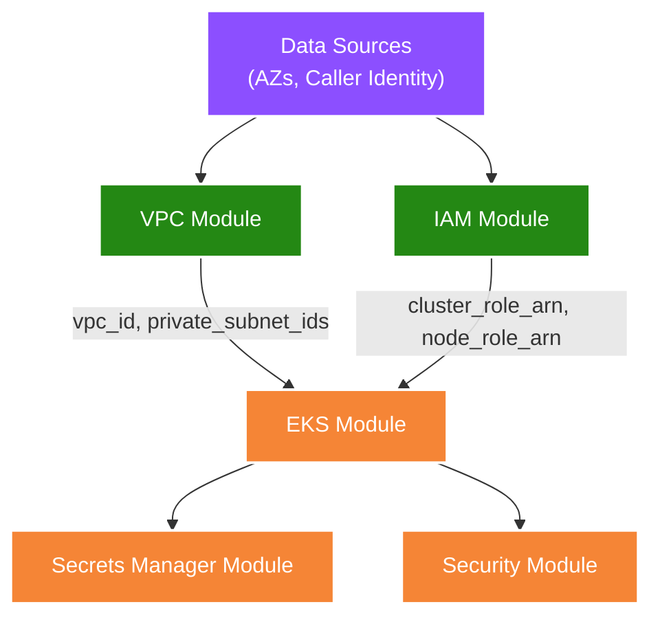
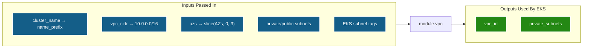
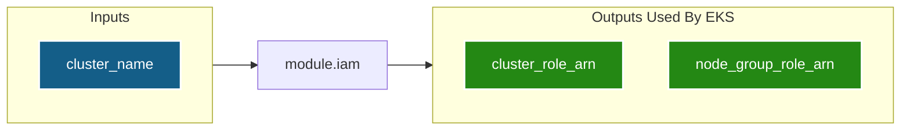
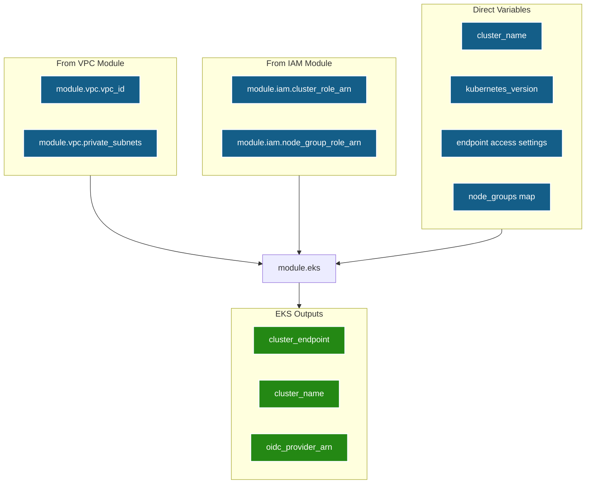
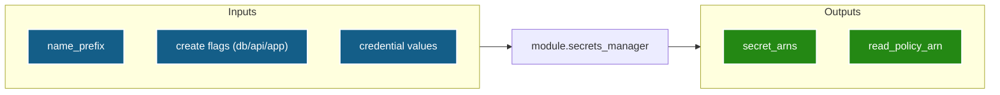
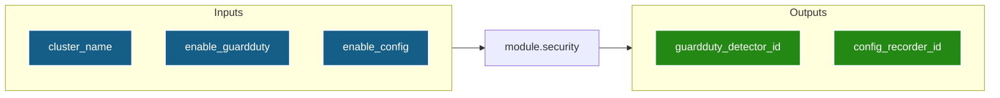
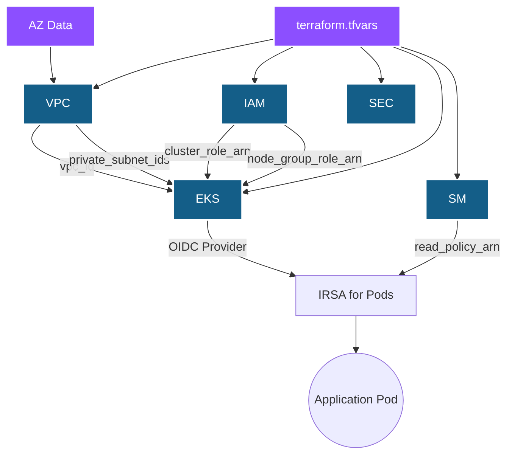

# Root `main.tf` — Module Orchestration Guide

The root `main.tf` is the **brain** of this Terraform project. It doesn't create any AWS resources directly — instead, it calls the 5 child modules and wires their inputs and outputs together to form a complete, secure EKS cluster.

---

## Module Dependency Flow

Terraform automatically resolves the dependency order based on the data flowing between modules. Here is the exact execution graph:

> **VPC** and **IAM** have no dependencies on each other — Terraform creates them **in parallel** to save time. The **EKS** module waits for both to finish because it needs their outputs.

---

## What's in This File

### 1. Data Sources

These **read** information from AWS without creating anything.

| Data Source | What It Returns | Used By |
|-------------|----------------|---------|
| `aws_availability_zones.available` | List of healthy AZs in the region (e.g., `ap-south-1a, 1b, 1c`) | VPC module (subnet distribution) |
| `aws_caller_identity.current` | AWS account ID, ARN of the caller | IAM policies, KMS key policies |

---

### 2. VPC Module Call

**Key detail**: The `slice(data.aws_availability_zones.available.names, 0, 3)` function takes only the first 3 AZs, ensuring we always create exactly 3 subnets regardless of how many AZs the region offers.

**Subnet tags** are functional, not decorative:
- `kubernetes.io/role/elb = 1` → AWS Load Balancer Controller places public ALBs in these subnets.
- `kubernetes.io/role/internal-elb = 1` → Internal NLBs go here.
- `kubernetes.io/cluster/<name> = shared` → Marks the subnet as belonging to this cluster.

---

### 3. IAM Module Call

This module has **no dependency on VPC**. Terraform creates IAM roles in parallel with networking, cutting provisioning time.

---

### 4. EKS Module Call

This is the largest module call. It consumes outputs from both VPC and IAM.

**`depends_on = [module.iam]`**: This explicit dependency is necessary because Terraform's implicit dependency tracking doesn't always catch the IAM → EKS relationship (the cluster needs roles to exist before it can assume them).

**Node Groups**: Two node groups are defined inline:

| Group | Type | Instances | Scaling | Taint |
|-------|------|-----------|---------|-------|
| `general` | ON_DEMAND | `t3.medium` | 2→4 | None |
| `spot` | SPOT | `t3.medium`, `t3a.medium` | 1→3 | `spot=true:NoSchedule` |

---

### 5. Secrets Manager Module Call

**All secrets are disabled by default**. To create them, set the corresponding `enable_*` flags in `terraform.tfvars`.

**Sensitive variables** (`db_password`, `api_key`, `api_secret`, `app_config`) are marked with `sensitive = true` in `variables.tf`, meaning Terraform redacts their values from `plan` and `apply` output.

---

### 6. Security Module Call

This module is **independent** of all others and can be created in parallel. It monitors the infrastructure without interfering with it.

---

## Summary: How Data Flows Through the System

