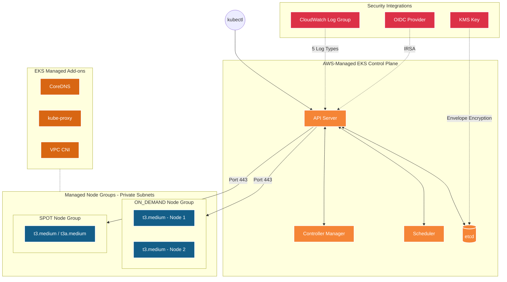
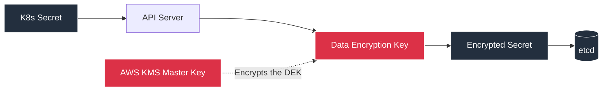
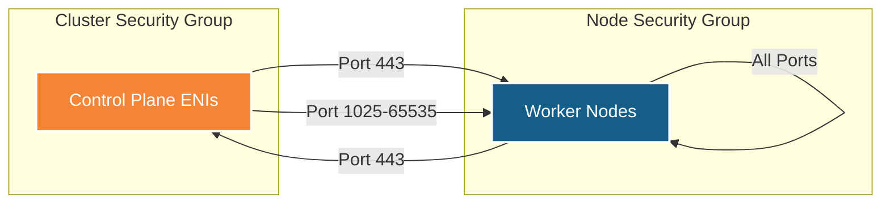
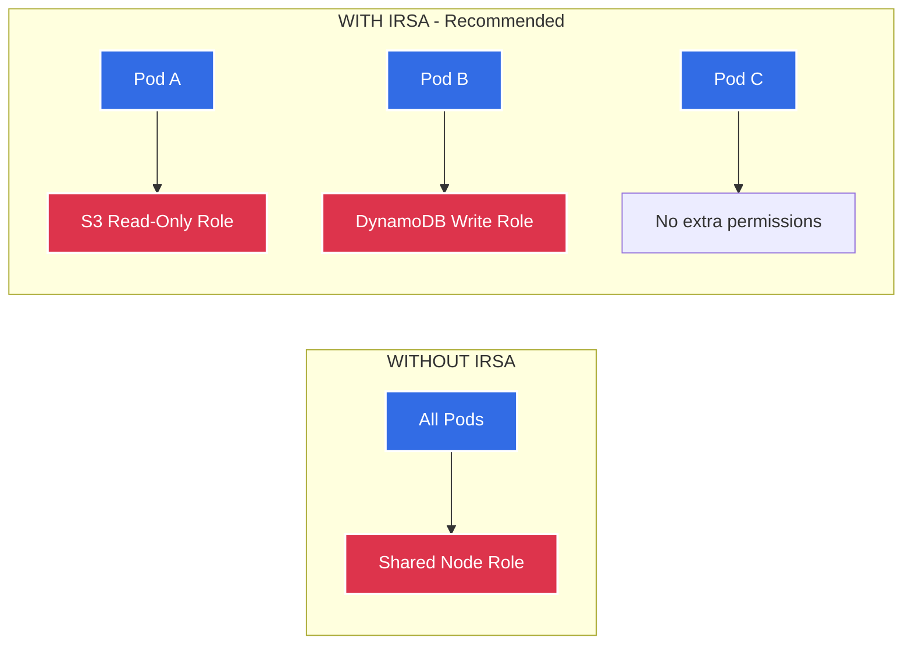
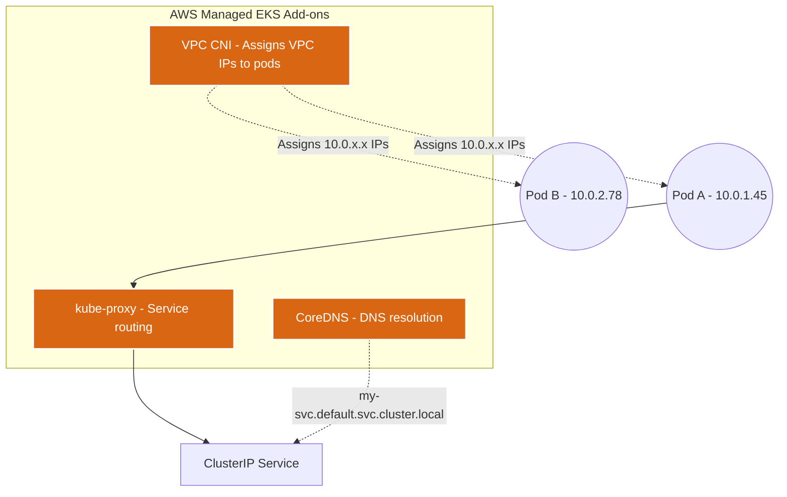

# EKS Module ⚓

This is the core module of the deployment. It provisions the Elastic Kubernetes Service (EKS) cluster, the managed node groups, and all supporting infrastructure — security groups, encryption, logging, networking add-ons, and the IRSA identity layer.

---

## Architecture Diagram



---

## What it Creates 🏗️

| # | Resource | Terraform Type | Purpose |
|---|----------|---------------|---------|
| 1 | **KMS Key** | `aws_kms_key` | Envelope encryption for K8s secrets in `etcd` |
| 2 | **CloudWatch Log Group** | `aws_cloudwatch_log_group` | Stores control plane logs (API, audit, scheduler, etc.) |
| 3 | **Cluster Security Group** | `aws_security_group` | Controls network access to the EKS control plane ENIs |
| 4 | **Node Security Group** | `aws_security_group` | Controls network access to/from worker nodes |
| 5 | **SG Rules** (×4) | `aws_security_group_rule` | Cross-communication rules between control plane and nodes |
| 6 | **EKS Cluster** | `aws_eks_cluster` | The fully-managed Kubernetes control plane |
| 7 | **OIDC Provider** | `aws_iam_openid_connect_provider` | Maps K8s ServiceAccounts to IAM Roles (IRSA) |
| 8 | **CoreDNS Add-on** | `aws_eks_addon` | Internal DNS resolution (`svc.cluster.local`) |
| 9 | **kube-proxy Add-on** | `aws_eks_addon` | Kubernetes Services networking (iptables/IPVS) |
| 10 | **VPC CNI Add-on** | `aws_eks_addon` | Assigns native VPC IPs directly to pods |
| 11 | **Launch Template** | `aws_launch_template` | Secure EC2 config (IMDSv2, encrypted gp3 EBS) |
| 12 | **Managed Node Groups** | `aws_eks_node_group` | Auto-scaling groups of worker EC2 instances |

---

## Detailed Resource Walkthrough

### 1. KMS Key for Secrets Encryption

The first resource created is a dedicated KMS key. This key enables **Envelope Encryption** — each Kubernetes Secret gets its own data encryption key (DEK), and the DEK itself is encrypted by this KMS master key.

```hcl
resource "aws_kms_key" "eks" {
  description             = "${var.cluster_name}-eks-secrets-key"
  deletion_window_in_days = 7
  enable_key_rotation     = true   # Automatically rotates the key annually

  policy = jsonencode({
    Version = "2012-10-17"
    Statement = [
      {
        Sid       = "Enable Root Account Full Access"
        Effect    = "Allow"
        Principal = { AWS = "arn:aws:iam::${data.aws_caller_identity.current.account_id}:root" }
        Action    = "kms:*"
        Resource  = "*"
      }
    ]
  })
}
```

**Why this matters**: Without KMS encryption, Kubernetes secrets in `etcd` are stored as easily decoded base64 strings. With envelope encryption, even direct access to `etcd` data does not expose the secret values.



---

### 2. CloudWatch Log Group

Captures all 5 types of EKS control plane logs for auditing, debugging, and compliance.

```hcl
resource "aws_cloudwatch_log_group" "eks" {
  count             = var.enable_cluster_logging ? 1 : 0
  name              = "/aws/eks/${var.cluster_name}/cluster"
  retention_in_days = 90
}
```

| Log Type | What It Records |
|----------|----------------|
| `api` | All API server requests (who called what) |
| `audit` | Detailed audit trail (who did what, when) |
| `authenticator` | Authentication decisions (allowed/denied) |
| `controllerManager` | Controller reconciliation events |
| `scheduler` | Pod scheduling decisions |

---

### 3. Security Groups

Two security groups are created with strict, granular rules:

```hcl
# Cluster Security Group — protects the EKS control plane ENIs
resource "aws_security_group" "cluster" {
  name_prefix = "${var.cluster_name}-cluster-"
  vpc_id      = var.vpc_id
  description = "Security group for EKS cluster control plane"
}

# Node Security Group — protects the worker nodes
resource "aws_security_group" "node" {
  name_prefix = "${var.cluster_name}-node-"
  vpc_id      = var.vpc_id
  description = "Security group for EKS worker nodes"
}
```

**Communication rules between them:**



| Rule | From | To | Port | Purpose |
|------|------|-----|------|---------|
| Nodes → Cluster | Node SG | Cluster SG | 443 | Kubelet registers with API server |
| Cluster → Nodes | Cluster SG | Node SG | 443 | API server health checks |
| Cluster → Nodes | Cluster SG | Node SG | 1025-65535 | `kubectl exec`, `kubectl logs` |
| Nodes → Nodes | Node SG | Node SG | All | Pod-to-pod communication |

---

### 4. EKS Cluster

The core resource — provisions the fully-managed Kubernetes control plane.

```hcl
resource "aws_eks_cluster" "main" {
  name     = var.cluster_name
  version  = var.kubernetes_version
  role_arn = var.cluster_role_arn   # IAM role from the IAM module

  vpc_config {
    subnet_ids              = var.subnet_ids   # Private subnets from VPC module
    endpoint_public_access  = var.endpoint_public_access
    endpoint_private_access = var.endpoint_private_access
    public_access_cidrs     = var.public_access_cidrs
    security_group_ids      = [aws_security_group.cluster.id]
  }

  encryption_config {
    provider { key_arn = aws_kms_key.eks.arn }
    resources = ["secrets"]   # Encrypt K8s secrets with our KMS key
  }

  enabled_cluster_log_types = var.enable_cluster_logging ? [
    "api", "audit", "authenticator", "controllerManager", "scheduler"
  ] : []
}
```

---

### 5. OIDC Provider (IRSA)

Maps Kubernetes ServiceAccounts to AWS IAM Roles, so individual pods get their own scoped AWS permissions.

```hcl
resource "aws_iam_openid_connect_provider" "eks" {
  count = var.enable_irsa ? 1 : 0

  client_id_list  = ["sts.amazonaws.com"]
  thumbprint_list = [data.tls_certificate.eks[0].certificates[0].sha1_fingerprint]
  url             = aws_eks_cluster.main.identity[0].oidc[0].issuer
}
```

**How IRSA works:**



**Without IRSA**: Every pod inherits the broad Node Group Role. **With IRSA**: Each pod gets only the exact AWS permissions it needs via its own ServiceAccount.

---

### 6. EKS Add-ons

Three critical system components deployed as AWS-managed add-ons:

```hcl
resource "aws_eks_addon" "coredns" {
  cluster_name = aws_eks_cluster.main.name
  addon_name   = "coredns"
}

resource "aws_eks_addon" "kube_proxy" {
  cluster_name = aws_eks_cluster.main.name
  addon_name   = "kube-proxy"
}

resource "aws_eks_addon" "vpc_cni" {
  cluster_name = aws_eks_cluster.main.name
  addon_name   = "vpc-cni"
}
```



| Add-on | What It Does |
|--------|-------------|
| **VPC CNI** | Assigns real VPC IP addresses to pods — native AWS networking, no overlay overhead |
| **kube-proxy** | Maintains iptables/IPVS rules on nodes to route traffic for Kubernetes Services |
| **CoreDNS** | Resolves `<service>.<namespace>.svc.cluster.local` DNS queries within the cluster |

---

### 7. Launch Template

Configures secure defaults for all EC2 worker nodes:

```hcl
resource "aws_launch_template" "eks" {
  name_prefix = "${var.cluster_name}-node-"

  # Enforce IMDSv2 — prevents SSRF attacks
  metadata_options {
    http_endpoint               = "enabled"
    http_tokens                 = "required"   # IMDSv2 only
    http_put_response_hop_limit = 1
  }

  # Encrypted root volume
  block_device_mappings {
    device_name = "/dev/xvda"
    ebs {
      volume_size = 20
      volume_type = "gp3"       # Cost-efficient SSD
      encrypted   = true        # Encryption at rest
    }
  }

  monitoring {
    enabled = var.enable_detailed_monitoring
  }
}
```

| Setting | Value | Why |
|---------|-------|-----|
| **IMDSv2** | Required (token mandatory) | Prevents SSRF attacks (e.g., Capital One breach vector) |
| **EBS Volume** | gp3, encrypted | Cost-efficient SSD with encryption at rest |
| **Monitoring** | Configurable | Toggle between 5-min (free) and 1-min ($2/instance/mo) |

---

### 8. Managed Node Groups

```hcl
resource "aws_eks_node_group" "this" {
  for_each = var.node_groups

  cluster_name    = aws_eks_cluster.main.name
  node_group_name = each.key
  node_role_arn   = var.node_role_arn
  subnet_ids      = var.subnet_ids

  scaling_config {
    desired_size = each.value.desired_size
    min_size     = each.value.min_size
    max_size     = each.value.max_size
  }

  instance_types = each.value.instance_types
  capacity_type  = each.value.capacity_type   # "ON_DEMAND" or "SPOT"

  launch_template {
    id      = aws_launch_template.eks.id
    version = aws_launch_template.eks.latest_version
  }

  labels = each.value.labels

  dynamic "taint" {
    for_each = try(each.value.taints, [])
    content {
      key    = taint.value.key
      value  = taint.value.value
      effect = taint.value.effect
    }
  }
}
```

### ON_DEMAND vs SPOT

| Feature | ON_DEMAND (general) | SPOT (spot) |
|---------|-------------------|-------------|
| **Pricing** | Full price | Up to 90% discount |
| **Interruption** | Never | 2-min warning from AWS |
| **Best for** | Production, stateful apps | Batch jobs, CI/CD, dev/test |
| **Taint** | None | `spot=true:NoSchedule` |
| **Default replicas** | 2 | 1 |

**Spot Taint**: The `spot=true:NoSchedule` taint prevents pods from being scheduled on spot nodes unless they explicitly tolerate it. To run a pod on spot nodes, add:

```yaml
tolerations:
- key: "spot"
  operator: "Equal"
  value: "true"
  effect: "NoSchedule"
```
