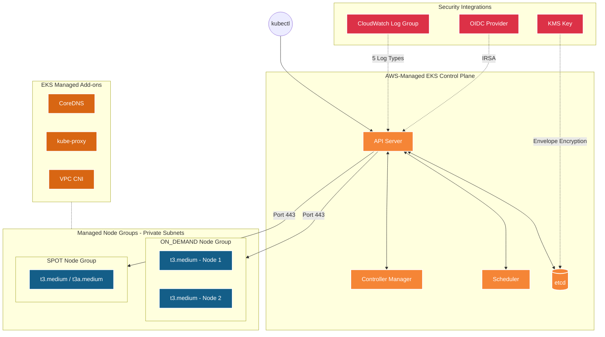
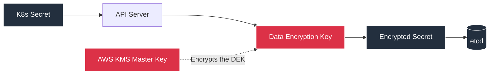
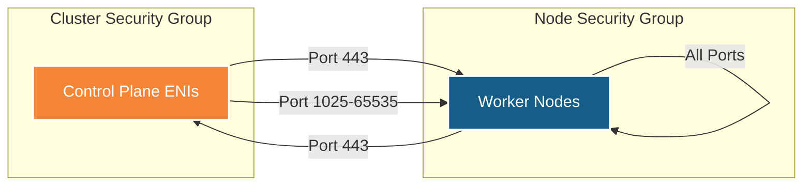
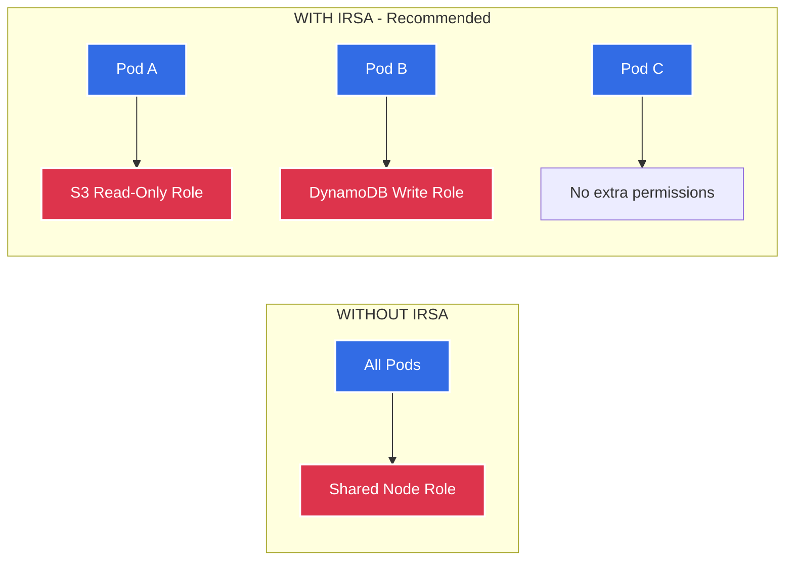

# EKS Module ⚓

This is the core module of the deployment. It provisions the Elastic Kubernetes Service (EKS) cluster, the managed node groups, and all supporting infrastructure — security groups, encryption, logging, networking add-ons, and the IRSA identity layer.

---

## Architecture Diagram



---

## What it Creates 🏗️

| # | Resource | Terraform Type | Purpose |
|---|----------|---------------|---------|
| 1 | **KMS Key + Alias** | `aws_kms_key`, `aws_kms_alias` | Envelope encryption for K8s secrets in `etcd` |
| 2 | **CloudWatch Log Group** | `aws_cloudwatch_log_group` | Stores control plane logs (API, audit, scheduler, etc.) |
| 3 | **Cluster Security Group** | `aws_security_group` | Controls network access to the EKS control plane ENIs |
| 4 | **Node Security Group** | `aws_security_group` | Controls network access to/from worker nodes |
| 5 | **SG Rules** (×3) | `aws_security_group_rule` | Cross-communication rules between control plane and nodes |
| 6 | **EKS Cluster** | `aws_eks_cluster` | The fully-managed Kubernetes control plane |
| 7 | **OIDC Provider** | `aws_iam_openid_connect_provider` | Maps K8s ServiceAccounts to IAM Roles (IRSA) |
| 8 | **CoreDNS Add-on** | `aws_eks_addon` | Internal DNS resolution (`svc.cluster.local`) |
| 9 | **kube-proxy Add-on** | `aws_eks_addon` | Kubernetes Services networking (iptables/IPVS) |
| 10 | **VPC CNI Add-on** | `aws_eks_addon` | Assigns native VPC IPs directly to pods |
| 11 | **Launch Template** | `aws_launch_template` | Secure EC2 config (IMDSv2, encrypted gp3 EBS, no public IP) |
| 12 | **Managed Node Groups** | `aws_eks_node_group` | Auto-scaling groups of worker EC2 instances |

---

## Detailed Resource Walkthrough

### 1. KMS Key for Secrets Encryption

```hcl
resource "aws_kms_key" "eks" {
  description             = "KMS key for EKS cluster ${var.cluster_name} encryption"
  deletion_window_in_days = 7
  enable_key_rotation     = true

  tags = merge(var.tags, {
    Name = "${var.cluster_name}-eks-kms"
  })
}

resource "aws_kms_alias" "eks" {
  name          = "alias/${var.cluster_name}-eks"
  target_key_id = aws_kms_key.eks.key_id
}
```

**Detailed explanation:**

- **`resource "aws_kms_key" "eks"`** — Creates a customer-managed KMS (Key Management Service) key. By default, when you create a KMS key, **AWS automatically attaches a default key policy** that gives the root account full access. We don't need to specify a policy block because the AWS default is already correct — it allows IAM policies in this account to control who can use the key. Adding a custom policy is only needed if you want cross-account access or very specific constraints.

- **`description`** — A human-readable label visible in the AWS Console. Including the cluster name makes it easy to find the right key when you have multiple clusters.

- **`deletion_window_in_days = 7`** — When you request deletion of this key (e.g., via `terraform destroy`), AWS doesn't delete it immediately. It enters a **pending deletion** state for 7 days. During this window, you can cancel the deletion if it was a mistake. This is a safety net — if the key is destroyed, **all data encrypted with it becomes permanently unrecoverable**. The minimum is 7 days, maximum is 30 days.

- **`enable_key_rotation = true`** — AWS automatically rotates the underlying key material every year. Importantly, **old key material is preserved**, so data encrypted with previous versions can still be decrypted. Only new encryption operations use the new key material. This is a security best practice required by frameworks like SOC2, PCI-DSS, and HIPAA.

- **`resource "aws_kms_alias" "eks"`** — A KMS alias gives the key a human-friendly name like `alias/eks-dev-cluster-eks` instead of the raw key ID like `mrk-abc123def456...`. You can reference the alias in IAM policies and other services, and if you ever need to replace the underlying key, just re-point the alias without updating every reference.

- **`target_key_id = aws_kms_key.eks.key_id`** — Links the alias to the actual key created above.

**How Envelope Encryption works with this key:**



1. You create a Kubernetes Secret (e.g., a database password).
2. The API Server generates a unique **Data Encryption Key (DEK)** just for this secret.
3. The DEK encrypts the secret data.
4. The DEK itself is encrypted by our **KMS Master Key** (the one we created above).
5. The encrypted DEK + the encrypted secret data are stored together in `etcd`.
6. To read the secret, the process is reversed: KMS decrypts the DEK, then the DEK decrypts the secret.

**Without this**, Kubernetes secrets in `etcd` are just base64-encoded — not encrypted. Running `echo "<value>" | base64 --decode` exposes the secret instantly.

---

### 2. CloudWatch Log Group

```hcl
resource "aws_cloudwatch_log_group" "eks" {
  count             = var.enable_cluster_logging ? 1 : 0
  name              = "/aws/eks/${var.cluster_name}/cluster"
  retention_in_days = 30

  tags = var.tags
}
```

**Detailed explanation:**

- **`count = var.enable_cluster_logging ? 1 : 0`** — This is a Terraform conditional pattern. When `enable_cluster_logging` is `true`, `count = 1` creates the resource. When `false`, `count = 0` means Terraform creates nothing — the resource is completely skipped. This pattern is how you make Terraform resources optional. Later, the EKS cluster resource references this log group, and the `count` ensures both the log group and the logging config are either both present or both absent.

- **`name = "/aws/eks/${var.cluster_name}/cluster"`** — This exact naming pattern is **required by AWS**. When you enable control plane logging on an EKS cluster, AWS automatically sends logs to a CloudWatch Log Group named `/aws/eks/<cluster-name>/cluster`. By pre-creating the log group ourselves, we gain control over the retention period (otherwise AWS creates one with **infinite retention**, which silently accumulates cost month after month).

- **`retention_in_days = 30`** — CloudWatch keeps logs for 30 days, then deletes them automatically. Without this setting, logs are stored **forever**. For a cluster generating ~500MB/day of logs, that's ~$100/year in storage growing indefinitely. Adjust this based on your compliance needs: 30 days for dev, 90 days for prod, 365 days for strict regulations.

**The 5 log types EKS sends to this log group:**

| Log Type | What It Records | When You Need It |
|----------|----------------|-----------------|
| `api` | Every HTTP request to the API server — `GET /pods`, `POST /deployments`, etc. | Debugging why an API call failed |
| `audit` | **Who** did **what** to **which resource** and **when** — the full audit trail | Security investigations, compliance audits (SOC2, PCI) |
| `authenticator` | IAM-to-Kubernetes user mapping decisions — which IAM role mapped to which K8s user and whether access was allowed or denied | Debugging "forbidden" or "unauthorized" errors |
| `controllerManager` | Controller reconciliation loops — ReplicaSet scaling, failed deployments, unhealthy endpoints | Understanding why a deployment is stuck or not scaling |
| `scheduler` | Pod placement decisions — which node was chosen and why, or why no node was suitable | Debugging pods stuck in `Pending` state |

---

### 3. Security Groups

**Cluster Security Group** — protects the control plane ENIs:

```hcl
resource "aws_security_group" "cluster" {
  name_prefix = "${var.cluster_name}-cluster-sg-"
  description = "Security group for EKS cluster control plane"
  vpc_id      = var.vpc_id

  egress {
    from_port   = 0
    to_port     = 0
    protocol    = "-1"
    cidr_blocks = ["0.0.0.0/0"]
    description = "Allow all outbound traffic"
  }

  tags = merge(var.tags, {
    Name = "${var.cluster_name}-cluster-sg"
  })

  lifecycle {
    create_before_destroy = true
  }
}
```

**Detailed explanation:**

- **`name_prefix` vs `name`** — Using `name_prefix` instead of `name` makes Terraform append a random suffix (e.g., `eks-dev-cluster-sg-abc123`). This prevents "name already exists" errors if you ever need to recreate the security group during an update. With a fixed `name`, Terraform would fail because it tries to create the new resource before deleting the old one.

- **`vpc_id = var.vpc_id`** — Security groups are VPC-scoped. This places the SG inside the same VPC where the subnets and worker nodes live. A security group from one VPC cannot be used in another.

- **`egress { ... protocol = "-1" }`** — The egress rule allows **all outbound traffic** from the control plane. The value `-1` means "all protocols" (TCP, UDP, ICMP, etc.). The control plane needs to reach: worker nodes (kubelet on port 10250), AWS services (CloudWatch, S3, STS, ELB), and the OIDC provider. Restricting egress is possible but fragile because AWS service IPs can change.

- **`lifecycle { create_before_destroy = true }`** — This is critical for zero-downtime updates. When Terraform needs to replace a security group (e.g., a name change), it normally destroys the old one first, then creates the new one. During that gap, the cluster has no SG attached — a brief security exposure. With `create_before_destroy`, Terraform creates the replacement SG first, migrates all references, then deletes the old one.

**Node Security Group** — protects the worker nodes:

```hcl
resource "aws_security_group" "node" {
  name_prefix = "${var.cluster_name}-node-sg-"
  description = "Security group for EKS worker nodes"
  vpc_id      = var.vpc_id

  egress {
    from_port   = 0
    to_port     = 0
    protocol    = "-1"
    cidr_blocks = ["0.0.0.0/0"]
    description = "Allow all outbound traffic"
  }

  tags = merge(var.tags, {
    Name                                        = "${var.cluster_name}-node-sg"
    "kubernetes.io/cluster/${var.cluster_name}" = "owned"
  })

  lifecycle {
    create_before_destroy = true
  }
}
```

- **`"kubernetes.io/cluster/${var.cluster_name}" = "owned"`** — This tag is functional, not decorative. The AWS Load Balancer Controller reads this tag to identify which security group belongs to which EKS cluster. When you create a Kubernetes Service of type `LoadBalancer`, the controller finds nodes with this tag to register them as targets. Without this tag, load balancers can't find your nodes.

---

### 4. Security Group Rules

```hcl
# RULE 1: Nodes → Cluster (Port 443)
resource "aws_security_group_rule" "node_to_cluster" {
  type                     = "ingress"
  from_port                = 443
  to_port                  = 443
  protocol                 = "tcp"
  security_group_id        = aws_security_group.cluster.id
  source_security_group_id = aws_security_group.node.id
  description              = "Allow nodes to communicate with cluster API"
}
```

**Detailed explanation of Rule 1:**

- **`type = "ingress"`** — This is an **inbound** rule on the cluster security group. It says "allow traffic IN to the cluster SG."
- **`from_port = 443` / `to_port = 443`** — Only HTTPS traffic (port 443). The Kubernetes API server listens on port 443.
- **`protocol = "tcp"`** — HTTPS runs over TCP.
- **`security_group_id = aws_security_group.cluster.id`** — The target SG where this rule is applied (the cluster SG). Think of this as: "attach this rule TO the cluster SG."
- **`source_security_group_id = aws_security_group.node.id`** — Only traffic originating FROM the node SG is allowed. This is much more secure than using CIDR blocks because it's tied to the SG identity, not IP addresses that can change.

**Why nodes need to call the cluster API:** The kubelet on each node constantly communicates with the API server to: register the node, report health status, receive new pod assignments, and push container logs.

```hcl
# RULE 2: Cluster → Nodes (Port 1025-65535)
resource "aws_security_group_rule" "cluster_to_node" {
  type                     = "ingress"
  from_port                = 1025
  to_port                  = 65535
  protocol                 = "tcp"
  security_group_id        = aws_security_group.node.id
  source_security_group_id = aws_security_group.cluster.id
  description              = "Allow cluster control plane to communicate with nodes"
}
```

**Why does the API server need high ports to nodes?** When you run `kubectl exec -it <pod> -- /bin/sh`, here's what happens:
1. Your `kubectl` command goes to the API server (port 443).
2. The API server opens a connection to the **kubelet** on the target node (port 10250).
3. The kubelet attaches to the container process and streams stdin/stdout back.

Port range 1025-65535 is needed because: kubelet listens on 10250, admission webhooks can listen on any high port, and metrics endpoints can vary. Opening the full ephemeral port range covers all these cases.

```hcl
# RULE 3: Node → Node (All ports/protocols)
resource "aws_security_group_rule" "node_to_node" {
  type              = "ingress"
  from_port         = 0
  to_port           = 65535
  protocol          = "-1"
  security_group_id = aws_security_group.node.id
  self              = true
  description       = "Allow nodes to communicate with each other"
}
```

- **`self = true`** — This special attribute means "traffic from this SG to the same SG is allowed." Since all worker nodes share the same node SG, this effectively allows any node to communicate with any other node on any port. This is necessary for pod-to-pod networking (VPC CNI assigns each pod a real VPC IP, and pods on different nodes talk directly), CoreDNS (UDP 53), Prometheus scraping, and service mesh sidecars.



---

### 5. EKS Cluster

```hcl
resource "aws_eks_cluster" "main" {
  name     = var.cluster_name
  version  = var.kubernetes_version
  role_arn = var.cluster_role_arn

  vpc_config {
    subnet_ids              = var.subnet_ids
    endpoint_public_access  = var.endpoint_public_access
    endpoint_private_access = var.endpoint_private_access
    public_access_cidrs     = var.public_access_cidrs
    security_group_ids      = [aws_security_group.cluster.id]
  }

  encryption_config {
    provider {
      key_arn = aws_kms_key.eks.arn
    }
    resources = ["secrets"]
  }

  enabled_cluster_log_types = var.enable_cluster_logging ? [
    "api", "audit", "authenticator", "controllerManager", "scheduler"
  ] : []

  depends_on = [aws_cloudwatch_log_group.eks]

  tags = var.tags
}
```

**Detailed explanation:**

- **`name = var.cluster_name`** — The cluster name (e.g., `eks-dev-cluster`). Must be unique in the region. This name appears everywhere — in `kubectl config`, IAM policies, subnet tags, CloudWatch log groups, and the AWS Console.

- **`version = var.kubernetes_version`** — The Kubernetes minor version (e.g., `"1.31"`). AWS supports the latest 4 minor versions. Critical: when a version reaches **end of life**, AWS will **force-upgrade** your cluster with 2 weeks notice, which can break workloads that depend on deprecated APIs. Keep your version current.

- **`role_arn = var.cluster_role_arn`** — The IAM role ARN from the IAM module. EKS assumes this role to perform all its management tasks: creating ENIs in your VPC, managing load balancers, and writing CloudWatch metrics. This role has `AmazonEKSClusterPolicy` and `AmazonEKSVPCResourceController` attached.

**`vpc_config` block — how the cluster connects to your network:**

- **`subnet_ids`** — The private subnets from the VPC module. EKS creates **Elastic Network Interfaces (ENIs)** in these subnets. These ENIs are how the API server (running in AWS-managed infrastructure) communicates with your worker nodes (running in your VPC). Using private subnets means these ENIs have no public IPs and are only reachable from within the VPC.

- **`endpoint_public_access`** — When `true`, the API server gets a public HTTPS endpoint. You can run `kubectl` from your laptop over the internet. For production, consider setting this to `false` and accessing the cluster only through a VPN or AWS SSM Session Manager.

- **`endpoint_private_access`** — When `true`, nodes in the VPC can reach the API server via a private DNS name that resolves to the ENI IPs. **Always keep this `true`**. If both endpoints are disabled, nothing can reach the control plane.

- **`public_access_cidrs`** — IP ranges allowed to access the public endpoint. Default `["0.0.0.0/0"]` means anyone on the internet. For production, set this to your office/VPN IP: `["203.0.113.5/32"]`. This is your first line of defense against unauthorized `kubectl` access.

- **`security_group_ids`** — Attaches our custom cluster SG. EKS also creates its own default SG, but our custom SG gives us explicit control over the rules.

**`encryption_config` block:**

- **`key_arn = aws_kms_key.eks.arn`** — Points to the KMS key we created in section 1. This tells EKS: "Use this key for envelope encryption."
- **`resources = ["secrets"]`** — Only Kubernetes Secret objects are encrypted. Currently, `"secrets"` is the only supported value by EKS. ConfigMaps, Deployments, etc. remain unencrypted in `etcd` (they don't contain sensitive data by design).

- **`enabled_cluster_log_types`** — The conditional expression either enables all 5 log types or sets an empty list (no logging). This works in tandem with the CloudWatch log group's `count` parameter — both are controlled by the same variable.

- **`depends_on = [aws_cloudwatch_log_group.eks]`** — Ensures the CloudWatch log group exists before the cluster tries to send logs to it. Without this, EKS would auto-create a log group with no retention policy, silently accumulating cost.

---

### 6. OIDC Provider (IRSA)

```hcl
data "tls_certificate" "cluster" {
  count = var.enable_irsa ? 1 : 0
  url   = aws_eks_cluster.main.identity[0].oidc[0].issuer
}

resource "aws_iam_openid_connect_provider" "cluster" {
  count           = var.enable_irsa ? 1 : 0
  client_id_list  = ["sts.amazonaws.com"]
  thumbprint_list = [data.tls_certificate.cluster[0].certificates[0].sha1_fingerprint]
  url             = aws_eks_cluster.main.identity[0].oidc[0].issuer

  tags = merge(var.tags, {
    Name = "${var.cluster_name}-oidc-provider"
  })
}
```

**Detailed explanation:**

- **`data "tls_certificate" "cluster"`** — This is a **data source**, not a resource. It doesn't create anything — it fetches the TLS certificate from the EKS cluster's OIDC issuer URL. We need this certificate's fingerprint to register the OIDC provider securely with IAM.

- **`url = aws_eks_cluster.main.identity[0].oidc[0].issuer`** — Every EKS cluster automatically gets a unique OIDC issuer URL (e.g., `https://oidc.eks.ap-south-1.amazonaws.com/id/ABCDEF1234567890`). This URL is the identity provider that issues JWT tokens to Kubernetes ServiceAccounts.

- **`client_id_list = ["sts.amazonaws.com"]`** — The "audience" for tokens from this OIDC provider. STS (Security Token Service) is the AWS service that exchanges OIDC tokens for temporary AWS credentials. This setting means: "When a pod presents an OIDC token, STS is the intended consumer of that token."

- **`thumbprint_list`** — The SHA-1 fingerprint of the root CA certificate that signed the OIDC provider's TLS certificate. IAM uses this to cryptographically verify that OIDC tokens are genuinely issued by this specific EKS cluster, preventing man-in-the-middle attacks.

**How IRSA works end-to-end:**



**Without IRSA**, every pod running on a node inherits the Node Group Role. If one pod needs S3 access, you must attach S3 permissions to the node role — and then *every* pod on *every* node gets S3 access. This is a massive security risk.

**With IRSA**, you create a ServiceAccount annotated with a specific IAM role ARN. Only pods using that ServiceAccount get those permissions. A pod reading from S3 gets `s3:GetObject` only. A pod writing to DynamoDB gets `dynamodb:PutItem` only. Pods that don't need AWS access get nothing extra.

---

### 7. EKS Add-ons

```hcl
resource "aws_eks_addon" "coredns" {
  cluster_name                = aws_eks_cluster.main.name
  addon_name                  = "coredns"
  addon_version               = var.coredns_version != "" ? var.coredns_version : null
  resolve_conflicts_on_create = "OVERWRITE"
  resolve_conflicts_on_update = "OVERWRITE"

  depends_on = [aws_eks_node_group.main]

  tags = var.tags
}

resource "aws_eks_addon" "kube_proxy" {
  cluster_name                = aws_eks_cluster.main.name
  addon_name                  = "kube-proxy"
  addon_version               = var.kube_proxy_version != "" ? var.kube_proxy_version : null
  resolve_conflicts_on_create = "OVERWRITE"
  resolve_conflicts_on_update = "OVERWRITE"

  tags = var.tags
}

resource "aws_eks_addon" "vpc_cni" {
  cluster_name                = aws_eks_cluster.main.name
  addon_name                  = "vpc-cni"
  addon_version               = var.vpc_cni_version != "" ? var.vpc_cni_version : null
  resolve_conflicts_on_create = "OVERWRITE"
  resolve_conflicts_on_update = "OVERWRITE"

  tags = var.tags
}
```

**Detailed explanation:**

- **`addon_version = var.coredns_version != "" ? var.coredns_version : null`** — If a specific version is provided in variables, use it. If the variable is an empty string (`""`), set to `null`, which tells AWS to install the **latest compatible version** for your Kubernetes version. This gives you flexibility: pin a version for stability in production, or leave it as latest for dev.

- **`resolve_conflicts_on_create = "OVERWRITE"` / `resolve_conflicts_on_update = "OVERWRITE"`** — If someone manually modified the addon via `kubectl` (e.g., changed CoreDNS replicas), Terraform would normally detect a conflict and fail. `"OVERWRITE"` tells Terraform: "My config is the source of truth — overwrite whatever is in the cluster." This ensures the add-on stays in the Terraform-managed state. Alternative is `"NONE"`, which would fail instead of overwriting.

- **`depends_on = [aws_eks_node_group.main]`** (CoreDNS only) — CoreDNS runs as a **Deployment** (not a DaemonSet), meaning Kubernetes needs at least one available node to schedule its pods on. Without this dependency, Terraform might install CoreDNS before any nodes exist, and the pods would be stuck in `Pending` forever. `kube-proxy` and `vpc-cni` run as **DaemonSets** that automatically deploy to each node as it joins, so they don't need this dependency.

**What each add-on does:**

| Add-on | Type | What It Does | What Breaks Without It |
|--------|------|-------------|------------------------|
| **VPC CNI** | DaemonSet | Assigns real VPC IPs (`10.0.x.x`) directly to each pod — no overlay network needed | Pods get no IP addresses, no networking at all |
| **kube-proxy** | DaemonSet | Maintains iptables/IPVS rules on every node for Kubernetes Service routing | Services don't work — pods can only communicate by raw IP, not by Service name |
| **CoreDNS** | Deployment | Resolves cluster DNS queries (`my-svc.default.svc.cluster.local` → ClusterIP) | No DNS-based service discovery — apps must hardcode IP addresses |

---

### 8. Launch Template

```hcl
resource "aws_launch_template" "node" {
  for_each    = var.node_groups
  name_prefix = "${var.cluster_name}-${each.key}-"
  description = "Launch template for ${var.cluster_name} ${each.key} node group"

  block_device_mappings {
    device_name = "/dev/xvda"
    ebs {
      volume_size           = lookup(each.value, "disk_size", 20)
      volume_type           = "gp3"
      iops                  = 3000
      throughput            = 125
      delete_on_termination = true
      encrypted             = true
    }
  }

  metadata_options {
    http_endpoint               = "enabled"
    http_tokens                 = "required"
    http_put_response_hop_limit = 2
    instance_metadata_tags      = "enabled"
  }

  monitoring {
    enabled = var.enable_detailed_monitoring
  }

  network_interfaces {
    associate_public_ip_address = false
    delete_on_termination       = true
    security_groups             = [aws_security_group.node.id]
  }

  tag_specifications {
    resource_type = "instance"
    tags = merge(var.tags, {
      Name = "${var.cluster_name}-${each.key}-node"
    })
  }

  lifecycle {
    create_before_destroy = true
  }

  tags = var.tags
}
```

**Detailed explanation:**

- **`for_each = var.node_groups`** — Creates one launch template per node group. So if you have `general` and `spot` groups, you get 2 launch templates. This allows each group to have different disk sizes (e.g., 50 GiB for prod, 20 GiB for dev).

**`block_device_mappings` block — the root EBS volume:**

- **`device_name = "/dev/xvda"`** — The root device name for Amazon Linux 2 (the default EKS-optimized AMI). This is where the OS, container runtime, and container images are stored.
- **`volume_type = "gp3"`** — General Purpose SSD v3. GP3 is **cheaper and more predictable** than GP2. GP2 uses a burst credit model where IOPS depend on volume size (100 GiB = 300 IOPS, 1 TiB = 3000 IOPS). GP3 gives a **flat baseline of 3000 IOPS and 125 MiB/s** regardless of volume size.
- **`iops = 3000` / `throughput = 125`** — Explicitly sets the GP3 baseline performance. These are the included-at-no-extra-cost values. You can increase them for I/O-heavy workloads (up to 16,000 IOPS and 1,000 MiB/s) for an additional per-IOPS charge.
- **`delete_on_termination = true`** — When a node is terminated (e.g., during a scale-down or rolling update), the EBS volume is automatically deleted. Without this, orphaned volumes would pile up, each costing ~$0.08/GiB/month.
- **`encrypted = true`** — Encrypts the volume at rest using the default AWS-managed EBS encryption key. All data on disk — container images, ephemeral pod storage, node logs — is encrypted.

**`metadata_options` block — IMDSv2 enforcement (CRITICAL SECURITY):**

- **`http_endpoint = "enabled"`** — Enables the Instance Metadata Service (IMDS) at `http://169.254.169.254`. IMDS provides the instance with its IAM role credentials, instance ID, availability zone, and other metadata.
- **`http_tokens = "required"`** — **This is the most important security setting.** It enforces IMDSv2, which requires a session token to access metadata. IMDSv1 allowed any HTTP GET request to read instance metadata — this was the exact vulnerability used in the **2019 Capital One data breach** where an SSRF attack read IAM credentials from IMDS. IMDSv2 requires a PUT request to get a token first, which SSRF attacks typically cannot perform.
- **`http_put_response_hop_limit = 2`** — The token response can traverse up to 2 network hops. For EKS, this must be `2` (not `1`) because pods running inside containers are 1 hop away from the instance, and the pod itself is another hop. With `hop_limit = 1`, containers would not be able to reach IMDS at all, breaking IRSA and other features that rely on instance identity.
- **`instance_metadata_tags = "enabled"`** — Allows reading instance tags through the IMDS API. Some monitoring tools and automation scripts use this to identify which cluster or node group an instance belongs to.

**`network_interfaces` block:**

- **`associate_public_ip_address = false`** — Nodes do **not** get public IP addresses. They're launched in private subnets and reach the internet exclusively through the NAT Gateway. This is a fundamental security requirement — worker nodes should never be directly accessible from the internet.
- **`security_groups = [aws_security_group.node.id]`** — Attaches our custom node security group with the SG rules we defined above.

---

### 9. Managed Node Groups

```hcl
resource "aws_eks_node_group" "main" {
  for_each = var.node_groups

  cluster_name    = aws_eks_cluster.main.name
  node_group_name = each.key
  node_role_arn   = var.node_role_arn
  subnet_ids      = var.subnet_ids
  version         = var.kubernetes_version

  scaling_config {
    desired_size = each.value.desired_size
    max_size     = each.value.max_size
    min_size     = each.value.min_size
  }

  instance_types = each.value.instance_types
  capacity_type  = lookup(each.value, "capacity_type", "ON_DEMAND")
  labels         = lookup(each.value, "labels", {})

  dynamic "taint" {
    for_each = coalesce(lookup(each.value, "taints", null), [])
    content {
      key    = taint.value.key
      value  = taint.value.value
      effect = taint.value.effect
    }
  }

  launch_template {
    id      = aws_launch_template.node[each.key].id
    version = aws_launch_template.node[each.key].latest_version
  }

  tags = merge(var.tags, lookup(each.value, "tags", {}))

  depends_on = [
    aws_eks_addon.vpc_cni,
    aws_eks_addon.kube_proxy
  ]

  lifecycle {
    ignore_changes = [scaling_config[0].desired_size]
  }
}
```

**Detailed explanation:**

- **`for_each = var.node_groups`** — Creates one node group per entry in the `node_groups` map. `each.key` is the group name (e.g., `"general"` or `"spot"`) and `each.value` is the config map for that group.

- **`node_role_arn = var.node_role_arn`** — The IAM role from the IAM module. Every EC2 instance assumes this role on boot. The role grants permissions to: register with EKS, pull images from ECR, and manage VPC networking.

- **`version = var.kubernetes_version`** — Sets the kubelet version on the nodes to match the cluster version. Nodes must be at the same or one minor version behind the cluster. If your cluster is 1.31, nodes can be 1.31 or 1.30 but not 1.29.

**`scaling_config` block:**

- **`desired_size`** — How many nodes to launch right now. On first `apply`, this is the starting count. The Cluster Autoscaler can later change this based on pod demand.
- **`max_size`** — The ceiling. The autoscaler will never create more nodes than this, protecting you from runaway costs.
- **`min_size`** — The floor. The autoscaler will never terminate nodes below this count, ensuring minimum availability. Set to at least 2 for production.

- **`capacity_type = lookup(each.value, "capacity_type", "ON_DEMAND")`** — `lookup()` reads the `capacity_type` key from the node group config. If it's not defined, defaults to `"ON_DEMAND"`. The two options are:
  - `"ON_DEMAND"` — Guaranteed, full-price instances. Never interrupted. Use for production, stateful, and critical workloads.
  - `"SPOT"` — Unused EC2 capacity at up to 90% discount. AWS can reclaim them with **2 minutes notice**. Use for batch processing, CI/CD, dev/test.

**`dynamic "taint"` block:**

- **`coalesce(lookup(each.value, "taints", null), [])`** — This is defensive coding. `lookup()` reads the `taints` key from the node group config, defaulting to `null` if not present. `coalesce()` then converts `null` to an empty list `[]`. This prevents a Terraform error when iterating over `for_each` with a null value.
- Taints mark nodes as "special." A taint of `spot=true:NO_SCHEDULE` says: "Do not schedule any pod here unless the pod explicitly tolerates this taint." This prevents critical workloads from accidentally running on spot instances that could be interrupted.

**To schedule pods on tainted spot nodes, add this to the pod spec:**

```yaml
tolerations:
- key: "spot"
  operator: "Equal"
  value: "true"
  effect: "NoSchedule"
```

**`depends_on = [aws_eks_addon.vpc_cni, aws_eks_addon.kube_proxy]`** — Nodes need VPC CNI (for networking) and kube-proxy (for service routing) to function. Without VPC CNI, nodes can't assign IPs to pods. Without kube-proxy, services don't work. This dependency ensures the add-ons are installed before nodes try to join the cluster.

**`lifecycle { ignore_changes = [scaling_config[0].desired_size] }`** — This is **essential** when using a Cluster Autoscaler. The autoscaler changes `desired_size` at runtime (scaling up when pods are pending, scaling down when nodes are idle). Without `ignore_changes`, every `terraform apply` would reset the node count back to the original value, undoing the autoscaler's work and potentially disrupting running pods.
