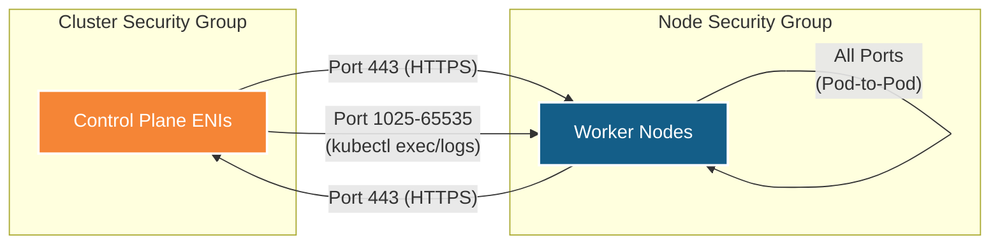
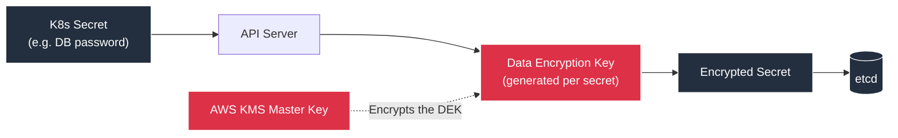
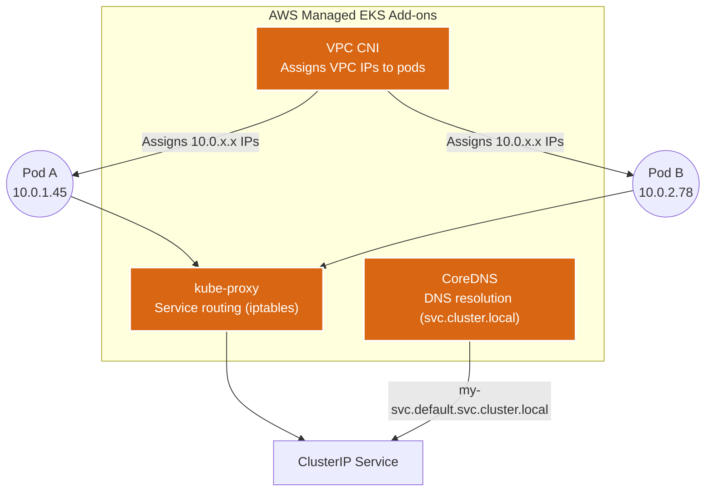

# EKS Module ⚓

This is the core module of the deployment. It provisions the Elastic Kubernetes Service (EKS) cluster, the managed node groups, and all supporting infrastructure — security groups, encryption, logging, networking add-ons, and the IRSA identity layer.

---

## Architecture Diagram

```mermaid
graph TD
    classDef cp fill:#F58536,stroke:#fff,stroke-width:2px,color:#fff
    classDef node fill:#145E88,stroke:#fff,stroke-width:2px,color:#fff
    classDef sec fill:#DC3147,stroke:#fff,stroke-width:2px,color:#fff
    classDef addon fill:#D86613,stroke:#fff,stroke-width:2px,color:#fff

    Admin((kubectl)) --> APIServer

    subgraph Control_Plane ["AWS-Managed EKS Control Plane"]
        APIServer["API Server"]
        Controller["Controller Manager"]
        Scheduler["Scheduler"]
        ETCD[("etcd")]

        APIServer <--> Controller
        APIServer <--> Scheduler
        APIServer <--> ETCD
    end

    subgraph Security_Layer ["Security Integrations"]
        KMS["KMS Key"] -. "Envelope Encryption" .-> ETCD
        CW["CloudWatch Log Group"] <-. "5 Log Types" .- APIServer
        OIDC["OIDC Provider"] -. "IRSA" .-> APIServer
    end

    subgraph Worker_Nodes ["Managed Node Groups (Private Subnets)"]
        subgraph General ["ON_DEMAND Node Group"]
            G1["t3.medium"]
            G2["t3.medium"]
        end
        subgraph Spot ["SPOT Node Group"]
            S1["t3.medium / t3a.medium"]
        end
    end

    subgraph Addons ["EKS Managed Add-ons"]
        CoreDNS["CoreDNS"]
        KubeProxy["kube-proxy"]
        VPCCNI["VPC CNI"]
    end

    APIServer <== "Port 443" ==> General
    APIServer <== "Port 443" ==> Spot
    Addons -.- Worker_Nodes

    class APIServer,Controller,Scheduler,ETCD cp
    class G1,G2,S1 node
    class KMS,CW,OIDC sec
    class CoreDNS,KubeProxy,VPCCNI addon
```

---

## What it Creates 🏗️

| # | Resource | Terraform Type | Purpose |
|---|----------|---------------|---------|
| 1 | **KMS Key** | `aws_kms_key` | Envelope encryption for K8s secrets in `etcd` |
| 2 | **CloudWatch Log Group** | `aws_cloudwatch_log_group` | Stores control plane logs (API, audit, scheduler, etc.) |
| 3 | **Cluster Security Group** | `aws_security_group` | Controls network access to the EKS control plane ENIs |
| 4 | **Node Security Group** | `aws_security_group` | Controls network access to/from worker nodes |
| 5 | **SG Rules** (×4) | `aws_security_group_rule` | Cross-communication rules between control plane and nodes |
| 6 | **EKS Cluster** | `aws_eks_cluster` | The fully-managed Kubernetes control plane |
| 7 | **OIDC Provider** | `aws_iam_openid_connect_provider` | Maps K8s ServiceAccounts to IAM Roles (IRSA) |
| 8 | **CoreDNS Add-on** | `aws_eks_addon` | Internal DNS resolution (`svc.cluster.local`) |
| 9 | **kube-proxy Add-on** | `aws_eks_addon` | Kubernetes Services networking (iptables/IPVS) |
| 10 | **VPC CNI Add-on** | `aws_eks_addon` | Assigns native VPC IPs directly to pods |
| 11 | **Launch Template** | `aws_launch_template` | Secure EC2 config (IMDSv2, encrypted gp3 EBS) |
| 12 | **Managed Node Groups** | `aws_eks_node_group` | Auto-scaling groups of worker EC2 instances |

---

## Security Group Rules



| Rule | From | To | Port | Purpose |
|------|------|-----|------|---------|
| Nodes → Cluster | Node SG | Cluster SG | 443 | Kubelet talks to API server |
| Cluster → Nodes | Cluster SG | Node SG | 1025-65535 | API server to nodes for `kubectl exec`, logs |
| Nodes → Nodes | Node SG | Node SG | All | Pod-to-pod communication |

---

## Encryption at Rest



This is **Envelope Encryption**: each secret gets its own Data Encryption Key (DEK), and the DEK is itself encrypted by the KMS Master Key. Even if `etcd` is compromised, secrets remain encrypted.

---

## Node Groups

### ON_DEMAND vs SPOT

| Feature | ON_DEMAND (general) | SPOT (spot) |
|---------|-------------------|-------------|
| **Pricing** | Full price | Up to 90% discount |
| **Interruption** | Never | 2-min warning from AWS |
| **Best for** | Production, stateful apps | Batch jobs, CI/CD, dev/test |
| **Taint** | None | `spot=true:NoSchedule` |
| **Default replicas** | 2 | 1 |

### Launch Template Security

| Setting | Value | Why |
|---------|-------|-----|
| **IMDSv2** | Required (token mandatory) | Prevents SSRF attacks (e.g., Capital One breach vector) |
| **EBS Volume** | gp3, encrypted | Cost-efficient SSD with encryption at rest |
| **Monitoring** | Configurable | Toggle between 5-min (free) and 1-min ($2/instance/mo) |

---

## EKS Add-ons



| Add-on | What It Does |
|--------|-------------|
| **VPC CNI** | Assigns real VPC IP addresses to pods, enabling native AWS networking without overlay overhead |
| **kube-proxy** | Maintains iptables/IPVS rules on nodes to route traffic for Kubernetes Services |
| **CoreDNS** | Resolves `<service>.<namespace>.svc.cluster.local` DNS queries within the cluster |

---

## IRSA (IAM Roles for Service Accounts)

The OIDC Provider created by this module connects the EKS cluster's identity system to AWS IAM. This enables:

1. A Kubernetes ServiceAccount is annotated with an IAM role ARN.
2. When a pod uses that ServiceAccount, the EKS OIDC provider exchanges the K8s token for temporary AWS credentials.
3. The pod can now call AWS APIs (S3, DynamoDB, Secrets Manager) with its own unique, scoped permissions.

**Key benefit**: No shared node-level credentials. Each pod gets exactly the permissions it needs.
