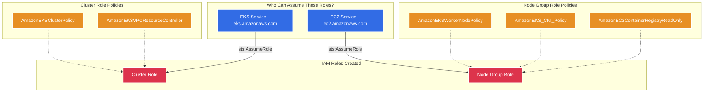
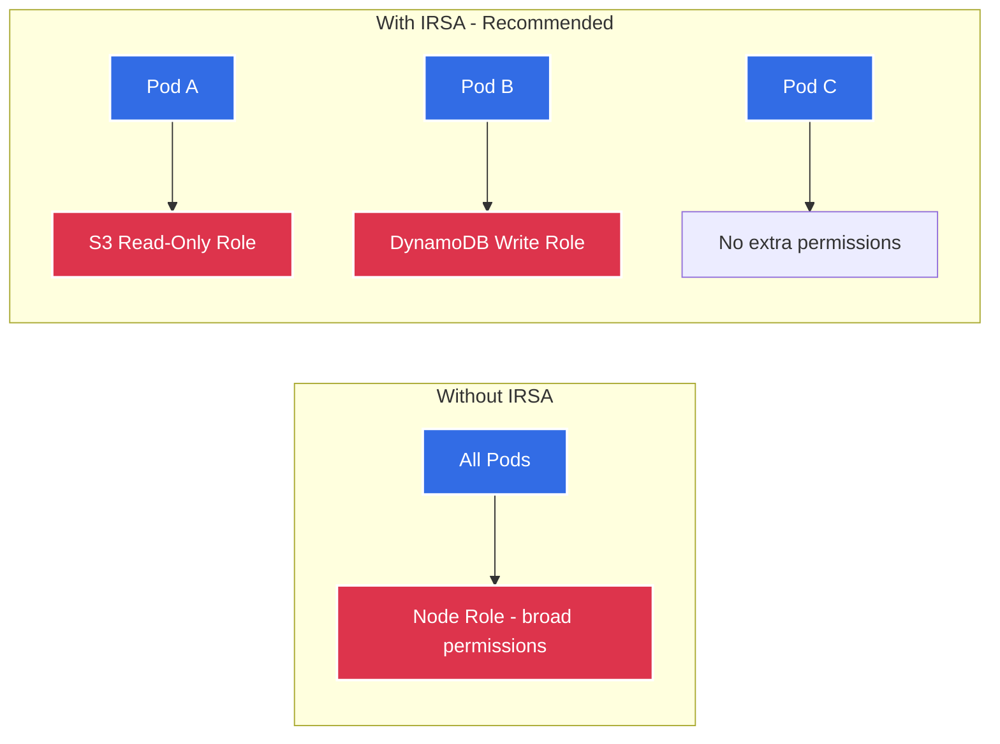

# IAM Module 🔐

This module provisions the Identity and Access Management (IAM) roles required for the EKS cluster. AWS IAM controls *who* can do *what*, providing the bedrock of AWS security through the principle of least privilege.

---

## Architecture Diagram



---

## Detailed Resource Walkthrough

### 1. EKS Cluster Role

```hcl
resource "aws_iam_role" "cluster" {
  name_prefix = "${var.cluster_name}-cluster-"

  assume_role_policy = jsonencode({
    Version = "2012-10-17"
    Statement = [{
      Action = "sts:AssumeRole"
      Effect = "Allow"
      Principal = {
        Service = "eks.amazonaws.com"
      }
    }]
  })

  tags = var.tags
}
```

**Detailed explanation:**

- **`name_prefix = "${var.cluster_name}-cluster-"`** — Creates a role with a name like `eks-dev-cluster-abc123`. Using `name_prefix` instead of `name` adds a random suffix, preventing name collisions when you have multiple clusters in the same AWS account.

- **`assume_role_policy`** — This is the **Trust Policy**. It answers: "WHO is allowed to use this role?" An IAM role has two parts:
  1. **Trust Policy** (who can *wear* the badge) — defined here
  2. **Permissions Policies** (what the badge *unlocks*) — attached below

- **`Version = "2012-10-17"`** — The IAM policy language version. Always use `"2012-10-17"` — this is the latest version and has been since 2012. Using an older version (`"2008-10-17"`) would disable features like policy variables.

- **`Action = "sts:AssumeRole"`** — The STS (Security Token Service) `AssumeRole` action. When the EKS service needs to perform an action (like creating an ENI in your VPC), it calls STS to assume this role and get temporary credentials.

- **`Principal = { Service = "eks.amazonaws.com" }`** — Only the EKS service itself can assume this role. Not your IAM user, not Lambda, not EC2 — **only** the EKS control plane. This is critical for security — it means no human or other service can accidentally (or maliciously) use the cluster's permissions.

---

### 2. Cluster Role Policy Attachments

```hcl
resource "aws_iam_role_policy_attachment" "cluster_policy" {
  policy_arn = "arn:aws:iam::aws:policy/AmazonEKSClusterPolicy"
  role       = aws_iam_role.cluster.name
}

resource "aws_iam_role_policy_attachment" "cluster_vpc_resource_controller" {
  policy_arn = "arn:aws:iam::aws:policy/AmazonEKSVPCResourceController"
  role       = aws_iam_role.cluster.name
}
```

**Detailed explanation:**

- **`aws_iam_role_policy_attachment`** — Attaches an AWS-managed policy to a role. Managed policies are pre-built by AWS, follow least-privilege principles, and are automatically updated when new AWS features are released. This is more secure than writing custom inline policies.

- **`AmazonEKSClusterPolicy`** — Grants the EKS service permissions to: manage the Kubernetes API server, create and manage Elastic Load Balancers for Kubernetes Services, publish CloudWatch metrics, and manage network interfaces. Without this policy, `terraform apply` fails with `InvalidParameterException: The role does not have the AmazonEKSClusterPolicy attached`.

- **`AmazonEKSVPCResourceController`** — Grants permissions to manage VPC ENIs (Elastic Network Interfaces). The VPC CNI plugin creates ENIs on nodes to assign real VPC IPs to pods. This policy also enables Security Groups for Pods (trunk ENIs). Without it, pod networking fails silently.

---

### 3. Node Group Role

```hcl
resource "aws_iam_role" "node_group" {
  name_prefix = "${var.cluster_name}-node-"

  assume_role_policy = jsonencode({
    Version = "2012-10-17"
    Statement = [{
      Action = "sts:AssumeRole"
      Effect = "Allow"
      Principal = {
        Service = "ec2.amazonaws.com"
      }
    }]
  })

  tags = var.tags
}
```

**Detailed explanation:**

- **`Principal = { Service = "ec2.amazonaws.com" }`** — This is the key difference from the cluster role. Here, **EC2 instances** (not the EKS service) assume this role. When a worker node boots up, EC2 uses this role's instance profile to provide the node with temporary AWS credentials. The kubelet on the node then uses these credentials to register with the EKS cluster and pull images from ECR.

---

### 4. Node Group Policy Attachments

```hcl
resource "aws_iam_role_policy_attachment" "node_worker_policy" {
  policy_arn = "arn:aws:iam::aws:policy/AmazonEKSWorkerNodePolicy"
  role       = aws_iam_role.node_group.name
}

resource "aws_iam_role_policy_attachment" "node_cni_policy" {
  policy_arn = "arn:aws:iam::aws:policy/AmazonEKS_CNI_Policy"
  role       = aws_iam_role.node_group.name
}

resource "aws_iam_role_policy_attachment" "node_registry_policy" {
  policy_arn = "arn:aws:iam::aws:policy/AmazonEC2ContainerRegistryReadOnly"
  role       = aws_iam_role.node_group.name
}
```

**Detailed explanation:**

- **`AmazonEKSWorkerNodePolicy`** — Allows the kubelet to communicate with the EKS API server, report node status, and describe EC2 instances for node labels. Without this, nodes cannot register with the cluster and show as `NotReady` or don't appear at all.

- **`AmazonEKS_CNI_Policy`** — Grants permissions to: `CreateNetworkInterface`, `AttachNetworkInterface`, `AssignPrivateIpAddresses`, and related ENI operations. The VPC CNI plugin runs as a DaemonSet on every node and uses these permissions to allocate VPC IPs directly to pods.

  > **Security note from the source code**: In production, consider moving this policy to IRSA (IAM Role for Service Accounts) for the `aws-node` ServiceAccount. This way, only the CNI pods get this permission instead of every process running on the node.

- **`AmazonEC2ContainerRegistryReadOnly`** — Grants **read-only** access to ECR. Nodes can pull (download) container images, but they **cannot push, delete, or modify** images. This is intentional — image pushing should only happen in CI/CD pipelines with different, purpose-built credentials. Without this policy, pods fail with: `Failed to pull image: no basic auth credentials`.

---

## How IRSA Extends This (Configured in EKS Module)



The roles created by this module are the **baseline**. IRSA (configured in the EKS module via the OIDC Provider) adds per-pod IAM roles on top, so pods get only the exact permissions they need.
