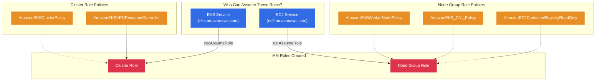
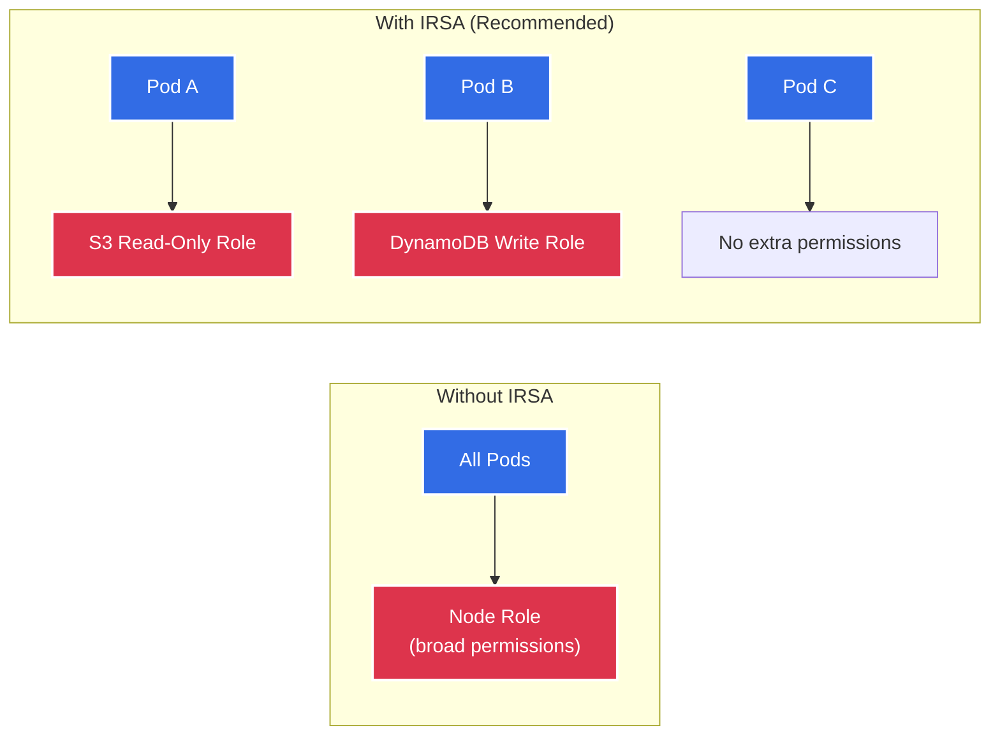

# IAM Module 🔐

This module provisions the Identity and Access Management (IAM) roles required for the EKS cluster. AWS IAM controls *who* can do *what*, providing the bedrock of AWS security through the principle of least privilege.

---

## Architecture Diagram



---

## What it Creates 🏗️

| # | Resource | Terraform Type | Purpose |
|---|----------|---------------|---------|
| 1 | **Cluster Role** | `aws_iam_role` | Assumed by the EKS control plane service |
| 2 | **Node Group Role** | `aws_iam_role` | Assumed by EC2 worker node instances |
| 3 | **Cluster Policy Attachments** (×2) | `aws_iam_role_policy_attachment` | Grants cluster management permissions |
| 4 | **Node Policy Attachments** (×3) | `aws_iam_role_policy_attachment` | Grants node registration, CNI, and ECR access |

---

## Role Details

### 1. EKS Cluster Role

**Who assumes it?** The AWS EKS service itself (`eks.amazonaws.com`).

**What it can do:**
| Policy | Permission Granted |
|--------|--------------------|
| `AmazonEKSClusterPolicy` | Manage Kubernetes API server, create load balancers, publish CloudWatch metrics |
| `AmazonEKSVPCResourceController` | Manage ENIs (Elastic Network Interfaces) in the VPC for pod networking |

**Trust Policy (simplified):**
```json
{
  "Effect": "Allow",
  "Principal": { "Service": "eks.amazonaws.com" },
  "Action": "sts:AssumeRole"
}
```

### 2. Node Group Role

**Who assumes it?** Every EC2 instance that joins the cluster as a worker node (`ec2.amazonaws.com`).

**What it can do:**
| Policy | Permission Granted |
|--------|--------------------|
| `AmazonEKSWorkerNodePolicy` | Register the node with the EKS cluster, describe cluster resources |
| `AmazonEKS_CNI_Policy` | Manage VPC ENIs to assign pod IPs (VPC CNI plugin) |
| `AmazonEC2ContainerRegistryReadOnly` | **Read-only** access to pull images from ECR (cannot push or delete) |

---

## How IRSA Extends This



Without IRSA, **every pod** inherits the broad Node Group Role permissions. With IRSA (enabled in the EKS module), each pod gets its own fine-grained IAM role via its Kubernetes ServiceAccount. This is the recommended AWS security pattern.

---

## Security Principles

- **Least Privilege**: Only AWS-managed policies are attached. No wildcard (`*`) permissions.
- **Read-Only ECR**: Nodes can pull images but cannot push, delete, or modify container images.
- **No Inline Policies**: All permissions come from well-audited AWS-managed policies, ensuring they stay up to date with AWS best practices.
