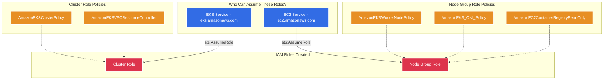
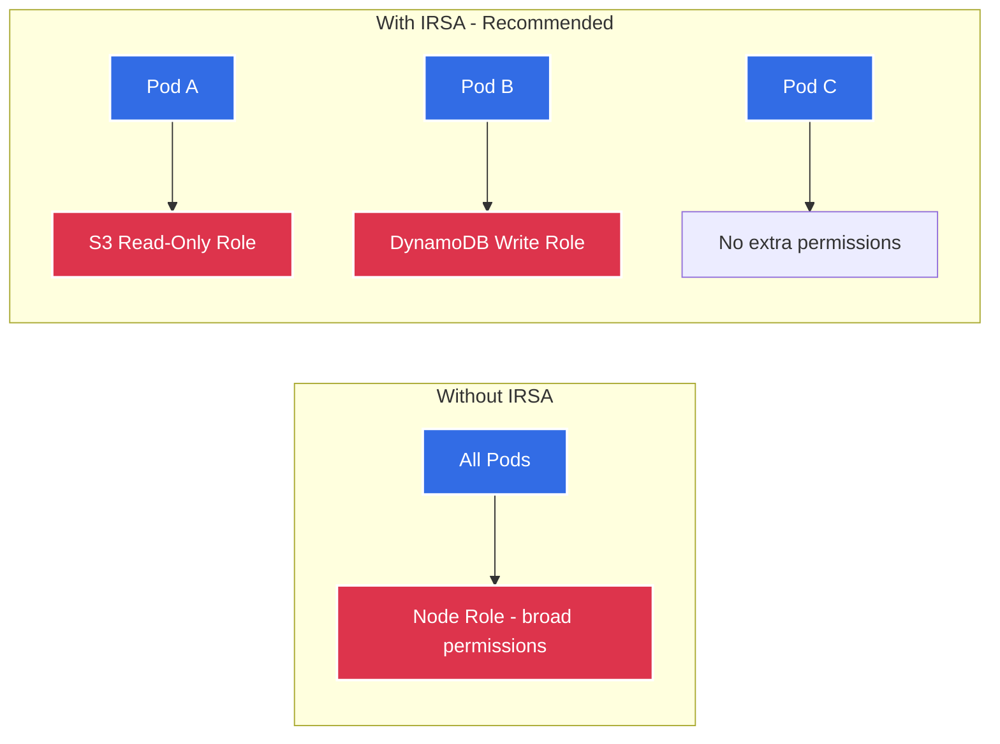

# IAM Module 🔐

This module provisions the Identity and Access Management (IAM) roles required for the EKS cluster. AWS IAM controls *who* can do *what*, providing the bedrock of AWS security through the principle of least privilege.

---

## Architecture Diagram



---

## What it Creates 🏗️

| # | Resource | Terraform Type | Purpose |
|---|----------|---------------|---------|
| 1 | **Cluster Role** | `aws_iam_role` | Assumed by the EKS control plane service |
| 2 | **Node Group Role** | `aws_iam_role` | Assumed by EC2 worker node instances |
| 3 | **Cluster Policy Attachments** (×2) | `aws_iam_role_policy_attachment` | Grants cluster management permissions |
| 4 | **Node Policy Attachments** (×3) | `aws_iam_role_policy_attachment` | Grants node registration, CNI, and ECR access |

---

## Detailed Resource Walkthrough

### 1. EKS Cluster Role

The role that the AWS EKS service assumes to manage the control plane.

```hcl
resource "aws_iam_role" "cluster" {
  name_prefix = "${var.cluster_name}-cluster-"

  assume_role_policy = jsonencode({
    Version = "2012-10-17"
    Statement = [{
      Action = "sts:AssumeRole"
      Effect = "Allow"
      Principal = {
        Service = "eks.amazonaws.com"   # Only EKS service can assume this role
      }
    }]
  })

  tags = var.tags
}

# Attach AWS-managed policies
resource "aws_iam_role_policy_attachment" "cluster_policy" {
  policy_arn = "arn:aws:iam::aws:policy/AmazonEKSClusterPolicy"
  role       = aws_iam_role.cluster.name
}

resource "aws_iam_role_policy_attachment" "vpc_resource_controller" {
  policy_arn = "arn:aws:iam::aws:policy/AmazonEKSVPCResourceController"
  role       = aws_iam_role.cluster.name
}
```

| Policy | What It Allows |
|--------|---------------|
| `AmazonEKSClusterPolicy` | Manage K8s API server, create load balancers, publish CloudWatch metrics |
| `AmazonEKSVPCResourceController` | Manage ENIs (Elastic Network Interfaces) for pod networking |

---

### 2. Node Group Role

The role that every EC2 worker node assumes when it joins the cluster.

```hcl
resource "aws_iam_role" "node_group" {
  name_prefix = "${var.cluster_name}-node-"

  assume_role_policy = jsonencode({
    Version = "2012-10-17"
    Statement = [{
      Action = "sts:AssumeRole"
      Effect = "Allow"
      Principal = {
        Service = "ec2.amazonaws.com"   # Only EC2 instances can assume this role
      }
    }]
  })

  tags = var.tags
}

# Attach AWS-managed policies
resource "aws_iam_role_policy_attachment" "worker_node_policy" {
  policy_arn = "arn:aws:iam::aws:policy/AmazonEKSWorkerNodePolicy"
  role       = aws_iam_role.node_group.name
}

resource "aws_iam_role_policy_attachment" "cni_policy" {
  policy_arn = "arn:aws:iam::aws:policy/AmazonEKS_CNI_Policy"
  role       = aws_iam_role.node_group.name
}

resource "aws_iam_role_policy_attachment" "ecr_read_only" {
  policy_arn = "arn:aws:iam::aws:policy/AmazonEC2ContainerRegistryReadOnly"
  role       = aws_iam_role.node_group.name
}
```

| Policy | What It Allows |
|--------|---------------|
| `AmazonEKSWorkerNodePolicy` | Register the node with the EKS cluster, describe cluster resources |
| `AmazonEKS_CNI_Policy` | Manage VPC ENIs to assign pod IPs (VPC CNI plugin) |
| `AmazonEC2ContainerRegistryReadOnly` | **Read-only** access to pull images from ECR (cannot push or delete) |

---

## How IRSA Extends This (Configured in EKS Module)



**Without IRSA**: Every pod inherits the broad Node Group Role. **With IRSA** (enabled in the EKS module): Each pod gets only the exact AWS permissions it needs via its Kubernetes ServiceAccount.

---

## Security Principles

- **Least Privilege**: Only AWS-managed policies are attached. No wildcard (`*`) permissions.
- **Read-Only ECR**: Nodes can pull images but cannot push, delete, or modify container images.
- **No Inline Policies**: All permissions come from well-audited AWS-managed policies.
