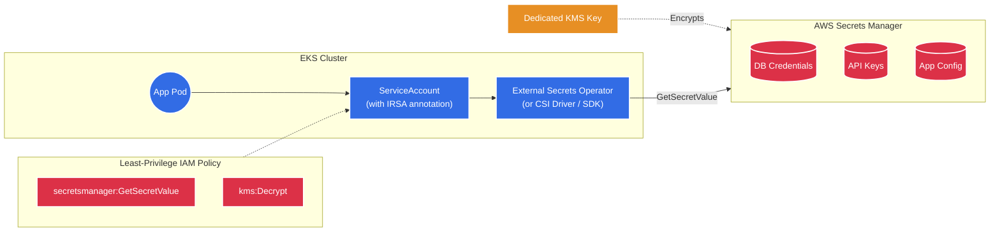
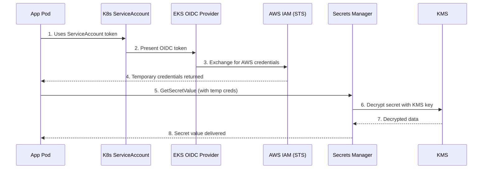
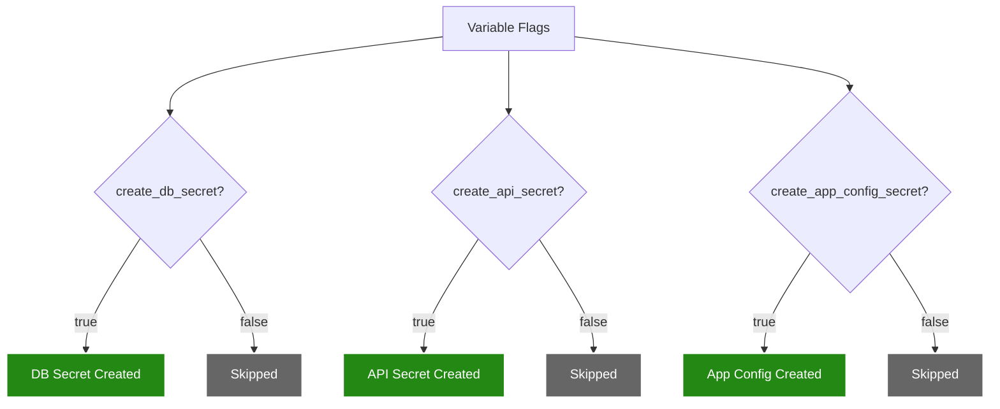

# Secrets Manager Module 🔑

This module sets up AWS Secrets Manager to securely store sensitive data — database credentials, API keys, and application configurations — outside of your source code and Kubernetes manifests.

---

## Architecture Diagram



---

## What it Creates 🏗️

| # | Resource | Terraform Type | Condition | Purpose |
|---|----------|---------------|-----------|---------|
| 1 | **KMS Key** | `aws_kms_key` | Always | Dedicated encryption key for secrets |
| 2 | **KMS Alias** | `aws_kms_alias` | Always | Human-readable name for the key |
| 3 | **DB Secret** | `aws_secretsmanager_secret` | `create_db_secret = true` | Stores database credentials |
| 4 | **DB Secret Value** | `aws_secretsmanager_secret_version` | `create_db_secret = true` | JSON with user, pass, host, port, engine |
| 5 | **API Secret** | `aws_secretsmanager_secret` | `create_api_secret = true` | Stores external API keys |
| 6 | **API Secret Value** | `aws_secretsmanager_secret_version` | `create_api_secret = true` | JSON with api_key, api_secret |
| 7 | **App Config Secret** | `aws_secretsmanager_secret` | `create_app_config_secret = true` | Stores app key-value config |
| 8 | **App Config Value** | `aws_secretsmanager_secret_version` | `create_app_config_secret = true` | JSON from config map |
| 9 | **IAM Read Policy** | `aws_iam_policy` | Always | Least-privilege read-only access to secrets |

---

## Secret Structure

Each secret is stored as a JSON document:

### Database Credentials
```json
{
  "username": "admin",
  "password": "super-secret-password",
  "engine": "postgres",
  "host": "mydb.cluster-xxx.rds.amazonaws.com",
  "port": 5432,
  "dbname": "myapp"
}
```

### API Keys
```json
{
  "api_key": "key-abc123",
  "api_secret": "secret-xyz789"
}
```

### Application Config
```json
{
  "LOG_LEVEL": "info",
  "FEATURE_FLAG": "true",
  "APP_ENV": "production"
}
```

---

## How a Pod Retrieves a Secret



---

## Conditional Creation

Secrets are **only created when explicitly enabled**. This prevents unnecessary resource creation and cost.



---

## Why a Dedicated KMS Key?

This module creates its **own KMS key**, separate from the EKS cluster's KMS key. This follows the principle of **separation of duties**:

| KMS Key | Encrypts | Managed By |
|---------|----------|------------|
| **EKS KMS Key** | Kubernetes secrets in `etcd` | EKS module |
| **Secrets Manager KMS Key** | Application secrets in Secrets Manager | This module |

If one key is compromised, the other remains secure.

---

## Integration Options

| Method | How It Works | Best For |
|--------|-------------|----------|
| **External Secrets Operator** | K8s operator syncs AWS secrets to K8s Secrets | GitOps workflows |
| **CSI Secrets Store Driver** | Mounts secrets as files in the pod filesystem | File-based configs |
| **AWS SDK** | Application code calls `GetSecretValue` directly | Custom logic, rotation |

---

## Cost

| Item | Cost |
|------|------|
| Each secret | ~$0.40/month |
| API calls | $0.05 per 10,000 calls |
| KMS Key | $1.00/month |
