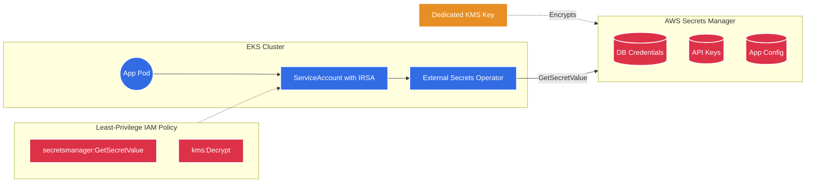
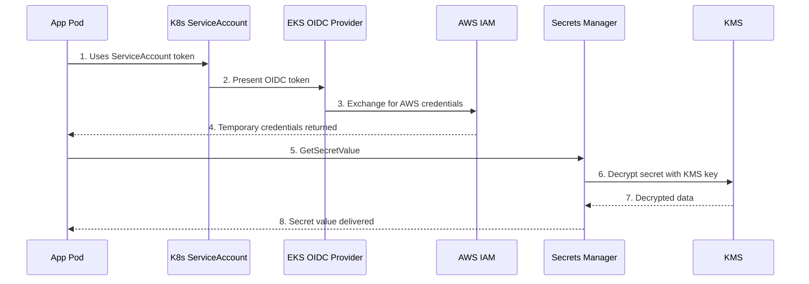
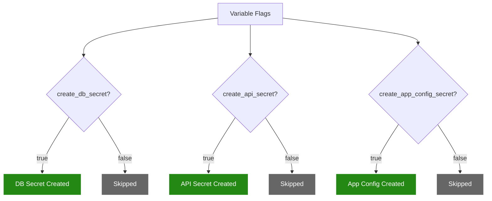

# Secrets Manager Module 🔑

This module sets up AWS Secrets Manager to securely store sensitive data — database credentials, API keys, and application configurations — outside of your source code and Kubernetes manifests.

---

## Architecture Diagram



---

## Detailed Resource Walkthrough

### 1. Dedicated KMS Key

```hcl
resource "aws_kms_key" "secrets" {
  count                   = var.create_db_secret || var.create_api_secret || var.create_app_config_secret ? 1 : 0
  description             = "KMS key for Secrets Manager encryption"
  deletion_window_in_days = 7
  enable_key_rotation     = true

  tags = merge(var.tags, {
    Name = "${var.name_prefix}-secrets-kms"
  })
}

resource "aws_kms_alias" "secrets" {
  count         = var.create_db_secret || var.create_api_secret || var.create_app_config_secret ? 1 : 0
  name          = "alias/${var.name_prefix}-secrets"
  target_key_id = aws_kms_key.secrets[0].key_id
}
```

**Detailed explanation:**

- **`count = var.create_db_secret || var.create_api_secret || var.create_app_config_secret ? 1 : 0`** — The KMS key is only created if **at least one** secret type is enabled. The `||` (OR) operator means: if ANY of the three flags is `true`, create the key. If no secrets are enabled, there's no need for an encryption key, saving $1/month.

- **Why a SEPARATE KMS key?** This module creates its own KMS key instead of reusing the EKS module's key. The source code explains 4 reasons:
  1. **Key separation** — Different services should use different keys
  2. **Different access policies** — EKS control plane vs application pods
  3. **Different rotation schedules** — Can be managed independently
  4. **Blast radius** — If one key is compromised, the other secrets remain safe

- **`target_key_id = aws_kms_key.secrets[0].key_id`** — The `[0]` index is needed because the key is a `count` resource. When `count = 1`, the resource is at index `[0]`. This alias gives the key a human-friendly name like `alias/eks-dev-secrets` instead of a raw key ID.

---

### 2. Database Credentials Secret

```hcl
resource "aws_secretsmanager_secret" "db_credentials" {
  count                   = var.create_db_secret ? 1 : 0
  name                    = "${var.name_prefix}-db-credentials"
  description             = "Database credentials for ${var.name_prefix}"
  kms_key_id              = aws_kms_key.secrets[0].id
  recovery_window_in_days = 7

  tags = merge(var.tags, {
    Name = "${var.name_prefix}-db-credentials"
    Type = "database"
  })
}

resource "aws_secretsmanager_secret_version" "db_credentials" {
  count     = var.create_db_secret ? 1 : 0
  secret_id = aws_secretsmanager_secret.db_credentials[0].id
  secret_string = jsonencode({
    username = var.db_username
    password = var.db_password
    engine   = var.db_engine
    host     = var.db_host
    port     = var.db_port
    dbname   = var.db_name
  })
}
```

**Detailed explanation:**

- **`aws_secretsmanager_secret`** — Creates the secret **container** (metadata, encryption settings, recovery policy). This is like creating a file — the name exists but it's empty.

- **`aws_secretsmanager_secret_version`** — Creates the actual secret **value** (the content inside the container). The separation is intentional — you can have multiple versions of a secret for rotation.

- **`kms_key_id = aws_kms_key.secrets[0].id`** — Encrypts this secret with our dedicated KMS key instead of the default AWS-managed key. With the dedicated key, we control the access policy, rotation schedule, and audit trail independently.

- **`recovery_window_in_days = 7`** — After you delete this secret (e.g., via `terraform destroy`), it's **recoverable for 7 days**. During this window, you can restore it. After 7 days, it's permanently deleted. In production, set this to `30` for maximum safety. Set to `0` for immediate deletion (testing only — not recommended).

- **`jsonencode({ username = var.db_username, ... })`** — Converts the Terraform variables to a JSON string. The resulting secret value looks like:
  ```json
  {
    "username": "admin",
    "password": "super-secret-password",
    "engine": "postgres",
    "host": "mydb.cluster-xxx.rds.amazonaws.com",
    "port": 5432,
    "dbname": "myapp"
  }
  ```

- **`Type = "database"` tag** — Not functional, but makes it easy to filter secrets in the AWS Console by type.

---

### 3. API Keys Secret

```hcl
resource "aws_secretsmanager_secret" "api_keys" {
  count                   = var.create_api_secret ? 1 : 0
  name                    = "${var.name_prefix}-api-keys"
  description             = "API keys for ${var.name_prefix}"
  kms_key_id              = aws_kms_key.secrets[0].id
  recovery_window_in_days = 7

  tags = merge(var.tags, {
    Name = "${var.name_prefix}-api-keys"
    Type = "api"
  })
}

resource "aws_secretsmanager_secret_version" "api_keys" {
  count     = var.create_api_secret ? 1 : 0
  secret_id = aws_secretsmanager_secret.api_keys[0].id
  secret_string = jsonencode({
    api_key    = var.api_key
    api_secret = var.api_secret
  })
}
```

**Detailed explanation:**

- Same pattern as the database secret. Stores API key/secret pairs for external service integrations (e.g., Stripe, SendGrid, GitHub tokens). The `var.api_key` and `var.api_secret` variables are marked as `sensitive = true` in `variables.tf`, meaning Terraform redacts them from `plan` and `apply` output.

---

### 4. Application Config Secret

```hcl
resource "aws_secretsmanager_secret" "app_config" {
  count                   = var.create_app_config_secret ? 1 : 0
  name                    = "${var.name_prefix}-app-config"
  description             = "Application configuration for ${var.name_prefix}"
  kms_key_id              = aws_kms_key.secrets[0].id
  recovery_window_in_days = 7

  tags = merge(var.tags, {
    Name = "${var.name_prefix}-app-config"
    Type = "application"
  })
}

resource "aws_secretsmanager_secret_version" "app_config" {
  count         = var.create_app_config_secret ? 1 : 0
  secret_id     = aws_secretsmanager_secret.app_config[0].id
  secret_string = jsonencode(var.app_config)
}
```

**Detailed explanation:**

- **`jsonencode(var.app_config)`** — Notice this encodes the **entire map** directly, not individual keys. `var.app_config` is a `map(string)`, so the result looks like:
  ```json
  { "LOG_LEVEL": "info", "FEATURE_FLAG": "true", "APP_ENV": "production" }
  ```
  This is useful for feature flags, environment-specific settings, and other configs you don't want hardcoded in Kubernetes ConfigMaps (because ConfigMaps are stored in base64 in `etcd`).

---

### 5. Least-Privilege IAM Read Policy

```hcl
resource "aws_iam_policy" "read_secrets" {
  count       = var.create_db_secret || var.create_api_secret || var.create_app_config_secret ? 1 : 0
  name_prefix = "${var.name_prefix}-read-secrets-"
  description = "Allow reading secrets from Secrets Manager"

  policy = jsonencode({
    Version = "2012-10-17"
    Statement = [
      {
        Effect = "Allow"
        Action = [
          "secretsmanager:GetSecretValue",
          "secretsmanager:DescribeSecret"
        ]
        Resource = concat(
          var.create_db_secret ? [aws_secretsmanager_secret.db_credentials[0].arn] : [],
          var.create_api_secret ? [aws_secretsmanager_secret.api_keys[0].arn] : [],
          var.create_app_config_secret ? [aws_secretsmanager_secret.app_config[0].arn] : []
        )
      },
      {
        Effect   = "Allow"
        Action   = ["kms:Decrypt", "kms:DescribeKey"]
        Resource = [aws_kms_key.secrets[0].arn]
      }
    ]
  })

  tags = var.tags
}
```

**Detailed explanation:**

- **Least-privilege design** — This policy grants **only** `GetSecretValue` (read the actual secret) and `DescribeSecret` (read metadata). It explicitly does **NOT** grant `PutSecretValue` (modify), `DeleteSecret`, or `CreateSecret`. This means pods can read secrets but cannot change or delete them.

- **`Resource = concat(...)`** — The `concat()` function builds a dynamic list of secret ARNs. Only the ARNs of secrets that were actually created are included. For example, if only `create_db_secret = true`, the Resource list contains only the DB secret ARN. This is **much more secure** than using a wildcard like `"arn:aws:secretsmanager:*:*:secret:*"`, which would grant access to all secrets in the account.

- **`kms:Decrypt` and `kms:DescribeKey`** — Because our secrets are encrypted with a custom KMS key, the IAM policy must explicitly allow decryption. Without the `kms:Decrypt` permission, even with `GetSecretValue` access, the secret value can't be decrypted and the API call returns an error.

- **`Resource = [aws_kms_key.secrets[0].arn]`** — Only allows decryption with **this specific** KMS key, not any KMS key in the account.

**How to use this policy with IRSA:**
1. Create an IAM role with this policy attached
2. Add a trust policy allowing the EKS OIDC provider
3. Annotate a K8s ServiceAccount with the role ARN
4. Pods using that ServiceAccount can now read the secrets

---

## How a Pod Retrieves a Secret



---

## Conditional Creation



---

## Cost

| Item | Cost |
|------|------|
| Each secret | ~$0.40/month |
| API calls | $0.05 per 10,000 calls |
| KMS Key | $1.00/month |
