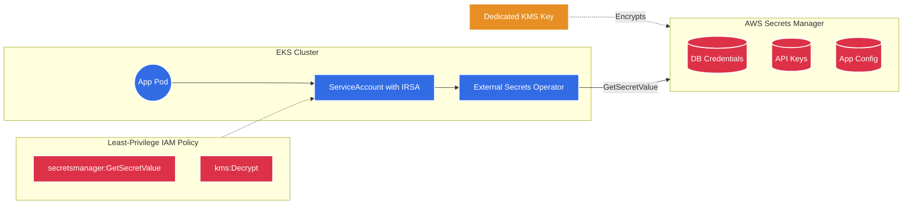
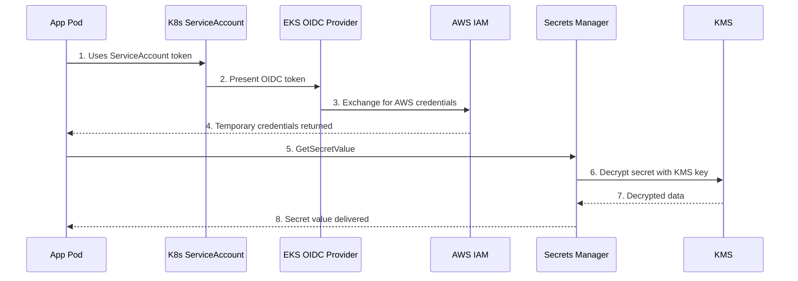
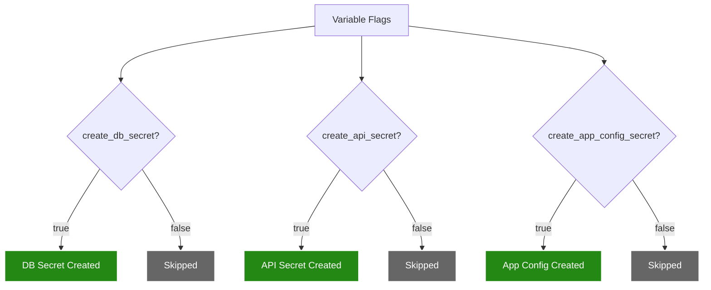

# Secrets Manager Module 🔑

This module sets up AWS Secrets Manager to securely store sensitive data — database credentials, API keys, and application configurations — outside of your source code and Kubernetes manifests.

---

## Architecture Diagram



---

## What it Creates 🏗️

| # | Resource | Terraform Type | Condition | Purpose |
|---|----------|---------------|-----------|---------|
| 1 | **KMS Key** | `aws_kms_key` | Always | Dedicated encryption key for secrets |
| 2 | **KMS Alias** | `aws_kms_alias` | Always | Human-readable name for the key |
| 3 | **DB Secret** | `aws_secretsmanager_secret` | `create_db_secret = true` | Stores database credentials |
| 4 | **API Secret** | `aws_secretsmanager_secret` | `create_api_secret = true` | Stores external API keys |
| 5 | **App Config Secret** | `aws_secretsmanager_secret` | `create_app_config_secret = true` | Stores app key-value config |
| 6 | **IAM Read Policy** | `aws_iam_policy` | Always | Least-privilege read-only access to secrets |

---

## Detailed Resource Walkthrough

### 1. Dedicated KMS Key

A separate KMS key is created exclusively for Secrets Manager, following the principle of **separation of duties** from the EKS cluster's KMS key.

```hcl
resource "aws_kms_key" "secrets" {
  description             = "${var.name_prefix}-secrets-key"
  deletion_window_in_days = 7
  enable_key_rotation     = true

  tags = var.tags
}

resource "aws_kms_alias" "secrets" {
  name          = "alias/${var.name_prefix}-secrets"
  target_key_id = aws_kms_key.secrets.key_id
}
```

| KMS Key | Encrypts | Managed By |
|---------|----------|------------|
| **EKS KMS Key** | Kubernetes secrets in `etcd` | EKS module |
| **Secrets Manager KMS Key** | Application secrets in Secrets Manager | This module |

---

### 2. Secrets (Conditionally Created)

Each secret is only provisioned when its flag is explicitly set to `true`.

```hcl
# Database credentials secret
resource "aws_secretsmanager_secret" "db" {
  count       = var.create_db_secret ? 1 : 0
  name_prefix = "${var.name_prefix}-db-"
  kms_key_id  = aws_kms_key.secrets.arn

  recovery_window_in_days = 7   # Prevents accidental permanent deletion
}

resource "aws_secretsmanager_secret_version" "db" {
  count     = var.create_db_secret ? 1 : 0
  secret_id = aws_secretsmanager_secret.db[0].id

  secret_string = jsonencode({
    username = var.db_username
    password = var.db_password
    engine   = var.db_engine
    host     = var.db_host
    port     = var.db_port
    dbname   = var.db_name
  })
}
```

**Secret JSON structure examples:**

```json
// Database Credentials
{
  "username": "admin",
  "password": "super-secret-password",
  "engine": "postgres",
  "host": "mydb.cluster-xxx.rds.amazonaws.com",
  "port": 5432,
  "dbname": "myapp"
}
```

```json
// API Keys
{ "api_key": "key-abc123", "api_secret": "secret-xyz789" }
```

---

### 3. Least-Privilege IAM Policy

A strict read-only policy that grants access only to the specific secrets and KMS key created by this module.

```hcl
resource "aws_iam_policy" "secrets_read" {
  name_prefix = "${var.name_prefix}-secrets-read-"

  policy = jsonencode({
    Version = "2012-10-17"
    Statement = [
      {
        Sid    = "AllowGetSecretValue"
        Effect = "Allow"
        Action = ["secretsmanager:GetSecretValue"]
        Resource = [for s in aws_secretsmanager_secret.db : s.arn]
      },
      {
        Sid    = "AllowKMSDecrypt"
        Effect = "Allow"
        Action = ["kms:Decrypt"]
        Resource = [aws_kms_key.secrets.arn]
      }
    ]
  })
}
```

---

## How a Pod Retrieves a Secret



---

## Conditional Creation

Secrets are **only created when explicitly enabled**:



---

## Integration Options

| Method | How It Works | Best For |
|--------|-------------|----------|
| **External Secrets Operator** | K8s operator syncs AWS secrets to K8s Secrets | GitOps workflows |
| **CSI Secrets Store Driver** | Mounts secrets as files in the pod filesystem | File-based configs |
| **AWS SDK** | Application code calls `GetSecretValue` directly | Custom logic, rotation |

---

## Cost

| Item | Cost |
|------|------|
| Each secret | ~$0.40/month |
| API calls | $0.05 per 10,000 calls |
| KMS Key | $1.00/month |
