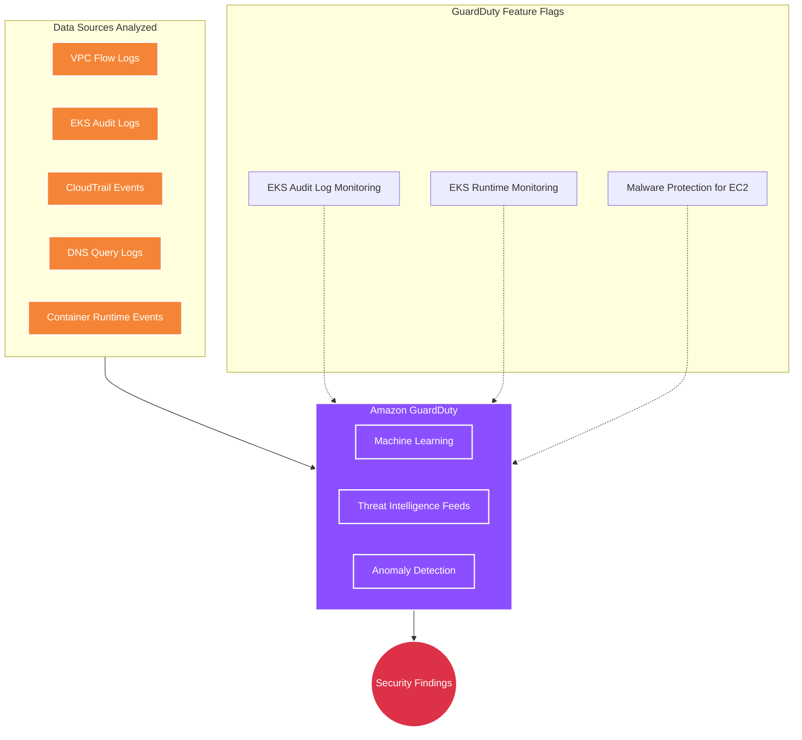
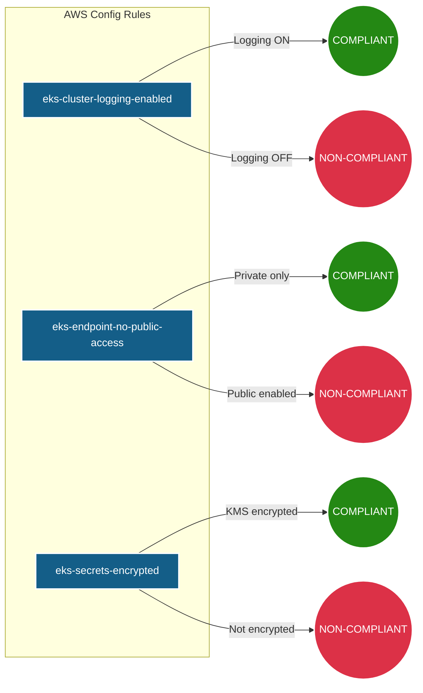
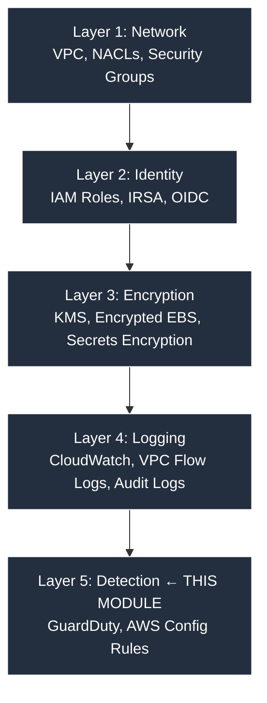

# Security Module 🛡️

This module enables continuous threat detection and configuration compliance monitoring using AWS-native services. While the VPC, IAM, and EKS modules provide preventive controls, this module acts as the **detection layer** — your automated Security Operations Center (SOC).

---

## Architecture Diagram

---

## What it Creates 🏗️

| # | Resource | Terraform Type | Purpose |
|---|----------|---------------|---------|
| 1 | **GuardDuty Detector** | `aws_guardduty_detector` | Enables threat detection service |
| 2 | **EKS Audit Log Monitoring** | GuardDuty feature | Analyzes K8s API calls for suspicious patterns |
| 3 | **EKS Runtime Monitoring** | GuardDuty feature | Detects OS-level threats on nodes |
| 4 | **Malware Protection** | GuardDuty feature | Scans EBS volumes when threats are detected |
| 5 | **Config Recorder** | `aws_config_configuration_recorder` | Records resource configuration changes |
| 6 | **Config Delivery Channel** | `aws_config_delivery_channel` | Stores config snapshots in S3 |
| 7 | **Config Rules** (×3) | `aws_config_config_rule` | Compliance checks against EKS best practices |

---

## Threat Detection (GuardDuty)

GuardDuty uses machine learning and AWS threat intelligence to detect threats in real time.

### What It Detects

| Threat Category | Example Findings |
|----------------|-----------------|
| **Unauthorized Access** | API calls from a known malicious IP |
| **Compromised Credentials** | Access keys used from an unusual geolocation |
| **Crypto Mining** | EC2 instance querying cryptocurrency mining pools |
| **Privilege Escalation** | Pod created with `hostNetwork: true` or `privileged: true` |
| **Container Escape** | Process running outside expected container namespace |
| **Data Exfiltration** | Unusual outbound data transfer volume |

---

## Compliance Monitoring (AWS Config)

| Config Rule | What It Checks | Expected State |
|-------------|---------------|----------------|
| `eks-cluster-logging-enabled` | Are all 5 control plane log types enabled? | COMPLIANT |
| `eks-endpoint-no-public-access` | Is the API server restricted from public access? | COMPLIANT (in prod) |
| `eks-secrets-encrypted` | Are K8s secrets encrypted with a KMS key? | COMPLIANT |

---

## Defense-in-Depth Strategy

This module fits into a multi-layered security architecture:

---

## Cost Considerations

| Service | Approximate Cost | Toggle Variable |
|---------|-----------------|-----------------|
| **GuardDuty** | ~$5-15/mo (30-day free trial) | `enable_guardduty` |
| **AWS Config** | ~$3-5/mo | `enable_aws_config` |

**Kube-native alternatives** (free, open source):
- **Falco** → Runtime threat detection (replaces GuardDuty runtime monitoring)
- **OPA/Kyverno** → Policy enforcement (replaces AWS Config rules)
