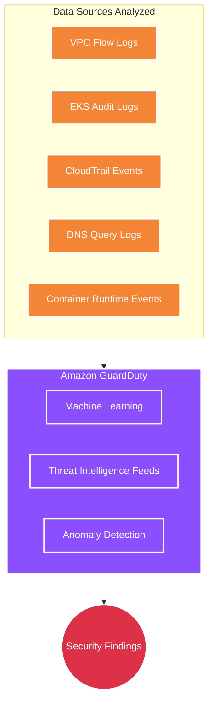
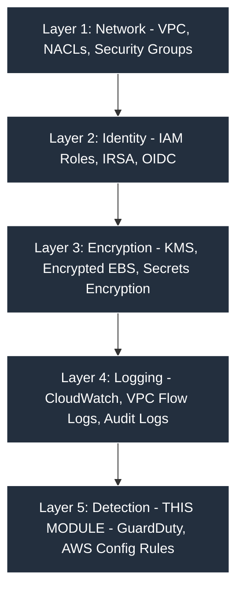

# Security Module 🛡️

This module enables continuous threat detection and configuration compliance monitoring using AWS-native services. While the VPC, IAM, and EKS modules provide preventive controls, this module acts as the **detection layer** — your automated Security Operations Center (SOC).

---

## Architecture Diagram



---

## Detailed Resource Walkthrough

### 1. Amazon GuardDuty Detector

```hcl
resource "aws_guardduty_detector" "main" {
  count  = var.enable_guardduty ? 1 : 0
  enable = true

  finding_publishing_frequency = "FIFTEEN_MINUTES"

  tags = merge(var.tags, {
    Name = "${var.cluster_name}-guardduty"
  })
}
```

**Detailed explanation:**

- **`count = var.enable_guardduty ? 1 : 0`** — GuardDuty is optional and costs ~$4-5/GB of data analyzed (first 30 days free). In dev environments, disable it to save costs. In production, always enable it.

- **`enable = true`** — Activates the detector and starts analyzing data immediately. GuardDuty analyzes **metadata only** (logs, flow logs, DNS queries) — it never reads your actual data or interferes with your applications.

- **`finding_publishing_frequency = "FIFTEEN_MINUTES"`** — How often GuardDuty publishes **updates** to existing findings. **New findings are always published immediately** regardless of this setting. Options are `"FIFTEEN_MINUTES"` (most responsive, recommended for production), `"ONE_HOUR"`, or `"SIX_HOURS"`.

---

### 2. GuardDuty Feature Flags

```hcl
resource "aws_guardduty_detector_feature" "eks_audit_logs" {
  count       = var.enable_guardduty ? 1 : 0
  detector_id = aws_guardduty_detector.main[0].id
  name        = "EKS_AUDIT_LOGS"
  status      = "ENABLED"
}

resource "aws_guardduty_detector_feature" "eks_runtime_monitoring" {
  count       = var.enable_guardduty ? 1 : 0
  detector_id = aws_guardduty_detector.main[0].id
  name        = "EKS_RUNTIME_MONITORING"
  status      = "ENABLED"
}

resource "aws_guardduty_detector_feature" "malware_protection" {
  count       = var.enable_guardduty ? 1 : 0
  detector_id = aws_guardduty_detector.main[0].id
  name        = "EBS_MALWARE_PROTECTION"
  status      = "ENABLED"
}
```

**Detailed explanation:**

- **`aws_guardduty_detector_feature`** — Uses the modern resource type (replaces the deprecated `datasources` block inside the detector). Each feature flag enables a specific detection capability:

- **`EKS_AUDIT_LOGS`** — Analyzes Kubernetes API audit logs to detect suspicious K8s activity:
  - Unauthorized `kubectl exec` into pods
  - Creation of privileged containers
  - API calls from known malicious IPs
  - Anomalous API patterns (unusual times, unusual users)
  - Credential exfiltration attempts

- **`EKS_RUNTIME_MONITORING`** — Monitors **OS-level events** on worker nodes. This goes deeper than audit logs — it detects:
  - Process injection attacks (a process spawning inside a container that wasn't part of the original image)
  - Suspicious file access patterns (reading `/etc/shadow`, modifying system binaries)
  - Unexpected network connections from containers (connecting to known C2 servers)
  - Privilege escalation attempts

- **`EBS_MALWARE_PROTECTION`** — When GuardDuty detects suspicious activity, it can scan the affected instance's EBS volumes for malware. This runs **only when triggered** by another finding (not continuously), so it doesn't impact normal performance.

**What GuardDuty detects (examples):**

| Threat Category | Finding Type |
|----------------|-------------|
| Port Scanning | `Recon:EC2/PortProbeUnprotectedPort` |
| Compromised Creds | `UnauthorizedAccess:IAMUser/MaliciousIPCaller` |
| Crypto Mining | `CryptoCurrency:EC2/BitcoinTool.B!DNS` |
| K8s Threats | `Kubernetes:K8sDNS/SuccessfullyCreated` |

---

### 3. AWS Config Recorder

```hcl
resource "aws_iam_role" "config" {
  count       = var.enable_config ? 1 : 0
  name_prefix = "${var.cluster_name}-config-"

  assume_role_policy = jsonencode({
    Version = "2012-10-17"
    Statement = [{
      Action    = "sts:AssumeRole"
      Effect    = "Allow"
      Principal = { Service = "config.amazonaws.com" }
    }]
  })

  tags = var.tags
}

resource "aws_iam_role_policy_attachment" "config" {
  count      = var.enable_config ? 1 : 0
  policy_arn = "arn:aws:iam::aws:policy/service-role/AWS_ConfigRole"
  role       = aws_iam_role.config[0].name
}

resource "aws_config_configuration_recorder" "main" {
  count    = var.enable_config ? 1 : 0
  name     = "${var.cluster_name}-config-recorder"
  role_arn = aws_iam_role.config[0].arn

  recording_group {
    all_supported = true
  }
}
```

**Detailed explanation:**

- **IAM Role for Config** — AWS Config needs its own IAM role to read configurations of your AWS resources and record changes. The trust policy allows only the `config.amazonaws.com` service to assume this role.

- **`AWS_ConfigRole` managed policy** — Grants Config read access to all supported resource types. This is a **service-role** policy (note the `service-role/` prefix in the ARN), meaning it's specifically designed for AWS services to use.

- **`recording_group { all_supported = true }`** — Config records configuration changes for **all supported resource types** in the account. This includes EC2 instances, security groups, EKS clusters, IAM roles, S3 buckets, etc. You could restrict this to specific types (e.g., only EKS-related), but recording everything gives you a complete configuration history for forensic analysis.

---

### 4. AWS Config Rules

```hcl
resource "aws_config_config_rule" "eks_cluster_logging" {
  count = var.enable_config ? 1 : 0
  name  = "${var.cluster_name}-eks-logging-enabled"

  source {
    owner             = "AWS"
    source_identifier = "EKS_CLUSTER_LOGGING_ENABLED"
  }

  scope {
    compliance_resource_types = ["AWS::EKS::Cluster"]
  }

  tags       = var.tags
  depends_on = [aws_config_configuration_recorder.main]
}

resource "aws_config_config_rule" "eks_endpoint_no_public_access" {
  count = var.enable_config ? 1 : 0
  name  = "${var.cluster_name}-eks-no-public-endpoint"

  source {
    owner             = "AWS"
    source_identifier = "EKS_ENDPOINT_NO_PUBLIC_ACCESS"
  }

  scope {
    compliance_resource_types = ["AWS::EKS::Cluster"]
  }

  tags       = var.tags
  depends_on = [aws_config_configuration_recorder.main]
}

resource "aws_config_config_rule" "eks_secrets_encrypted" {
  count = var.enable_config ? 1 : 0
  name  = "${var.cluster_name}-eks-secrets-encrypted"

  source {
    owner             = "AWS"
    source_identifier = "EKS_SECRETS_ENCRYPTED"
  }

  scope {
    compliance_resource_types = ["AWS::EKS::Cluster"]
  }

  tags       = var.tags
  depends_on = [aws_config_configuration_recorder.main]
}
```

**Detailed explanation:**

- **`source { owner = "AWS" }`** — These are **AWS-managed rules** (pre-built by AWS). You can also create custom rules using Lambda functions, but managed rules are easier and cover the most common compliance checks.

- **`source_identifier`** — The unique ID of the managed rule. AWS maintains a catalog of ~300+ managed rules covering various compliance frameworks.

- **`scope { compliance_resource_types = ["AWS::EKS::Cluster"] }`** — This rule only evaluates EKS Cluster resources. Without the scope, it would try to evaluate every resource in the account, which would be unnecessary and costly.

- **`depends_on = [aws_config_configuration_recorder.main]`** — Config Rules require the Configuration Recorder to be running. Without this dependency, Terraform might create the rule before the recorder exists, causing the rule to enter an error state.

**What each rule checks:**

| Rule | What It Checks | Expected |
|------|---------------|----------|
| `EKS_CLUSTER_LOGGING_ENABLED` | Are all 5 control plane log types enabled? | COMPLIANT |
| `EKS_ENDPOINT_NO_PUBLIC_ACCESS` | Is the API server restricted from public access? | COMPLIANT in prod (NON_COMPLIANT in dev is OK) |
| `EKS_SECRETS_ENCRYPTED` | Are K8s secrets encrypted with a KMS key? | COMPLIANT |

> **Note from the source code**: The `EKS_ENDPOINT_NO_PUBLIC_ACCESS` rule will flag our cluster as `NON_COMPLIANT` because we have public access enabled. This is intentional for development. In production, disable public access and access the cluster via VPN.

---

## Defense-in-Depth Strategy



---

## Cost

| Service | Approximate Cost | Toggle Variable |
|---------|-----------------|-----------------|
| **GuardDuty** | ~$4-5/GB analyzed (30-day free trial) | `enable_guardduty` |
| **AWS Config** | ~$0.003/rule evaluation + $0.003/item recorded | `enable_config` |
| **Small EKS cluster total** | ~$10-30/month | — |
