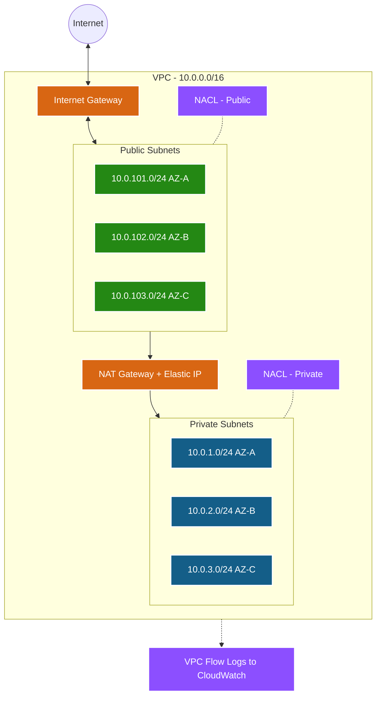
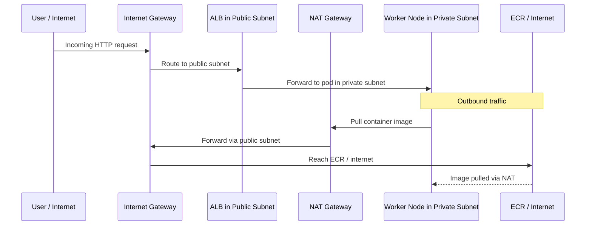

# VPC Module 🌐

This module provisions the foundational networking infrastructure for the EKS cluster. It sets up a secure, production-grade Virtual Private Cloud (VPC) with public and private subnets across multiple Availability Zones.

---

## Architecture Diagram



---

## Detailed Resource Walkthrough

### 1. VPC

```hcl
resource "aws_vpc" "main" {
  cidr_block           = var.vpc_cidr
  enable_dns_hostnames = true
  enable_dns_support   = true

  tags = merge(var.tags, {
    Name = "${var.name_prefix}-vpc"
  })
}
```

**Detailed explanation:**

- **`cidr_block = var.vpc_cidr`** — The IP address range for the entire VPC. For example, `10.0.0.0/16` gives you 65,536 IP addresses (10.0.0.0 through 10.0.255.255). The `/16` is the network prefix length — smaller numbers mean more IPs. This range is divided among all subnets. Choose a range that doesn't overlap with your on-premises network if you plan to use VPN or Direct Connect.

- **`enable_dns_hostnames = true`** — When an instance gets a public IP, AWS also assigns a DNS hostname like `ec2-10-0-1-5.compute.amazonaws.com`. **EKS requires this** — the kubelet uses DNS hostnames to register nodes with the API server. Without this, nodes show as `NotReady`.

- **`enable_dns_support = true`** — Enables the Amazon-provided DNS server at the VPC's base IP + 2 (e.g., `10.0.0.2`). This DNS server resolves AWS service endpoints (like `eks.amazonaws.com`, `ecr.amazonaws.com`) and private hosted zones. **EKS requires this** for the control plane endpoint to resolve correctly from inside the VPC.

- **`merge(var.tags, { Name = "..." })`** — `merge()` combines two maps. `var.tags` contains common tags like `Environment = "dev"` and `Terraform = "true"`. The inline map adds the `Name` tag, which is what appears in the AWS Console's "Name" column.

---

### 2. Internet Gateway

```hcl
resource "aws_internet_gateway" "main" {
  vpc_id = aws_vpc.main.id

  tags = merge(var.tags, {
    Name = "${var.name_prefix}-igw"
  })
}
```

**Detailed explanation:**

- **`vpc_id = aws_vpc.main.id`** — Attaches the gateway to our VPC. A VPC can have only **one** Internet Gateway. The IGW is horizontally scaled, redundant, and highly available — AWS manages all of this for you.

- An IGW does two things: (1) It provides a target in your route tables for internet-routable traffic, and (2) it performs NAT for instances with public IPs. Think of it as the "front door" of your VPC. Only resources in subnets that have a route to the IGW (public subnets) can use it.

---

### 3. Public Subnets

```hcl
resource "aws_subnet" "public" {
  count                   = length(var.public_subnets)
  vpc_id                  = aws_vpc.main.id
  cidr_block              = var.public_subnets[count.index]
  availability_zone       = var.azs[count.index]
  map_public_ip_on_launch = true

  tags = merge(var.tags, var.public_subnet_tags, {
    Name = "${var.name_prefix}-public-${var.azs[count.index]}"
    Type = "public"
  })
}
```

**Detailed explanation:**

- **`count = length(var.public_subnets)`** — Creates one subnet per CIDR in the list. With `["10.0.101.0/24", "10.0.102.0/24", "10.0.103.0/24"]`, this creates 3 subnets. `count.index` gives 0, 1, 2 for each iteration.

- **`cidr_block = var.public_subnets[count.index]`** — Each subnet gets its own portion of the VPC CIDR. A `/24` provides 256 IPs (251 usable — AWS reserves 5 per subnet for network address, router, DNS, future use, and broadcast).

- **`availability_zone = var.azs[count.index]`** — Each subnet is placed in a different AZ (e.g., `ap-south-1a`, `ap-south-1b`, `ap-south-1c`). This is critical for high availability — if one AZ goes down, the other two keep running. ALBs require at least 2 AZs.

- **`map_public_ip_on_launch = true`** — Every instance launched in this subnet automatically gets a public IPv4 address. The NAT Gateway needs this because it must have a public-facing presence.

- **`var.public_subnet_tags`** — These contain EKS-specific tags that the AWS Load Balancer Controller reads:
  - `"kubernetes.io/role/elb" = "1"` → "Place internet-facing ALBs in these subnets"
  - `"kubernetes.io/cluster/<name>" = "shared"` → "These subnets belong to this EKS cluster"

---

### 4. Private Subnets

```hcl
resource "aws_subnet" "private" {
  count             = length(var.private_subnets)
  vpc_id            = aws_vpc.main.id
  cidr_block        = var.private_subnets[count.index]
  availability_zone = var.azs[count.index]

  tags = merge(var.tags, var.private_subnet_tags, {
    Name = "${var.name_prefix}-private-${var.azs[count.index]}"
    Type = "private"
  })
}
```

**Detailed explanation:**

- Notice that `map_public_ip_on_launch` is **not set** (defaults to `false`). Instances in private subnets do **not** get public IPs. They're invisible from the internet. This is the primary security measure — EKS worker nodes live here.

- **`var.private_subnet_tags`** contain: `"kubernetes.io/role/internal-elb" = "1"` → "Place internal NLBs in these subnets" (for internal-facing services).

- Private subnets access the internet through the NAT Gateway for outbound-only traffic (pulling images, DNS, AWS API calls). No inbound traffic from the internet can reach them.

---

### 5. NAT Gateway

```hcl
resource "aws_eip" "nat" {
  count  = var.enable_nat_gateway ? (var.single_nat_gateway ? 1 : length(var.public_subnets)) : 0
  domain = "vpc"

  tags = merge(var.tags, {
    Name = "${var.name_prefix}-nat-eip-${count.index + 1}"
  })

  depends_on = [aws_internet_gateway.main]
}

resource "aws_nat_gateway" "main" {
  count         = var.enable_nat_gateway ? (var.single_nat_gateway ? 1 : length(var.public_subnets)) : 0
  allocation_id = aws_eip.nat[count.index].id
  subnet_id     = aws_subnet.public[count.index].id

  tags = merge(var.tags, {
    Name = "${var.name_prefix}-nat-${count.index + 1}"
  })

  depends_on = [aws_internet_gateway.main]
}
```

**Detailed explanation:**

- **`count = var.enable_nat_gateway ? (var.single_nat_gateway ? 1 : length(var.public_subnets)) : 0`** — This nested ternary provides 3 modes:
  - `enable_nat_gateway = false` → 0 NAT Gateways (no internet for private subnets)
  - `enable_nat_gateway = true, single_nat_gateway = true` → 1 NAT Gateway (cost-saving, ~$33/mo)
  - `enable_nat_gateway = true, single_nat_gateway = false` → 3 NAT Gateways (HA, ~$100/mo)

- **`aws_eip "nat"`** — Creates an Elastic IP (static public IPv4 address) for each NAT Gateway. The IP is static because external services (firewalls, API allowlists) may need to whitelist it. NAT Gateways require a dedicated EIP.

- **`domain = "vpc"`** — Allocates the EIP for VPC use (not the deprecated EC2-Classic platform).

- **`allocation_id = aws_eip.nat[count.index].id`** — Assigns the Elastic IP to the NAT Gateway.

- **`subnet_id = aws_subnet.public[count.index].id`** — NAT Gateways must be placed in **public** subnets because they need direct internet access via the IGW to forward traffic from private subnets.

- **`depends_on = [aws_internet_gateway.main]`** — The NAT Gateway needs the IGW to exist before it can route traffic to the internet. Without this explicit dependency, Terraform might create the NAT Gateway before the IGW is ready, causing temporary connectivity issues.

---

### 6. Route Tables

```hcl
resource "aws_route_table" "public" {
  vpc_id = aws_vpc.main.id
  tags = merge(var.tags, { Name = "${var.name_prefix}-public-rt" })
}

resource "aws_route" "public_internet_gateway" {
  route_table_id         = aws_route_table.public.id
  destination_cidr_block = "0.0.0.0/0"
  gateway_id             = aws_internet_gateway.main.id
}

resource "aws_route_table_association" "public" {
  count          = length(var.public_subnets)
  subnet_id      = aws_subnet.public[count.index].id
  route_table_id = aws_route_table.public.id
}
```

**Detailed explanation:**

- **`destination_cidr_block = "0.0.0.0/0"`** — This is the **default route** (also called "catch-all"). It matches any destination IP that doesn't match a more specific route. Think of it as: "for everything else, go to the Internet Gateway."

- **`aws_route_table_association "public"`** — Each public subnet must be explicitly associated with this route table. Without this association, subnets use the VPC's main route table, which has **no internet route** — making the subnet effectively private even though it has public IPs.

```hcl
resource "aws_route_table" "private" {
  count  = var.single_nat_gateway ? 1 : length(var.private_subnets)
  vpc_id = aws_vpc.main.id
  tags = merge(var.tags, { Name = "${var.name_prefix}-private-rt-${count.index + 1}" })
}

resource "aws_route" "private_nat_gateway" {
  count                  = var.enable_nat_gateway ? (var.single_nat_gateway ? 1 : length(var.private_subnets)) : 0
  route_table_id         = aws_route_table.private[count.index].id
  destination_cidr_block = "0.0.0.0/0"
  nat_gateway_id         = aws_nat_gateway.main[count.index].id
}

resource "aws_route_table_association" "private" {
  count          = length(var.private_subnets)
  subnet_id      = aws_subnet.private[count.index].id
  route_table_id = var.single_nat_gateway ? aws_route_table.private[0].id : aws_route_table.private[count.index].id
}
```

**Detailed explanation:**

- **Private route table count logic**: With `single_nat_gateway = true`, one route table serves all 3 private subnets (all traffic goes through the same NAT). With `single_nat_gateway = false`, each private subnet gets its own route table pointing to its own NAT Gateway in the same AZ — this prevents cross-AZ traffic charges and provides HA.

- **`route_table_id = var.single_nat_gateway ? aws_route_table.private[0].id : aws_route_table.private[count.index].id`** — If using a single NAT, all 3 private subnets use route table `[0]`. If using multi-AZ NAT, each subnet uses its matching route table.

---

### 7. Network ACLs

```hcl
resource "aws_network_acl" "public" {
  vpc_id     = aws_vpc.main.id
  subnet_ids = aws_subnet.public[*].id

  ingress {
    rule_no    = 100
    protocol   = "tcp"
    action     = "allow"
    cidr_block = "0.0.0.0/0"
    from_port  = 443
    to_port    = 443
  }

  ingress {
    rule_no    = 200
    protocol   = "tcp"
    action     = "allow"
    cidr_block = "0.0.0.0/0"
    from_port  = 80
    to_port    = 80
  }

  ingress {
    rule_no    = 300
    protocol   = "tcp"
    action     = "allow"
    cidr_block = "0.0.0.0/0"
    from_port  = 1024
    to_port    = 65535
  }

  ingress {
    rule_no    = 400
    protocol   = "-1"
    action     = "allow"
    cidr_block = var.vpc_cidr
    from_port  = 0
    to_port    = 0
  }

  egress {
    rule_no    = 100
    protocol   = "-1"
    action     = "allow"
    cidr_block = "0.0.0.0/0"
    from_port  = 0
    to_port    = 0
  }

  tags = merge(var.tags, { Name = "${var.name_prefix}-public-nacl" })
}
```

**Detailed explanation:**

- **NACLs are STATELESS** — unlike Security Groups (stateful), NACLs do not remember connections. If you allow an inbound request on port 443, you **must also** explicitly allow the outbound response.

- **`rule_no`** — Rules are evaluated in **ascending numerical order** (100 first, then 200, etc.). The first rule that matches is applied. Lower numbers = higher priority. Use increments of 100 to leave room for future rules.

- **Rule 100 (HTTPS 443)** — Allows ALBs and external services to reach resources via HTTPS.
- **Rule 200 (HTTP 80)** — Allows HTTP-to-HTTPS redirects and health checks.
- **Rule 300 (Ephemeral ports 1024-65535)** — This is **critical because NACLs are stateless**. When your instances make outbound requests, responses come back on ephemeral (high-numbered) ports. Without this rule, responses would be blocked.
- **Rule 400 (VPC-internal, all protocols)** — Allows all traffic from within the VPC. This enables NAT Gateway → private subnet communication and other intra-VPC traffic.

```hcl
resource "aws_network_acl" "private" {
  vpc_id     = aws_vpc.main.id
  subnet_ids = aws_subnet.private[*].id

  ingress {
    rule_no    = 100
    protocol   = "-1"
    action     = "allow"
    cidr_block = var.vpc_cidr
    from_port  = 0
    to_port    = 0
  }

  ingress {
    rule_no    = 200
    protocol   = "tcp"
    action     = "allow"
    cidr_block = "0.0.0.0/0"
    from_port  = 1024
    to_port    = 65535
  }

  egress {
    rule_no    = 100
    protocol   = "-1"
    action     = "allow"
    cidr_block = "0.0.0.0/0"
    from_port  = 0
    to_port    = 0
  }

  tags = merge(var.tags, { Name = "${var.name_prefix}-private-nacl" })
}
```

**Detailed explanation:**

- The private NACL is **more restrictive**. Rule 100 only allows traffic from within the VPC (`var.vpc_cidr`), not from `0.0.0.0/0`. This means only the control plane, other nodes, and the NAT Gateway can reach private subnets.
- Rule 200 allows ephemeral port responses from the internet (same reason as public NACL — stateless means we must explicitly allow response traffic from image pulls, DNS queries, etc.).

---

### 8. VPC Flow Logs (Optional)

```hcl
resource "aws_iam_role" "flow_log" {
  count       = var.enable_flow_logs ? 1 : 0
  name_prefix = "${var.name_prefix}-vpc-flow-log-"

  assume_role_policy = jsonencode({
    Version = "2012-10-17"
    Statement = [{
      Action = "sts:AssumeRole"
      Effect = "Allow"
      Principal = {
        Service = "vpc-flow-logs.amazonaws.com"
      }
    }]
  })
}

resource "aws_cloudwatch_log_group" "flow_log" {
  count             = var.enable_flow_logs ? 1 : 0
  name              = "/aws/vpc/${var.name_prefix}/flow-logs"
  retention_in_days = 30
}

resource "aws_flow_log" "main" {
  count           = var.enable_flow_logs ? 1 : 0
  vpc_id          = aws_vpc.main.id
  traffic_type    = "ALL"
  iam_role_arn    = aws_iam_role.flow_log[0].arn
  log_destination = aws_cloudwatch_log_group.flow_log[0].arn
}
```

**Detailed explanation:**

- **`traffic_type = "ALL"`** — Captures both accepted and rejected traffic. `"ACCEPT"` only logs successful connections (good for usage analysis). `"REJECT"` only logs denied traffic (good for security monitoring). `"ALL"` gives you the complete picture for forensic analysis.

- **Flow logs record**: source/destination IP and port, protocol, number of packets and bytes, accept/reject action, and timestamp. They do **NOT** capture packet contents — only metadata. This makes them safe for compliance without privacy concerns.

- **Use cases**: Detecting unauthorized access attempts (repeated REJECT from unknown IPs), identifying data exfiltration (unusual outbound data volume), troubleshooting connectivity issues (why can't Pod A reach Pod B?), and compliance auditing (PCI-DSS, SOC2, HIPAA).

---

## Traffic Flow


