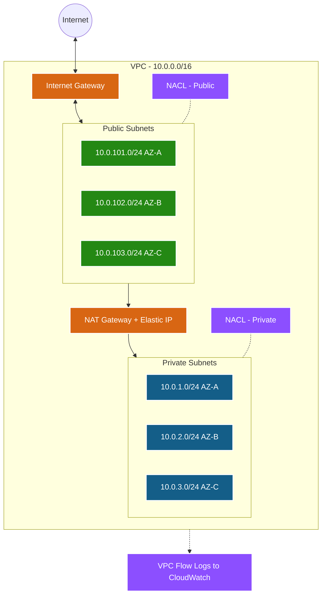
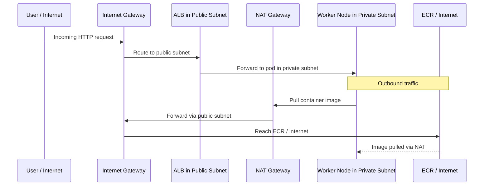

# VPC Module 🌐

This module provisions the foundational networking infrastructure for the EKS cluster. It sets up a secure, production-grade Virtual Private Cloud (VPC) with public and private subnets across multiple Availability Zones.

---

## Architecture Diagram



---

## What it Creates 🏗️

| # | Resource | Terraform Type | Purpose |
|---|----------|---------------|---------|
| 1 | **VPC** | `aws_vpc` | Isolated network with DNS support (required by EKS) |
| 2 | **Internet Gateway** | `aws_internet_gateway` | Internet access for public subnets |
| 3 | **Public Subnets** (×3) | `aws_subnet` | For ALBs, NAT Gateways, bastion hosts |
| 4 | **Private Subnets** (×3) | `aws_subnet` | For EKS worker nodes (no direct internet) |
| 5 | **Elastic IP** | `aws_eip` | Static IP for the NAT Gateway |
| 6 | **NAT Gateway** | `aws_nat_gateway` | Outbound internet for private subnets |
| 7 | **Public Route Table** | `aws_route_table` | Routes `0.0.0.0/0` → Internet Gateway |
| 8 | **Private Route Table** | `aws_route_table` | Routes `0.0.0.0/0` → NAT Gateway |
| 9 | **Network ACLs** | `aws_network_acl` | Stateless subnet-level firewall |
| 10 | **VPC Flow Logs** | `aws_flow_log` | Network traffic audit logs (optional) |

---

## Detailed Resource Walkthrough

### 1. VPC

The isolated private network where everything lives.

```hcl
resource "aws_vpc" "main" {
  cidr_block           = var.vpc_cidr   # e.g., "10.0.0.0/16" — 65,536 IPs
  enable_dns_hostnames = true           # Required for EKS
  enable_dns_support   = true           # Required for EKS

  tags = merge(var.tags, {
    Name = "${var.name_prefix}-vpc"
  })
}
```

**Why DNS is enabled**: EKS requires DNS hostnames and support for nodes to resolve the cluster API endpoint and communicate with the control plane.

---

### 2. Public and Private Subnets

Subnets are spread across 3 Availability Zones for high availability.

```hcl
# Public subnets — for ALBs and NAT Gateway
resource "aws_subnet" "public" {
  count                   = length(var.public_subnets)     # 3 subnets
  vpc_id                  = aws_vpc.main.id
  cidr_block              = var.public_subnets[count.index] # "10.0.101.0/24"
  availability_zone       = var.azs[count.index]            # "ap-south-1a"
  map_public_ip_on_launch = true                            # Auto-assign public IPs

  tags = merge(var.tags, var.public_subnet_tags, {
    Name = "${var.name_prefix}-public-${var.azs[count.index]}"
  })
}

# Private subnets — for EKS worker nodes (no public IPs)
resource "aws_subnet" "private" {
  count             = length(var.private_subnets)
  vpc_id            = aws_vpc.main.id
  cidr_block        = var.private_subnets[count.index]
  availability_zone = var.azs[count.index]

  tags = merge(var.tags, var.private_subnet_tags, {
    Name = "${var.name_prefix}-private-${var.azs[count.index]}"
  })
}
```

**Subnet Tagging for EKS** — These tags are functional, not just labels:

| Tag | Subnet Type | Meaning |
|-----|------------|---------|
| `kubernetes.io/role/elb = 1` | Public | Place internet-facing ALBs here |
| `kubernetes.io/role/internal-elb = 1` | Private | Place internal NLBs here |
| `kubernetes.io/cluster/<name> = shared` | Both | This subnet belongs to the cluster |

---

### 3. NAT Gateway

Allows private subnets to access the internet for pulling container images, without exposing nodes to inbound traffic.

```hcl
resource "aws_eip" "nat" {
  count  = var.enable_nat_gateway ? (var.single_nat_gateway ? 1 : length(var.public_subnets)) : 0
  domain = "vpc"
  depends_on = [aws_internet_gateway.main]
}

resource "aws_nat_gateway" "main" {
  count         = var.enable_nat_gateway ? (var.single_nat_gateway ? 1 : length(var.public_subnets)) : 0
  allocation_id = aws_eip.nat[count.index].id
  subnet_id     = aws_subnet.public[count.index].id
  depends_on    = [aws_internet_gateway.main]
}
```

| Mode | `single_nat_gateway` | NAT Count | Cost | Use Case |
|------|---------------------|-----------|------|----------|
| **Single** | `true` | 1 | ~$33/mo | Dev/Test |
| **Multi-AZ** | `false` | 3 (one per AZ) | ~$100/mo | Production HA |

---

### 4. Route Tables

```hcl
# Public route table — routes to Internet Gateway
resource "aws_route" "public_internet_gateway" {
  route_table_id         = aws_route_table.public.id
  destination_cidr_block = "0.0.0.0/0"              # All internet traffic
  gateway_id             = aws_internet_gateway.main.id
}

# Private route table — routes to NAT Gateway
resource "aws_route" "private_nat_gateway" {
  count                  = var.enable_nat_gateway ? (var.single_nat_gateway ? 1 : length(var.private_subnets)) : 0
  route_table_id         = aws_route_table.private[count.index].id
  destination_cidr_block = "0.0.0.0/0"
  nat_gateway_id         = aws_nat_gateway.main[count.index].id
}
```

---

### 5. Network ACLs

NACLs provide a **stateless** firewall at the subnet boundary — a secondary defense layer in case Security Group rules are misconfigured.

```hcl
resource "aws_network_acl" "private" {
  vpc_id     = aws_vpc.main.id
  subnet_ids = aws_subnet.private[*].id

  ingress {
    rule_no    = 100
    protocol   = "tcp"
    action     = "allow"
    cidr_block = var.vpc_cidr    # Allow traffic from within VPC
    from_port  = 0
    to_port    = 65535
  }

  egress {
    rule_no    = 100
    protocol   = "-1"            # All protocols
    action     = "allow"
    cidr_block = "0.0.0.0/0"    # Allow all outbound
    from_port  = 0
    to_port    = 0
  }
}
```

---

### 6. VPC Flow Logs (Optional)

When enabled, captures metadata about all network traffic for security auditing.

```hcl
resource "aws_flow_log" "main" {
  count                = var.enable_flow_logs ? 1 : 0
  vpc_id               = aws_vpc.main.id
  traffic_type         = "ALL"
  iam_role_arn         = aws_iam_role.flow_log[0].arn
  log_destination      = aws_cloudwatch_log_group.flow_log[0].arn
  log_destination_type = "cloud-watch-logs"
}
```

---

## Traffic Flow


