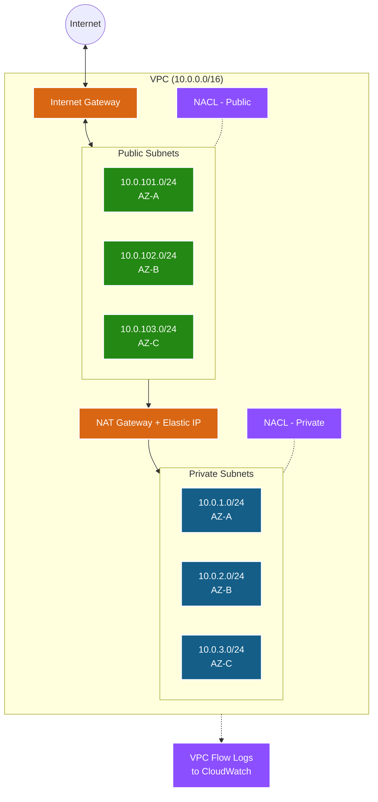
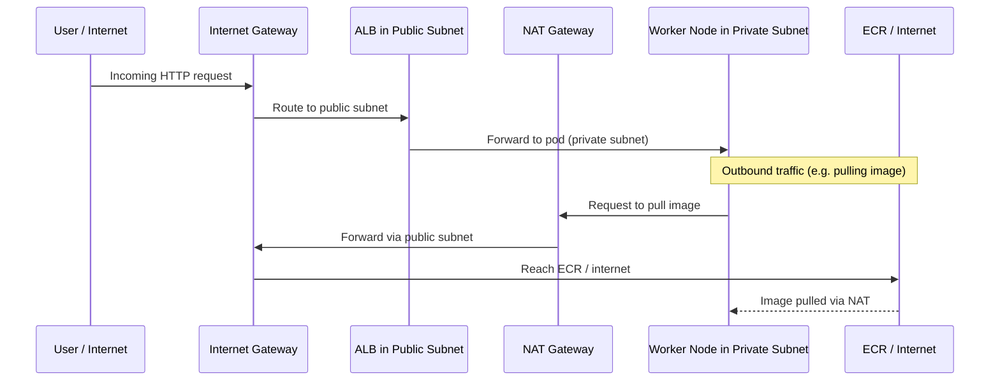

# VPC Module 🌐

This module provisions the foundational networking infrastructure for the EKS cluster. It sets up a secure, production-grade Virtual Private Cloud (VPC) with public and private subnets across multiple Availability Zones.

---

## Architecture Diagram

---

## What it Creates 🏗️

| # | Resource | Terraform Type | Purpose |
|---|----------|---------------|---------|
| 1 | **VPC** | `aws_vpc` | Isolated network with DNS support (required by EKS) |
| 2 | **Internet Gateway** | `aws_internet_gateway` | Internet access for public subnets |
| 3 | **Public Subnets** (×3) | `aws_subnet` | For ALBs, NAT Gateways, bastion hosts |
| 4 | **Private Subnets** (×3) | `aws_subnet` | For EKS worker nodes (no direct internet) |
| 5 | **Elastic IP** | `aws_eip` | Static IP for the NAT Gateway |
| 6 | **NAT Gateway** | `aws_nat_gateway` | Outbound internet for private subnets |
| 7 | **Public Route Table** | `aws_route_table` | Routes `0.0.0.0/0` → Internet Gateway |
| 8 | **Private Route Table** | `aws_route_table` | Routes `0.0.0.0/0` → NAT Gateway |
| 9 | **Network ACLs** | `aws_network_acl` | Stateless subnet-level firewall |
| 10 | **VPC Flow Logs** | `aws_flow_log` | Network traffic audit logs (optional) |

---

## How Traffic Flows

---

## Key Design Decisions

### Why Public + Private Subnets?
- **Private subnets** hide worker nodes from the internet. They have no public IPs and no direct inbound route. This is the #1 security best practice for EKS nodes.
- **Public subnets** exist only for resources that *must* face the internet: load balancers and the NAT Gateway.

### Why NAT Gateway?
Pods running in private subnets still need outbound internet to:
- Pull container images from ECR or Docker Hub.
- Communicate with external APIs and AWS services.

The NAT Gateway provides this outbound access without exposing nodes to inbound traffic.

### Single vs. Multi-AZ NAT
| Mode | `single_nat_gateway` | NAT Count | Cost | Use Case |
|------|---------------------|-----------|------|----------|
| **Single** | `true` | 1 | ~$33/mo | Dev/Test |
| **Multi-AZ** | `false` | 3 (one per AZ) | ~$100/mo | Production HA |

### Subnet Tagging for EKS
These tags are **functional**, not just labels. The AWS Load Balancer Controller reads them to discover where to place load balancers:

| Tag | Subnet Type | Meaning |
|-----|------------|---------|
| `kubernetes.io/role/elb = 1` | Public | Place internet-facing ALBs here |
| `kubernetes.io/role/internal-elb = 1` | Private | Place internal NLBs here |
| `kubernetes.io/cluster/<name> = shared` | Both | This subnet belongs to the cluster |

### Network ACLs (NACLs)
NACLs provide a **stateless** firewall at the subnet boundary. Unlike Security Groups (stateful), NACLs evaluate both inbound and outbound rules independently. They act as a secondary defense layer in case Security Group rules are misconfigured.

### VPC Flow Logs (Optional)
When enabled, captures metadata about all network traffic (source/dest IPs, ports, accept/reject) to CloudWatch. Useful for:
- Forensic investigation after a security incident.
- Detecting unusual traffic patterns (e.g., data exfiltration).
- Compliance auditing (PCI-DSS, SOC2).
